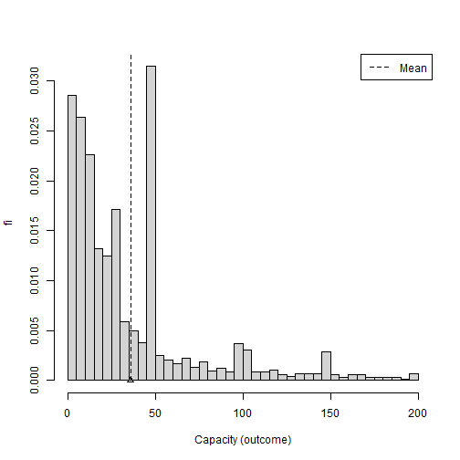
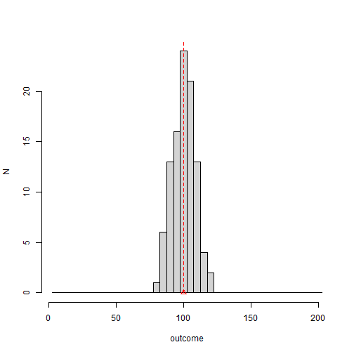
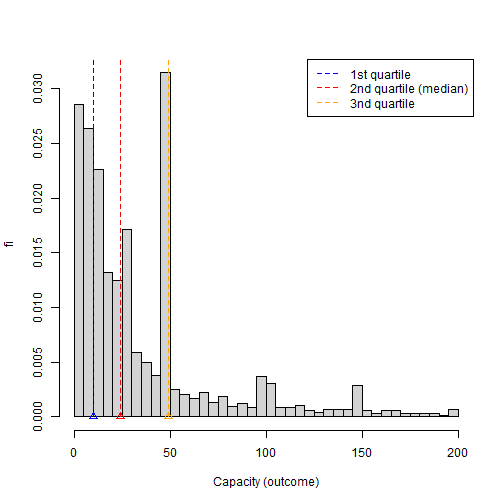
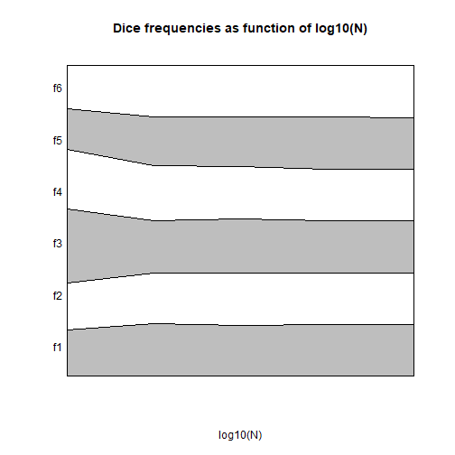

Introducción a la estadística
======================================================
author: Alejandro Cáceres
date:  
autosize: true

Escuela Técnica Superior de Ingeniería de Barcelona Este <br>
Universitat Politècnica de Catalunya (UPC)
 

<p style= "font-size: 70px"> Capítulo 1 </p>

Objetivo
======================================================

- Introducción a la estadística
- Modelos Vs datos
- Datos: discretos, continuos
- Resumir datos en tablas y figuras.


Objetivo estadístico
======================================================

- Resolver problemas de forma sistemática (ciencia, tecnología de ingeniería)

- ¡Los humanos modernos usamos un **método** general desarrollado históricamente durante miles de años! ... y aún en desarrollo.

- Tiene tres componentes principales: observación, lógica y generación de nuevos conocimientos


Mapa conceptual
======================================================


Método científico
======================================================


Productos
======================================================


Estadística
======================================================


Datos
======================================================


Resultado
======================================================

**Observación**

- Una **observación** es la adquisición de un número o una característica al realizar un experimento

 ... 1 0 0 1 0 **1** 0 1 1 ... (el número en negrita es una observación)

**Resultado**

- Un **resultado** es uno de los valores posibles de las observaciones de un experimento.

**1** es un resultado, **0** es el otro resultado

Resultado
======================================================

Los resultados pueden ser:

- Categórico: si el resultado de un experimento solo puede tomar valores discretos (número de piezas de automóvil producidas por hora, número de leucocitos en sangre)

- Continuo: Si el resultado de un experimento solo puede tomar valores continuos (estado de carga de la batería, temperatura del motor).


Experimento aleatorio
======================================================

Los experimentos producen *señales* y *ruido*.

- Las señales son medidas fiables/predictivas
- El ruido es una medida poco fiable/impredecible

La mayoría de los experimentos

*resultado = señal + ruido*

El objetivo es extraer el la señal en el resultado.

Experimento aleatorio
======================================================

Cuando el ruido no es cero, tenemos un **experimento aleatorio**

**Definición:**

Un experimento que se repite de la misma manera cada vez y sus observaciones dan resultados diferentes.


Experimento aleatorio
======================================================

Ejemplos:

- sobre el mismo objeto (persona): temperatura, niveles de azúcar.
- en objetos diferentes pero con la misma medida: el tamaño de un tornillo de una línea de producción.
- varios correos electrónicos recibidos en una hora.

Plantas de energía
======================================================

En el [World Global Resource Institute](
https://www.wri.org/publication/global-power-plant-database)
recopilan datos globales sobre plantas de energía:

Tienen un registro de:

- 299910 plantas
- desde 2014-2017
- en 164 países
- tipo de planta y capacidad (GWH)

Los datos se pueden descargar y se pueden obtener diferentes medidas.


Parques eólicos
======================================================

Veamos los parques eólicos. Este es un ejemplo de sólo **6** parques eólicos de un total de 5091.


```
                           name country primary_fuel
539      Mortons Lane Wind Farm     AUS         Wind
542      Mount Millar Wind Farm     AUS         Wind
545         Mt Mercer Wind Farm     AUS         Wind
553           Mumbida Wind Farm     AUS         Wind
560                   Musselroe     AUS         Wind
569 North Brown Hill  Wind Farm     AUS         Wind
```
 


Variables categóricas
======================================================


Cuando repetimos un experimento aleatorio, registramos una lista de resultados. <br>


Resumimos las observaciones **categóricas** contando cuántas veces vimos un resultado en particular.

$n_i$ es el número de veces que observamos el resultado $i$

En nuestro ejemplo, pensemos en AUS (Australia) como un posible **resultado** para la observación del  **país** del que procede de un parque eólico.

Cuando veamos otro parque eólico obtendremos tendremos otro país del que procede (repetición del experimento aleatorio). 

Frecuencias
======================================================

¿Cuántos parques eólicos hay en cada país?


```
    outcome frequency
n1      ARG        12
n2      AUS        58
n3      BEL        12
n4      BRA       412
n5      CAN       241
n6      CHL        18
n7      CHN       835
n8      DEU        25
n9      DNK        19
n10     ESP       342
n11     EST        13
n12     FIN        12
n13     FRA       721
n14     GBR       727
n15     GRC        12
n16     IND       108
n17     IRL        38
n18     KOR        12
n19     LKA        14
n20     MAR        11
n21     MEX        20
n22     NLD        40
n23     POL        59
n24     PRT       224
n25     URY        39
n26     USA      1043
n27     ZAF        24
```


Frecuencias relativas
======================================================


También podemos resumir las observaciones calculando la **proporción** de cuántas veces vimos un resultado en particular.

$$f_i= n_i/N$$ donde $N$ es el número total de observaciones

En nuestro ejemplo se registran $N= 5091$ parques eólicos.

La frecuencia es la proporción de parques eólicos en cada país de un total de 5091.


Frecuencias relativas
======================================================


```
   outcome   ni          fi
1      ARG   12 0.002357101
2      AUS   58 0.011392654
3      BEL   12 0.002357101
4      BRA  412 0.080927126
5      CAN  241 0.047338440
6      CHL   18 0.003535651
7      CHN  835 0.164014928
8      DEU   25 0.004910627
9      DNK   19 0.003732076
10     ESP  342 0.067177372
11     EST   13 0.002553526
12     FIN   12 0.002357101
13     FRA  721 0.141622471
14     GBR  727 0.142801021
15     GRC   12 0.002357101
16     IND  108 0.021213907
17     IRL   38 0.007464152
18     KOR   12 0.002357101
19     LKA   14 0.002749951
20     MAR   11 0.002160676
21     MEX   20 0.003928501
22     NLD   40 0.007857003
23     POL   59 0.011589079
24     PRT  224 0.043999214
25     URY   39 0.007660577
26     USA 1043 0.204871342
27     ZAF   24 0.004714202
```


Frecuencias
======================================================


Claramente, debemos tener

$$\sum_{i= 1..m} n_i= N$$

y

$$\sum_{i= 1..m} f_i= 1$$

donde $m$ es la cantidad total de posibles resultados observados en los datos.


Gráfico de sectores
======================================================
Podemos visualizar aún más las frecuencias relativas con un gráfico de sectores, donde el área del círculo representa el 100% de las observaciones (proporción= 1) y las secciones las frecuencias relativas de todos los resultados.


Resultado versus observación
======================================================

Esta es una **observación** del experimento aleatorio: ver el país de un parque eólico en los datos.


```
                   name country primary_fuel
1459 Campo dos Ventos V     BRA         Wind
```

Esta es la frecuencia de observación del **resultado** BRA (o número de parques eólicos en Brasil)


```
  outcome  ni         fi
4     BRA 412 0.08092713
```

Variables categóricas y ordenadas
======================================================

Los países no tienen un orden intrínseco con respecto a los resultados. Sin embargo, a veces las variables **categóricas** se pueden **ordenar** (días, meses, años)


```
                   name country year_of_capacity_data
1459 Campo dos Ventos V     BRA                  2017
1462            Camurim     BRA                  2017
1469            Candiba     BRA                  2017
1472     Canoa Quebrada     BRA                  2017
1482  Capão do Inglês     BRA                  2017
1488           Caravela     BRA                  2017
```


Variables categóricas y ordenadas
==================================================

- Podemos ver de nuevo cuántas veces se observa cada año en los datos (en qué año se recopilaron los datos de los parques eólicos)

- y la proporción de resultados para cada año (los años son las observaciones ahora)


```
  outcome   ni         fi
1    2015   12 0.00673023
2    2016  273 0.15311273
3    2017 1459 0.81828379
4    2018   39 0.02187325
```

Frecuencia acumulada  absoluta
==================================================


Cuando se pueden ordenar los resultados, es útil preguntar cuántos resultados se observaron hasta un valor dado; llamamos a este número la frecuencia acumulada absoluta hasta el resultado$i$:
$$N_i= \sum_{k= 1..i} n_k$$


```
  outcome   ni         fi   Ni
1    2015   12 0.00673023   12
2    2016  273 0.15311273  285
3    2017 1459 0.81828379 1744
4    2018   39 0.02187325 1783
```

Frecuencia acumulada  relativa
==================================================

Se puede hacer la misma definición para la frecuencia relativa.

$$F_i= \sum_{k= 1..i} f_k$$


```
  outcome   ni         fi   Ni         Fi
1    2015   12 0.00673023   12 0.00673023
2    2016  273 0.15311273  285 0.15984296
3    2017 1459 0.81828379 1744 0.97812675
4    2018   39 0.02187325 1783 1.00000000
```

hasta 2017 se recopiló el 0,97% de los datos de 1783 parques eólicos.


Gráfico de barras
==================================================

Podemos dibujar $n_i$ Vs los resultados, por médio de un diagrama de barras


Variables continuas
==================================================


El resultado de un experimento aleatorio también puede dar resultados **continuos**, como la capacidad de MW de la granja.


```
                           name country capacity_mw
539      Mortons Lane Wind Farm     AUS        20.0
542      Mount Millar Wind Farm     AUS        70.0
545         Mt Mercer Wind Farm     AUS       131.0
553           Mumbida Wind Farm     AUS        55.0
560                   Musselroe     AUS       168.0
569 North Brown Hill  Wind Farm     AUS       132.3
```
 
Variables continuas
==================================================
- Podemos conocer el rango de la observación por sus resultados mínimos y máximos observados

- La capacidad de los parques eólicos oscilan entre: (1MW, 200MW)


Variables continuas
==================================================

- ¡Los resultados continuos no se pueden contar!

- Cubrimos el rango en pequeños intervalos regulares del mismo tamaño (subintervalos)


```r
[0.801,20.9], (20.9,40.7], (40.7,60.6], (60.6,80.5], (80.5,100], (100,120], (120,140], (140,160], (160,180], (180,200]
```


- creamos una variable **categórica ordenada**; en este caso con 10 posibles resultados


Variables continuas
==================================================

Entonces, por ejemplo, la lista de valores

```r
16.56  1.80  2.02 25.20 25.20  6.30
```

se asignan a los intervalos
are mapped to the intervals

```r
[0.801,20.9], [0.801,20.9], [0.801,20.9], (20.9,40.7], (20.9,40.7], [0.801,20.9]
```

Variables continuas
==================================================
Y nuestros datos se verán como


```
                           name country bined.capacity
560                   Musselroe     AUS      (160,180]
569 North Brown Hill  Wind Farm     AUS      (120,140]
575     Oakland Hills Wind Farm     AUS    (60.6,80.5]
618          Royalla Solar Farm     AUS   [0.801,20.9]
624              Snowtown North     AUS      (140,160]
625              Snowtown South     AUS      (120,140]
```

Frecuencias para variables continuas
==================================================


```
        outcome   ni          fi   Ni        Fi
1  [0.801,20.9] 2251 0.460515548 2251 0.4605155
2   (20.9,40.7]  964 0.197217676 3215 0.6577332
3   (40.7,60.6]  965 0.197422259 4180 0.8551555
4   (60.6,80.5]  171 0.034983633 4351 0.8901391
5    (80.5,100]  161 0.032937807 4512 0.9230769
6     (100,120]  139 0.028436989 4651 0.9515139
7     (120,140]   56 0.011456628 4707 0.9629705
8     (140,160]  102 0.020867430 4809 0.9838380
9     (160,180]   41 0.008387889 4850 0.9922259
10    (180,200]   38 0.007774141 4888 1.0000000
```

Histograma
==================================================

El histograma es la gráfica de $n_i$ o $f_i$ Vs los resultados (bins). El histograma depende del tamaño de los subintervalos.


Histograma
==================================================


gráfico de frecuencia acumulada
==================================================

También podemos graficar la frecuencia acumulada Vs los resultados


Estadísticos descriptivos
==================================================

Las estadísticas de resumen son números calculados a partir de los datos que nos dicen características importantes de las variables numéricas (categóricas o continuas).

Valores límite:

- mínimo: el resultado mínimo observado
- máximo: el resultado máximo observado

Estadísticos descriptivos
==================================================

Valor central de los resultados

- El promedio se define como

$$\bar{x}= \frac{1}{N} \sum_{j= 1..N} x_j$$

donde $x_j$ es la **observación** $j$ (parque eólico) de un total de $N$.

Estadísticos descriptivos
==================================================


La capacidad media se puede calcular directamente a partir de las **observaciones**

</br>$\bar{c}= \frac{1}{N}\sum_j c_j$
</br>$= \frac{1}{N}(16.56  1.80  + 2.02 + 25.20+ 25.20 + 6.30+...) = 35.751$


Estadísticos descriptivos
==================================================

Para variables categoricas ordenadas podemos usar la tabla de frecuencias para calcular el promedio


```
  outcome   ni         fi
1    2015   12 0.00673023
2    2016  273 0.15311273
3    2017 1459 0.81828379
4    2018   39 0.02187325
```

El promedio anual de los datos de los parques eólicos **también** se puede calcular a partir de las frecuencias relativas (outcome=y)

$\bar{y}=\frac{1}{N}\sum_{i} y_j=\frac{1}{N}\sum_{i} y_i*n_{i}=\sum_{i} y_i*f_{y}$

$=2015*f_{1}+2016*f_{2}+2017*f_{3}+2018*f_{4}=2016.85$


Estadísticos descriptivos
==================================================

En términos de los **resultados** que pueden tomar las variables categóricas el **promedio** se puede escribir como

$$\bar{x}= \sum_{i = 1...m} x_i f_i$$

de un total de $m$ posibles resultados (número de países).

$\bar{x}$ calcula el **valor central** o el centro de gravedad de los resultados. Como si cada resultado tuviera una densidad de masa $f_i$.


Estadísticos descriptivos
==================================================

Los promedios no son el resultado de una observación (experimento aleatorio) sino una serie de observaciones. 

Describe el número en el que se equilibran los valores observados.

Por eso escuchamos, por ejemplo, que un paciente con coronavirus puede infectar a un promedio de 2,5 personas.


Estadísticos descriptivos
==================================================



Estadísticos descriptivos
==================================================

Otra medida de centralidad es la mediana. La mediana $q_{0.5}$ es el valor $x_p$

$median(x)=q_{0.5}=x_p$ 

debajo del cual encontramos la mitad de las observaciones

$\sum_{x\leq x_p} 1 = \frac{N}{2}$

o en términos de frecuencias, es el valor $x_p$ que hace que la frecuencia acumulada $F_p$ sea igual a 0.5

$q_{0.5}=\sum_{x\leq x_p} f_x =F_p=0.5$


Estadísticos descriptivos
==================================================

- Media: Centro de masa (compensa valores distantes)
- Mediana: la mitad de la masa


Estadísticos descriptivos
==================================================

Una medida importante de los resultados es su **dispersión**. Muchos experimentos pueden compartir su media, pero difieren en la dispersión de los valores.





Estadísticos descriptivos
==================================================


Estadísticos descriptivos
==================================================

La dispersión sobre la media se mide con 

- La varianza muestral:

$$s^2=\frac{1}{N-1} \sum_{j=1..N} (x_j-\bar{x})^2$$


que mide la distancia cuadrada promedio de las **observaciones** al promedio. La razón de N-1 se explicará cuando hablemos de inferencia.


Estadísticos descriptivos
==================================================

- En términos de las frecuencias de las variables **categóricas** observadas (momento de inercia)

$$s^2=\frac{N}{N-1} \sum_{i=1...m} (x_i-\bar{x_i})^2 f_i$$


Estadísticos descriptivos
==================================================

La raíz cuadrada de la varianza muestral $s$ se llama **desviación estándar** o típica.


La desviación estándar de la capacidad de los parques eólicos es

$s= [\frac{1}{N-1}((16.56-35.751)^2+  (1.80-35.751)^2$  
</br>$+ (2.02-35.751)^2 + ...)]^{1/2} = 37.487$

La capacidad de los parques eólicos se desvía de su media en 37.487MW.

Estadísticos descriptivos
==================================================

- La dispersión de datos también se puede medir con respecto a los medios mediante el **rango intercuartil**

- Definimos el primer cuartil como el valor $p$ **debajo de** en el que se encuentran el primer 25% de las observaciones

$$q_{0.25}=\sum_{i=1..p} f_i =F_p=0.25$$

- También definimos el tercer cuartil como el valor $p$ **por encima de** donde se encuentran el primer 25% de las observaciones


Estadísticos descriptivos
==================================================
La distancia entre el tercer cuartil y el primer cuartil se llama **rango intercuartil** (IQR) y captura el 50% central de las observaciones



Estadísticos descriptivos
==================================================
El rango intercuartílico, la mediana y el 5% y el 95% de los datos se pueden visualizar en una **gráfica de caja**, aquí los valores de los resultados están en el eje y. El IQR es la caja, la mediana la línea en el medio y los bigotes marcan el 5% y el 95% de los datos.


Resumen
==================================================

- Hemos visto datos **observacionales**: Cada parque eólico de viento tenía algunas variables medidas:

- Categórico: año, país
- Continuo: Capacidad en MW

Consideramos que observar un parque eólico es la observación de un experimento aleatorio: observar parques eólicos en todo el mundo. 

Cada vez que observamos un parque eólico las variables toman valores diferentes. 

Cada variable tiene una **frecuencia** de observación.

Resumen
==================================================

- Las frecuencias de las variables $f_i$ o su acumulación $F_i$ (en variables ordenadas) son características del sistema (humanos construyendo parques eólicos).

- No deberían depender de quién está ejecutando el experimento, a diferencia de $n_i$ o $N$.

- Pero dependen (en su definición) de $n_i$ y $N$. ¿Cuándo pierden su dependencia de $n_i$?


Experimento aleatorio
==================================================
Lanzemos un dado 10 veces y calculemos las frecuencias para cada resultado


```
  outcome ni  fi Ni  Fi
1       1  2 0.2  2 0.2
2       2  2 0.2  4 0.4
3       3  1 0.1  5 0.5
4       5  1 0.1  6 0.6
5       6  4 0.4 10 1.0
```


Resumen
==================================================

- ¿Qué sucede cuando $N$ aumenta a 1,000?


```
  outcome  ni    fi   Ni    Fi
1       1 162 0.162  162 0.162
2       2 165 0.165  327 0.327
3       3 159 0.159  486 0.486
4       4 168 0.168  654 0.654
5       5 185 0.185  839 0.839
6       6 161 0.161 1000 1.000
```

- ¿Qué sucede cuando$N \rightarrow \infty$?


Resumen
==================================================

$$lim_{N\rightarrow \infty} f_i = P_i$$




Próximo
==================================================

Llamamos **Probabilidad** $P_i$ al límite cuando$N \rightarrow \infty$ de la frecuencia de observación del valor $i$ en un experimento aleatorio.

- Entendemos que estos valores pertenecen a la Naturaleza, no dependen del experimentador ni del observador: describen las cosas como son.

- Como no podemos hacer un experimento infinitas veces, ¿podemos comenzar al revés? Si creemos que los $P_i$ describen las cosas como son, ¿podemos **predecir** de ellos los valores observados de $f_i$ a $N$ reales?

- ¿Cuáles son las principales propiedades lógicas de estos $P_i$?

Ejercicio
==================================================

Pensemos en un experimento aleatorio arquetípico: **el lanzamiento un dado**.

- Lanzamos un dado 20 veces y obtuvimos:

1 5 1 2 2 1 2 2 3 1 1 3 3 1 6 3 5 6 4 4

- ¿Cuál es la duodécima observación?

- ¿Cuales es la frecuencia absoluta, la frecuencia relativa, la frecuencias absoluta acumulada y la frecuencia relativa acumulada de cada resultado?

Ejercicio
==================================================


- ¿Qué resultado se observó 4 veces?

- ¿Cuantas observaciones tuvo el evento de obtener un número menor o igual a 3?

- ¿Cuál es el conjunto de todos los resultados?

- ¿Cuál es la media y a la mediana?

- ¿Cuál es la deviación típica?

- ¿Cuál es la probabiliad de obtener 3? ¿por qué?
