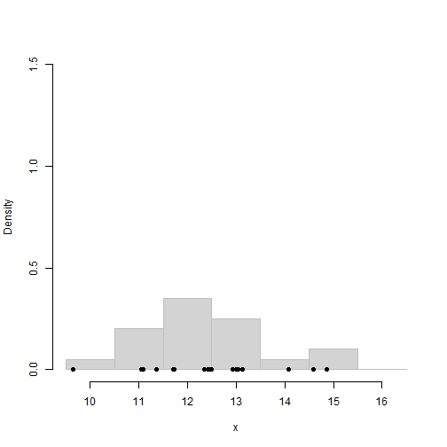
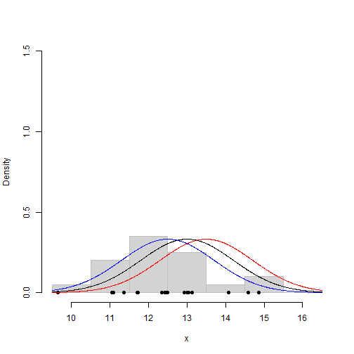
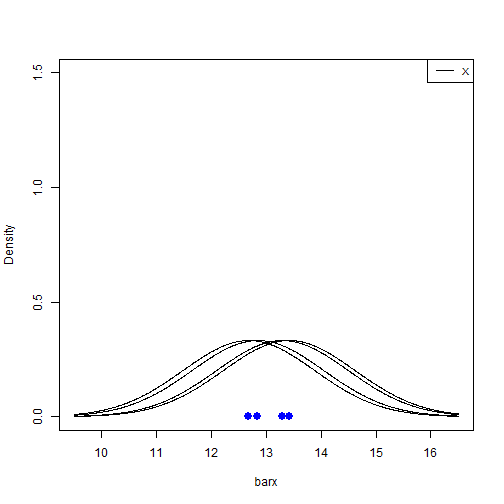
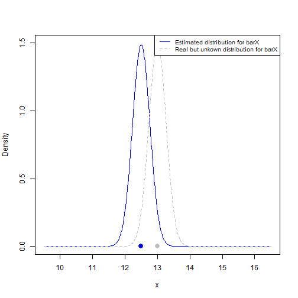
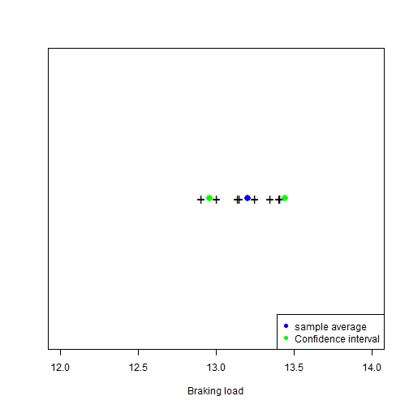
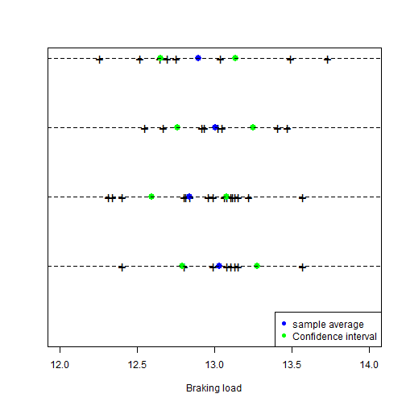

Introducción a la estadística
======================================================
autor: Alejandro Cáceres
fecha:
tamaño automático: verdadero

Escuela Técnica Superior de Ingeniería de Barcelona Este <br>
Universitat Politècnica de Catalunya (UPC)
 

<p style = "font-size: 70px"> Capítulo 10 </p>

Introducción a la estadística
======================================================
autor: Alejandro Cáceres
fecha:
tamaño automático: verdadero

Escuela Técnica Superior de Ingeniería de Barcelona Este <br>
Universitat Politècnica de Catalunya (UPC)
 

<p style = "font-size: 70px"> Clase 10 </p>


Objetivo
======================================================

- Definición de estimación intervalar
- Intervalos de confianza para una muestra aleatoria normal con varianza conocida

Estimación de intervalar
======================================================

Por lo general, comenzamos realizando un experimento aleatorio $n$ veces



Estimación de intervalar
======================================================

Suponemos que el experimento aleatorio sigue una distribución eriment follows a distribution . ¿Pero cual es? ¿Qué parámetro $\theta$ ($\mu$ en el caso de $N(\mu,\sigma)$) deberíamos elegir?




Estimación de intervalar
======================================================


Cuando proponemos un modelo de probabilidad para la variable aleatoria eriment follows a distribution 

- Podemos usar **máxima verosimilitud** o el **método de momentos** para proponer estimadores $\theta$ para el parámetro $\theta$.

- Los estimadores son variables aleatorias que representan el experimento aleatorio de repetir el experimento de $X$ $n$ veces y combinar los resultados para calcular la estimación $\hat{\theta}$.

- La estimación $\hat{\theta}$ se obtiene de los datos y es un valor observado del experimento aleatorio que mide el estimador $\theta$.

Estimación de intervalar
======================================================

La máxima verosimilitud y el método de los momentos nos dicen que para estimar $\mu$ **podemos elegir** $\bar{x}$, que es la observación de la variable aleatoria $\bar{x}$


Estimación de intervalar
======================================================

¿Cuán **seguros** estamos de que $\bar{x}$ está **cerca** del $\mu$ real?

Si repetimos los $n$ -experimentos muchas veces, obtendremos cada vez una respuesta diferente para $\bar{x}$ porque $\bar{x}$ es una variable aleatoria.


Estimación de intervalar
======================================================

Cada valor de $\bar{x}$ **infiere** una distribución diferente de $X$




Estimación de intervalar
======================================================

Por lo general, solo tenemos un valor de $\bar{x}$ o repetimos el experimento solo $n$ veces.




Estimación de intervalar
======================================================


Consideremos el caso de la media $\mu$: cuando estimamos $\mu \sim \bar {x}$ ($\hat {\mu} = \bar {x}$)

- No sabemos qué tan cerca estamos del valor verdadero pero desconocido de $\mu$.

- Para saber qué tan lejos puede caer $\bar{x}$ de $\mu$, definimos los límites $(f_ {inf}, f_ {sup})$ de manera que tengamos una probabilidad de $ 95 \% $ de que la diferencia entre $\bar{x}$ y $\mu$ está entre estos números.


Queremos identificar el intervalo entre 95% de $\bar{x}$ sobre la media $\mu$.

Estimación de intervalar
======================================================

Escribámoslo como:

$P(f_{inf} \leq \bar{X} - \mu \leq  f_{sup} )=0.95$

$P(\bar{X} - f_{sup} \leq \mu \leq \bar{X} - f_{inf} )=0.95$

y definir el **intervalo aleatorio**

$(L,U)$ tal que $P(L \leq  \mu \leq  U )=0.95$.

Cuando el intervalo captura la **distancia** $(\bar{X}-\mu)$ al parámetro, entonces

$(L,U)=(\bar{X} - f_{sup},\bar{X} - f_{inf})$

Este intervalo es una **variable aleatoria** y, por definición, tiene una probabilidad de $0.95$ de contener $\mu$.


Estimación de intervalar
======================================================

Cuando realizamos $n$ -experimentos aleatorios ($n$ -muestra) podemos calcular $f_ {inf}$ y $f_ {sup}$.


- el intervalo que obtenemos del experimento es

$(l,u)=(\bar{x} - f_{sup},\bar{x} - f_{inf})$ (¡en minúsculas!)
 (tamaño del script)

- este intervalo contiene o no el parámetro $\mu$: ¡**nunca lo sabremos **!

- Decimos que tenemos una confianza de $95 \%$ de que el intervalo $(l, u)$ capturará el verdadero parámetro desconocido $\mu$. Piense en comprar una lotería marcada para la que no conoce el resultado.

Estimación de intervalar
======================================================
Consideremos la probabilidad

$P(f_{inf} \leq \bar{X} - \mu \leq  f_{sup} )=0.95$

y dividir por $\sigma_{\bar{X}}$

$P( \frac{f_{inf}}{\sigma_{\bar{X}}} \leq \frac{\bar{X}-\mu}{\sigma_{\bar{X}}} \leq  \frac{f_{sup}}{\sigma_{\bar{X}}} )=0.95$


Sustituyamos por $\sigma_{\bar{X}}=\sigma_{X}/\sqrt{n}$. 


Entonces necesitamos resolver: $P( \frac{f_{inf}}{\sigma_{X}/\sqrt{n}} \leq \frac{\bar{X}-\mu}{\sigma_{X}/\sqrt{n}} \leq  \frac{f_{sup}}{\sigma_{X}/\sqrt{n}} )=0.95$

para $f_{inf}$ y $f_{sup}$. 


Estimación de intervalar
======================================================
Vamos a asumir dos condiciones:

1. que $X \hookrightarrow N (\mu, \sigma^2_X)$.

2. que **sabemos** $\sigma_ {X}$ como información adicional.

Si 1 y 2 son verdaderas ** entonces ** podemos mostrar que $Z=\frac{\bar{X}-\mu}{\sigma_{X}/\sqrt{n}}$ se distribuye normalmente $Z \hookrightarrow N(\mu=0, \sigma^2=1)$ 

- Podemos usar $\Phi ^ {- 1}$ (inverso del estándar de distribución estándar acumulativo) para encontrar $f_ {inf}$ y $f_ {sup}$.


Estimación de intervalar
======================================================

Si definimos $z_ {0.025}$ y $z_ {0.975}$ como los números de la distribución estándar que capturan el 95% de la distribución sobre la mediana:

$\Phi^{- 1} (0.025) = z_{0.975}$ y $\Phi^{- 1}(0.975) = z_{0.025}$


Estimación de intervalar
======================================================


luego comparando $P( z_{0.975} \leq Z \leq  z_{0.025} )=0.95$
con  $P( \frac{f_{inf}}{\sigma_{X}/\sqrt{n}} \leq \frac{\bar{X}-\mu}{\sigma_{X}/\sqrt{n}} \leq  \frac{f_{sup}}{\sigma_{X}/\sqrt{n}} )=0.95$


tenemos:

$f_{inf}=z_{0.925}*\sigma_{X}/\sqrt{n}$

$f_{sup}=z_{0.025}*\sigma_{X}/\sqrt{n}$


Estimación de intervalar
======================================================


En R podemos calcular estos números con la función *qnorm*=$\Phi^{-1}$

```r
z0.975 <- qnorm(0.025)
z0.975
```

```
[1] -1.959964
```

```r
z0.025 <- qnorm(0.975)
z0.025 
```

```
[1] 1.959964
```

Estimación de intervalar
======================================================

Para una variable aleatoria $X$ que distribuye normalmente $X \hookrightarrow N (\mu, \sigma^2_X)$ con varianza conocida $\sigma^2_X$, el intervalo aleatorio de $95%$ es

$(L,U) = (\bar{X} - f_{sup},\bar{X} - f_{inf})= (\bar{X} - 1.96\sigma_{X}/\sqrt{n},\bar{X} + 1.96 \sigma_{X}/\sqrt{n})$

y el intervalo de confianza **observado** $95\%$ es

$(l,u) = (\bar{x} - 1.96\sigma_{X}/\sqrt{n},\bar{x} + 1.96\sigma_{X}/\sqrt{n})$

También escribimos que la estimación de la media $\mu_X$

$\hat{\mu}_X=\bar{x} \pm 1.96\sigma_{X}/\sqrt{n}$

¡Y así separamos la señal del error!

nota: la probabilidad está en $X$, la señal en $E (\bar {X})$ y el error en $V(\bar {X})$.


Estimación de intervalar
======================================================
Para una muestra de 8 observaciones, tenemos una estimación de la media y un intervalo de confianza




Estimación de intervalar
======================================================
Cada vez que obtenemos una nueva muestra, las estimaciones cambian. Si realizamos 100 muestras, $95%$ de los intervalos de confianza contendrán $\mu$ (¡no sabemos cuál!)




Estimación de intervalar
======================================================

A partir de la distribución del estimador de $\theta$ definimos un **límite de confianza** $\alpha$ tal que la probabilidad de que el **intervalo aleatorio** $(L, U)$ contenga el parámetro $\theta$ es $(1- \ alpha)$.

$P(L \leq \theta \leq U)=P(\Theta -f_{\alpha/2} \leq \theta \leq \Theta - f_{1-\alpha/2})=1-\alpha$


Estimación de intervalar
======================================================

Si el intervalo de confianza de $95\%$ en el límite de confianza de $0.05%$ (la cantidad de probabilidad que queda fuera) para $X \hookrightarrow N (\mu, \sigma_X)$ y conocido $\sigma_X$

$(l,u) = (\bar{x} - z_{0.025}\sigma_{X}/\sqrt{n},\bar{x} - z_{0.975}\sigma_{X}/\sqrt{n})$

entonces el intervalo de confianza de $99\%$ para el límite de confianza $0.01$ es
$(l,u) = (\bar{x} - z_{0.005}\sigma_{X}/\sqrt{n},\bar{x} - z_{0.995}\sigma_{X}/\sqrt{n})$

$= (\bar{x} - 2.57\sigma_{X}/\sqrt{n},\bar{x} + 2.57\sigma_{X}/\sqrt{n})$

o

$\hat{\mu}_X=\bar{x} \pm 2.57\sigma_{X}/\sqrt{n}$

Si queremos tener más confianza, ¡necesitamos intervalos de confianza más amplios!


Estimación de intervalar
======================================================
Podemos recordar $z_{0.025}=\Phi^{-1}(0.975)=1.96$  o $z_{0.005}=\Phi^{-1}(0.995)=2.57$. Si no, podemos usar R o mirar una tabla.


Estimación de intervalar
======================================================

¡Los intervalos de confianza son muy mal entendidos!

- Un intervalo de confianza es un resultado de un proceso aleatorio.
- ¡cuando obtenemos un CI no sabemos si contiene el parámetro!
- $1- \alpha$ por ciento de las veces que los intervalos de CI contienen el parámetro
- Los CI no son probabilidades de observar el parámetro.

Para un conjunto de medidas, solo obtenemos una **caja negra** con un nivel de confianza que contiene el parámetro ... ¡pero nunca podemos mirar adentro!


Estimación de intervalar para la media
======================================================

Se prueba el impacto de un material metálico para medir la energía necesaria para cortarlo a una temperatura determinada.

- Se cortaron diez probetas de acero A238 a 60ºC con las siguientes energías de impacto (J)

- 64.1, 64.7, 64.5, 64.6, 64.5, 64.3, 64.6, 64.8, 64.2, 64.3

- Si sabemos que la energía del impacto se distribuye aleatoriamente con $\sigma = 1J$, ¿cuál es el $95 \%$ CI para la media de estos datos?

Estimación de intervalar para la media
======================================================

Sabemos

- $x_i=\{64.1, 64.7, 64.5, 64.6, 64.5, 64.3, 64.6, 64.8, 64.2, 64.3\}$
- $X \rightarrow N(\mu, \sigma^2)$
- $\sigma=1J$
- $\alpha=0.05$

El intervalo de confianza es entonces

$CI=(\bar{x}-1.96 \frac{\sigma}{\sqrt{n}}, \bar{x}+1.96  \frac{\sigma}{\sqrt{n}})$
</br>$=(64.46-1.96 \frac{1}{\sqrt{10}}, 64.46+1.96  \frac{1}{\sqrt{10}})=(63.84,65.08)$

o

$\hat{\mu}=64.46 \pm 0.61$ nos dice que podemos estar seguros en el primer dígito (6), algo seguros en el segundo (4) e inseguros en los decimales (46).

Estimación de intervalar para la media
======================================================


¿Cuál es el intervalo de confianza en el límite de confianza de $1\%$?

Sabemos

- $x_i=\{64.1, 64.7, 64.5, 64.6, 64.5, 64.3, 64.6, 64.8, 64.2, 64.3\}$
- $X \rightarrow N(\mu, \sigma^2)$
- $\sigma=1J$
- $\alpha=0.01$


Estimación de intervalar para la media
======================================================

El intervalo de confianza de $99\%$ (o el nivel de $1 \%$) es entonces

$CI_{99\%}=(\bar{x}-2.57 \frac{\sigma}{\sqrt{n}}, \bar{x}+2.57  \frac{\sigma}{\sqrt{n}})$
</br>$=(64.46-2.57 \frac{1}{\sqrt{10}}, 64.46+2.57  \frac{1}{\sqrt{10}})=(63.64,65.27)$

ten en cuenta que
$CI_{95\%}=(63.84,65.08) \subset CI_{99\%}=(63.64,65.27)$


Estimación de intervalar para la media (varianza desconocida)
======================================================

¿Qué pasa si **no sabemos** $\sigma_X$: La situación más probable!

Vamos a asumir solo la condición:

1. que $X \hookrightarrow N (\mu, \sigma^2_X)$.

Si no conocemos la **varianza** podemos estimarla por $S ^ 2$ y formar el estadístico estandarizado

$T=\frac{\bar{X}-E(\bar{X})}{\sqrt{V(\bar{X})}}= \frac{\bar{X}-\mu}{S/\sqrt{n}}$


Estimación de intervalar para la media (varianza desconocida)
======================================================

Si:

- $n> 30$ entonces el teorema del límite central nos da una buena aproximación a una distribución normal para

$T= \frac{\bar{X}-\mu}{S/\sqrt{n}}\hookrightarrow N(\mu, S^2)$


- $n <30$ entonces $T$ sigue una distribución **t** con $n-1$ grados de libertad.

$T=\frac{\bar{X}-\mu}{S/\sqrt{n}}\hookrightarrow t(n-1)$


Estimación de intervalar para la media (varianza desconocida)
======================================================

De la definición de intervalo de confianza aleatorio en la confianza $95 \%$

$(L,U) = (\bar{X} - f_{sup},\bar{X} - f_{inf})$, tal que $P(\bar{X} - f_{sup} \leq \mu \leq \bar{X} - f_{inf})=0.95$

tenemos:

$f_{inf}=t_{0.975,n-1}*S/\sqrt{n}$

$f_{sup}=t_{0.025,n-1}*S/\sqrt{n}$

$(l,u) = (\bar{x} - t_{0.025,n-1}s/\sqrt{n},\bar{x} - t_{0.975, n-1}s/\sqrt{n})$


o al $99 \%$

$(l,u) = (\bar{x} - t_{0.005,n-1}s/\sqrt{n},\bar{x} - t_{0.995, n-1}s/\sqrt{n})$


Estimación de intervalar para la media (varianza desconocida)
======================================================


Se prueba el impacto de un material metálico para medir la energía necesaria para cortarlo a una temperatura determinada.

- Se cortaron diez probetas de acero A238 a 60ºC con las siguientes energías de impacto (J)

- 64.1, 64.7, 64.5, 64.6, 64.5, 64.3, 64.6, 64.8, 64.2, 64.3

- Si sabemos que la energía de impacto se distribuye aleatoriamente pero **no sabemos** la varianza, ¿cuál es el $95\%$ CI para la media de estos datos?


Estimación de intervalar para la media (varianza desconocida)
======================================================

- $\bar{x}$ = 64,46
- $s = 0,227$
- $\alpha = 0.05$
- $t_{0.975,9} = - 2.26$ obtenido de $P (T \leq t_ {0.975,9}) = 0.025$
- $t_{0.025,9} = 2.26$ obtenido de $P (T \leq t_ {0.025,9}) = 0.975$

El intervalo de CI es entonces

$CI=(\bar{x}- t_{0.975,9}\frac{s}{\sqrt{n}},\bar{x}-t_{0.025,9}  \frac{s}{\sqrt{n}})$

$=(64.46-2.26 \frac{0.227}{\sqrt{10}},64.46+2.26 \frac{0.227}{\sqrt{10}})=(64.29,64.62)$


pero $CI=(63.84,65.08)$ cuando $\sigma_X=1$. Los datos sugieren $\sigma_X <1$.


Estimación de intervalar para la varianza
======================================================
$t_{0.025,n-1}=F^{-1}(0.975)$ 
</br>por $n=10$ o $df=n-1=9$


```r
t0.975 <- qt(0.025, df=9)
t0.975
```

```
[1] -2.262157
```

```r
t0.025 <- qt(0.975, df=9)
t0.025
```

```
[1] 2.262157
```


Estimación de intervalar
======================================================

- $t_{\alpha/2, n-1}$ es el número de la distribución $t$ que **deja fuera** $\alpha / 2$ de la probabilidad.

- $t_{\alpha/2, n-1}=F_{t,n-1}^{-1}(1-\alpha/2)$


- Recuerda que $t_{1-\alpha/2, n-1}$=-$t_{\alpha/2, n-1}$


Estimación de intervalar
======================================================


Estimación de intervalar para la varianza
======================================================

Sabemos que la estimación de $s^2=\sigma^2_X=0.227^2=0.05$, pero ¿cuál es su intervalo de confianza?

Seguiremos asumiendo la condición:

1. que $X \hookrightarrow N(\mu, \sigma^2_X)$. 

y estimar la varianza con $S ^ 2$ y formar la estadística estandarizada

$Y=S^2(n-1)/\sigma_X^2$

Lo cual no captura una distancia de $\sigma_X ^ 2$ sino más bien una **proporción**.

Estimación de intervalar para la varianza
======================================================

Cuando $X \hookrightarrow N (\mu, \sigma^2_X)$.

- entonces $Y$ sigue una distribución $\chi^ 2$ con $n-1$ grados de libertad

$\frac{S^2}{\sigma_X^2}(n-1)\rightarrow \chi^2_{n-1}$

- Buscamos un intervalo de confianza en la confianza $95\%$ $(L, U)$ tal que $P(L \leq \sigma_x^2 \leq U)=0.95$

Podemos usar $\chi^2$ para determinar el $95 \%$ de la distribución alrededor de $Y$

$P(\chi^2_{0.975,n-1} \leq Y \leq \chi^2_{0.025,n-1})=0.95$


Estimación de intervalar para la varianza
======================================================

reemplazando el valor de $Y$

$P(\chi^2_{0.975,n-1} \leq \frac{S^2}{\sigma_X^2}(n-1) \leq \chi^2_{0.025,n-1})=0.95$

y resolviendo para $\sigma_X^2$

$P(\frac{S^2 (n-1)}{\chi^2_{0.025,n-1}}\leq \sigma_X^2 \leq \frac{S^2(n-1)}{\chi^2_{0.975,n-1}})=0.95$

El intervalo aleatorio a $95 \%$ de confianza

$(L,U) = (\frac{S^2 (n-1)}{\chi^2_{0.025,n-1}},\frac{S^2(n-1)}{\chi^2_{0.975,n-1}})$


y el intervalo de confianza de $95 \%$ (tamaño del script)
$(l,u) = (\frac{s^2 (n-1)}{\chi^2_{0.025,n-1}},\frac{s^2(n-1)}{\chi^2_{0.975,n-1}})$


Estimación de intervalar para la varianza
======================================================
$\chi^2_{0.975,n-1}=F^{-1}(0.025)$ 
</br>for $n=10$ or $df=n-1=9$


```r
chi0.975 <- qchisq(0.025, df=9)
chi0.975
```

```
[1] 2.700389
```

```r
chi0.025 <- qchisq(0.975, df=9)
chi0.025
```

```
[1] 19.02277
```

Estimación de intervalar
======================================================


Estimación de intervalar para la varianza
======================================================

En nuestro ejemplo

- $s=0.227$
- $n=10$

$(l,u) = (\frac{s^2 (n-1)}{\chi^2_{0.025,n-1}},\frac{s^2(n-1)}{\chi^2_{0.975,n-1}})$
</br>$= (\frac{0.227^2 (10-1)}{19.02277},\frac{0.227^2(10-1)}{2.700389})=c(0.02,0.17)$

Según los datos $\sigma_X ^ 2 \neq 1$


Estimación de intervalars para proporciones
======================================================

Se seleccionó una muestra aleatoria de 400 pacientes para probar una nueva vacuna para el virus de la influenza, luego de 6 meses de vacunación 136 estaban enfermos. ¿Cuál es la eficacia esperada de la vacuna?

Tenemos  $x = 136$ fallas en 400 ensayos y esperamos que sigan una distribución binomial

$X \rightarrow Bin (n, p)$ con $E (X) = np$, $V (X) = np (1-p)$

con la probabilidad $p$ de falla para una persona ($k = 1$).

Queremos tener un $95 \%$ CI por $p$.

Estimación de intervalars para proporciones
======================================================

Si la distribución de la población es

$X \rightarrow Bin (n, p)$

Entonces, la estadística estandarizada de $X$ (el número de ensayos de Bernoulli exitosos) se puede aproximar mediante una distribución estándar cuando $pn> 5$ y $(p-1) n> 5$

$Z=\frac{X-E(X)}{\sqrt{V(X)}}= \frac{X-np}{\big[np(1-p) \big]^{1/2}}\rightarrow N(0,1)$

Estimación de intervalars para proporciones
======================================================

De obtener $95 \%$ de la distribución por $Z$


$P(z_{0.975} \leq Z \leq z_{0.025})$

$=P(z_{0.975} \leq \frac{X-np}{\big[np(1-p) \big]^{1/2}} \leq z_{0.025})=0.95$

Obtenemos el intervalo de confianza de $95 \%$ para $p$ (recuerda: $z_{0.025} = -z_{0.975} = 1.96$)


$P(\frac{X}{n}-1.96\big[\frac{p(1-p)}{n} \big]^{1/2} \leq p \leq \frac{X}{n}+1.96\big[\frac{p(1-p)}{n} \big]^{1/2})$


No hemos logrado resolver completamente $p$

Estimación de intervalars para proporciones
======================================================

definimos las estadísticas de un ensayo de Bernoulli ($k = 0, 1$):

- $\bar{K}=\sum_{i=1}^n K_i=X/n$ (recuerda $E (\bar {K}) = E (K) = p$)
- $S ^ 2 = \bar {K} (1- \bar {K})$

$P(\bar{K}-1.96 \frac{S}{\sqrt{n}} \leq p \leq \bar{K}+1.96 \frac{S}{\sqrt{n}})$

Entonces, el intervalo aleatorio a $95%$ de confianza es
$(L,U)=(\bar{K}-1.96 \frac{S}{\sqrt{n}},\bar{K}+1.96 \frac{S}{\sqrt{n}})$


Estimación de intervalars para proporciones
======================================================

El $95 \%$ CI asociado con un conjunto de observaciones es

$CI=(l,u)=(\bar{k}-z_{\alpha/2}\big[\frac{\bar{k}(1-\bar{k})}{n} \big]^{1/2},  \bar{k}+z_{\alpha/2}\big[\frac{\bar{k}(1-\bar{k})}{n} \big]^{1/2})$

donde $\bar{k}=x/n=\hat{p}$ (promedio del número de eventos $A$ en $n$ pruebas)

equivalentemente:

$CI=(l,u)=(\hat{p}-z_{\alpha/2}\big[\frac{\hat{p}(1-\hat{p})}{n} \big]^{1/2},  \hat{p}+z_{\alpha/2}\big[\frac{\hat{p}(1-\hat{p})}{n} \big]^{1/2})$


Estimación de intervalars para proporciones
======================================================

En nuestro caso, contamos fallas en las vacunas X = 136 en 400 ensayos

sabemos

- $\hat{p}=\bar{k}=134/400=0.34$
- $z_{0.025}=1.96$

$CI=(\hat{p}-1.96\big[\frac{\hat{p}(1-\hat{p})}{n} \big]^{1/2},  \hat{p}+1.96\big[\frac{\hat{p}(1-\hat{p})}{n} \big]^{1/2})$

$=(0.29,0.39)$

¿Por qué medimos el fracaso en lugar del éxito de una vacuna?
