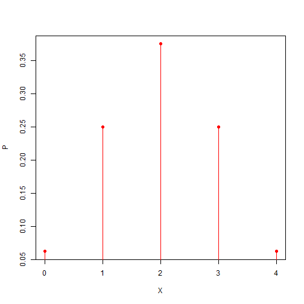
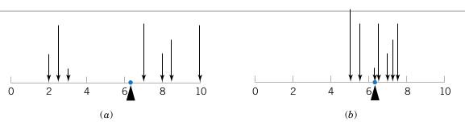
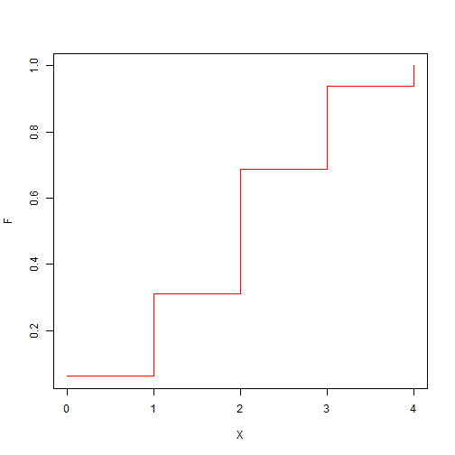

Introducción a la estadística
======================================================
author: Alejandro Cáceres
date:  
autosize: true

Escuela Técnica Superior de Ingeniería de Barcelona Este  
Universitat Politècnica de Catalunya (UPC)
 

 Capítulo 4 

Objetivo
======================================================

- Variables aleatorias
- Función de probabilidad
- Media, varianza y momentos de variables aleatorias
- Distribución de probabilidad acumulada

Probabilidad
======================================================

Probabilidad
==================================================

¿Cómo asignamos valores a la función de probabilidad?

** Interpretación clásica: **

Siempre que un espacio muestral consta de N eventos posibles que son igualmente probables, la probabilidad de cada resultado es $\frac{1}{N}$.

Tenga en cuenta que esto es puramente en el espacio modelo. La intención es hacer de la probabilidad una cantidad puramente abstracta (matemática). Nos corresponde a nosotros interpretar lo que significa **igualmente probable**.

Probabilidad
==================================================

Considere el lanzamiento de una moneda.

- espacio muestral: {H, T} o {0,1} si asignamos 0: H y 1: T.
- Desde el diseño, antes de lanzar una moneda en particular, no hay **razón** para pensar que un resultado es más probable que el otro.

luego:

- $P(0)=\frac{1}{2}$
- $P(1)=\frac{1}{2}$

Lo mismo es cierto para un dado $P(i)=1/6$ y para la lotería de Navidad $P(i)=\frac{1}{N tickets}$.

Probabilidad
==================================================
Si definimos la función $X$ en el espacio muestral de acuerdo con la asignación

X:{H,T} $\rightarrow$ {0,1}

luego

- $P(X=0)=\frac{1}{2}$
- $P(X=1)=\frac{1}{2}$

Llamamos $ X $ a ** variable aleatoria **

Probabilidad
==================================================

¿Cómo puedes tener probabilidades desiguales?

- Miremos de nuevo los dados e imaginemos que necesitas lanzar un 6 para ganar el juego de aparchís.

- su probabilidad de ganar en el próximo lanzamiento es $P(6)=1/6$
- tu probabilidad de no ganar en el próximo lanzamiento es $P(E=1\cap 2\cap 3\cap 4\cap 5)=5/6$

Tenga en cuenta que no necesitamos (o no podemos) ejecutar el experimento muchas veces.

Probabilidad
==================================================

Definamos la variable aleatoria

X:{1 $\cap$ 2 $\cap$ 3 $\cap$ 4 $\cap$ 5, **6**} $\rightarrow$ {0,1}

Luago

- $P(X=0)=\frac{5}{6}$
- $P(X=1)=\frac{1}{6}$

Estas también son las probabilidades del lanzamiento de una moneda desequilibrada.

Variable aleatoria
==================================================

**Definición:**

Una variable aleatoria es una función que asigna un número real a cada resultado en el espacio muestral de un experimento aleatorio.

- Más comúnmente, una variable aleatoria es la **medición** numérica de interés que se realiza en un experimento aleatorio.

Medición
==================================================

**Definición:**

El proceso de medición es la asignación de un número a una característica de un objeto o evento para que pueda compararse con otros objetos o eventos.

Propiedades:

- tipo: nominal (Hombre / Mujer), ordinal (1º, 2º, .. 3º), intervalo (distancia) y proporciones (longitud)
- magnitud: un valor numérico producido por un instrumento
- unidad: una referencia universal a la que se hacen comparaciones (mediciones)
- **incertidumbre**: errores en el proceso de medición

Medición
==================================================

El resultado de un proceso de medición no siempre es el mismo: variable aleatoria

Una variable aleatoria puede ser:
- Discreto (nominal, ordinal)
- Continuo (intervalo, relación)

Variable aleatoria discreta
==================================================

Mostramos cómo un valor de variables aleatorias representa un evento del experimento que se compone de conjuntos de resultados primarios (quizás no observados), cada uno con la misma probabilidad de que el experimento esté en.

Ejemplo extremo:

- En física, llamamos a estos eventos primarios, micro-estados. Un microestado es aquel en el que conocemos todas las posiciones y velocidades de todos los átomos de un gas.

- la temperatura de un gas en equilibrio con el ambiente es una **variable aleatoria** y un valor de 20 grados es un evento del gas que corresponde a muchos micro-estados. La temperatura es la energía cinética promedio.

Variable aleatoria discreta
==================================================

¿Cómo se trabaja desde las mediciones hasta la función de probabilidad de la variable aleatoria que representa?

- En el ejemplo anterior, esto se hace en un marco teórico completo llamado mecánica estadística.

Consideremos un ejemplo mucho más simple:

Imagine que queremos medir qué tan ruidosa es la transmisión de bits entre dos computadoras. Si tuviera que transmitir 100 bits en un canal ruidoso, ¿cuál debería ser la probabilidad de transmitir 1, 2, 3, ... 100 errores?

Variable aleatoria discreta
==================================================

Espacio muestral de un bit: {correcto, error} cada uno igualmente probable

Espacio muestral conjunto de 100 bits:

$\{correct|correct|...|correct|correct,$ 

$\,correct|correct|...|correct|error,$ 

$\,correct|correct|...|error|error,$ .... 

$\,error|error|error|...|error\}$

Para cada bit, hay dos resultados posibles, para 100 bits hay
$n=2\times 2 \times ... \times 2=2^{100}$
eventos primarios.

Variable aleatoria discreta
==================================================

Número de bits con errores en ** cualquier ** resultado

Espacio muestral para 100 bits:

$\{correct|correct|...|correct|correct:$**0**, 
$\,correct|correct|...|correct|error:$**1**,
$\,correct|correct|...|error|correct:$**1**, 
....
$\,correct|correct|...|error|error:$**2**, 
.... 
$\,error|error|error|...|error:$**100**}

Variable aleatoria discreta
==================================================

El número de bits con errores en **cualquier** resultado es una variable aleatoria X

X es una variable aleatoria tal que $X \in {0,1,2,..100}$

Tenga en cuenta que los valores de X se asignan a un número diferente de resultados (algunos valores de X tienen más microeventos que otros y, por lo tanto, serán más probables)

Función de probabilidad
==================================================

Veamos en detalle una transmisión de 5 bits.

- ¿Cuál es la probabilidad de transmitir $X$ número de errores en una transmisión de 5 bits de un canal totalmente ruidoso?

Función de probabilidad
==================================================

Espacio muestral para 5 bits:
 $\{0|0|0|0|0$:**0**,
 $\{0|0|0|0|1$:**1**,
 $\{0|0|0|1|0$:**1**,
 ...
 $\{0|0|0|1|1$:**2**,
 ...
 $1|1|1|1|1$:**5**,

¿cuántos eventos primarios para X=0,1,2,3,4,5?

Función de probabilidad
==================================================

Es como seleccionar grupos de tamaño $x$ conjuntos de un conjunto de  $n$

- $X=0$ aparece como el número de subconjuntos de tamaño 0 ($n_0=1$) de un conjunto de 5 elementos
- $X=1$ aparece como número de subconjuntos de tamaño 1 ($n_1=5$)
- $X=x$ aparece como número de subconjuntos de tamaño x ($n_x=\binom 5 x$)

$X$ capital es la variable, $x$ tamaño del script es un valor observado / realizado de $X$

Tenga en cuenta que $\sum_{x=0}^5 \binom 5 x =2^5$ es el tamaño del espacio muestral

Coeficiente binomial
==================================================

El coeficiente binomial entre dos números $n$ y $k$ se define como

$\binom n k =\frac{n!}{k!(n-k)!}$

donde el factorial $!$ en un número $r$ se define como $r!=1 * 2 * 3 * ... (r-1) * r$

- el coeficiente binomial dan los coeficientes de expansión

$(x+y)^n=\sum_{i=0}^n\binom n k x^{n-k}y^k$

- dan el número de subconjuntos de tamaño $k$ que se pueden hacer con un conjunto de tamaño $n$ ($k$ número en la fila $n$ del triángulo de Pascal)

Función de probabilidad
==================================================

Número de microeventos para cada valor de la variable aleatoria

| 0 | 1 | 2 | 3  | 4 | 5 | total |
| --------- | ---------  | ---------  | ---------   | ---------  |---------  | --------- |
| $n_0$ | $n_1$ | $n_2$ | $n_3$  | $n_4$ | $n_5$ | $n_{\cdot}$ |

Dado que cada microevento es igualmente probable,
La tabla de probabilidad es cada número dividido por  $n_{\cdot}=2^5$

| 0 | 1 | 2 | 3  | 4 | 5 | total |
| --------- | ---------  | ---------  | ---------   | ---------  |---------  | --------- |
|  1/32 | 5/32 |  10/32 | 10/32  | 5/32 |  1/32 | 1 |

(*Triángulo de Pascal*)

Nota: ¡este no es el resultado de un experimento! es el resultado de nuestras suposiciones

Función de probabilidad
==================================================

Por lo tanto, la probabilidad de cada valor de la variable aleatoria $X$ es

$P(X=0)=1/32$ 
 $P(X=1)=5/32$
 $P(X=2)=10/32$
 $P(X=3)=10/32$
 $P(X=4)=5/32$
 $P(X=5)=1/32$

La función definida por $f(x_i)=P(X=x_i)$ se llama **función de masa de probabilidad de X**

Función de probabilidad
==================================================

**Definición:**

Para una variable aleatoria discreta X con valores posibles $x_1, x_2, .., x_m$, una probabilidad
La función de masa es una función tal que

- $f(x_i)\geq 0$
- $\sum_{i=1}^m f(x_i)=1$  
- $f(x_i)=P(X=x_i)$

Función de probabilidad
======================================================

Función de probabilidad
======================================================

- Hemos mostrado cómo asignar una función de masa de probabilidad a una variable $X$ que es el resultado de un experimento dado.

- Tenga en cuenta que la definición de $X$ y su función de masa de probabilidad es general sin referencia a ningún experimento. Las funciones viven en el espacio modelo.

- $X$ y $f(x)$ son objetos abstractos que pueden o no asignarse a un experimento

- Tenemos la libertad de construirlos como queramos siempre que respetemos su definición.

- Tienen unas propiedades que se derivan exclusivamente de su definición.

Función de probabilidad
======================================================

Ejemplo:

Considere la siguiente variable aleatoria $X$ sobre los resultados

| Resultado | a | b | c | d  | e | f | 
| --------- | --------- | ---------  | ---------  | ---------   | ---------  |---------  | 
| X | 0 | 0 | 1.5 | 1.5  | 2 | 3 | 

Si cada resultado es igualmente probable (eventos primarios), ¿cuál es la función de masa de probabilidad de $x$?

Función de probabilidad
======================================================

$f(0)=P(X=0)=2/6$
 $f(1.5)=P(X=1.5)=2/6$
 $f(2)=P(X=2)=1/3$
 $f(3)=P(X=3)=1/3$

Podemos calcular, por ejemplo, las siguientes probabilidades para los valores de X

- $P(X>3)$
- $P(X=0\, \cup \, X=2 )$ 
- $P(X \leq 2)$

Función de probabilidad
======================================================

O considere que no nos importa cuáles son los eventos primarios pero tenemos una definición directa de la función de masa de probabilidad

|X | -2 | -1 | 0 | 1  | 2 | 
| --------- | --------- | ---------  | ---------  | ---------   | ---------  | 
| f(x) | 1/8 | 2/8 | 2/8  | 2/8 | 1/8 | 

Todavía podemos calcular las probabilidades sobre los valores de $X$

 $P(X\leq 2)$
 $P(-1\leq X \cap X\leq 1)$
 $P(X>2)$
 $P(X\leq -1 \, \cup  \,X=2)$

Media y varianza
======================================================

Las funciones de masa de probabilidad tienen dos propiedades principales

- su centro
- su propagación

Podemos preguntar,

- ¿alrededor de qué valores de $X$ se concentra la probabilidad?

- Cuán dispersos están los valores de $X$ en relación con sus probabilidades.

Media y varianza
======================================================

Media y varianza
======================================================

Tomemos la perspectiva frecuentista y recordemos que cuando hablamos de datos

- Recordemos que el promedio en términos de las frecuencias de los valores de $x_i$ (resultados)

$$\bar{x}=\sum_{i=1..m} x_i \frac{n_i}{n}$$

fue el centro de gravedad de las observaciones y $m$ es el número posible de resultados para $x_i$ y $n$ la cantidad total de observaciones.

¿Cuál sería el centro de gravedad de $P(X=x_i)$ ($n \rightarrow \infty$)?

Media y varianza
======================================================

**Definición**

La media ($\mu$) o el valor esperado de una variable aleatoria discreta X ($E(X)$) con función de masa $f(x)$ viene dada por

$$ \mu =E(X)=\sum_{i=1}^m x_i f(x_i) $$

Media y varianza
======================================================

Es el centro de gravedad de las probabilidades: el punto donde se equilibran las cargas de probabilidad en una carretera.

Media y varianza
======================================================

¿Cuál es la media de $X$ si su función de masa de probabilidad $f(x)$ está dada por

$P(X=0)=1/32$ 
 $P(X=1)=5/32$
 $P(X=2)=10/32$
 $P(X=3)=10/32$
 $P(X=4)=5/32$
 $P(X=5)=1/32$

E(X)=**0** 1/32 + **1** 5/32 + **2** 10/32 + **3** 10/32 + **4** 5/32 + **5** 1/32 =2.5

Media y varianza
======================================================

Media y varianza
======================================================

En términos similares, definimos la distancia media al cuadrado de la media:

**Definición**

La varianza, escrita como $\sigma^2$ o $V(X)$, de una variable aleatoria discreta X con función de masa $f(x)$ está dada por

$$ \sigma^2 =V(X)=\sum_{i=1}^m (x_i-\mu)^2 f(x_i) $$

- $\sigma$ se llama desviación estándar de la distribución

- Piense en ello como el momento de inercia sobre la media.

Media y varianza
======================================================

¿Cuál es la varianza de $X$ si su función de masa de probabilidad $f(x)$ está dada por?

$P(X=0)=1/32$ 
 $P(X=1)=5/32$
 $P(X=2)=10/32$
 $P(X=3)=10/32$
 $P(X=4)=5/32$
 $P(X=5)=1/32$

Media y varianza
======================================================

Var(X)=**(0-2.5)**$^2$ 1/32 + **(1-2.5)**$^2$ 5/32 + **(2-2.5)**$^2$ 10/32 + **(3-2.5)**$^2$ 10/32 + **(4-2.5)**$^2$ 5/32 + **(5-2.5)**$^2$ 1/32 =1.25

$$Var(X)=\sigma^2=1.25$$
$$\sigma=1.11$$

Funciones de X
======================================================

**Definición**

Para cualquier función $h$ de una variable aleatoria X, con función de masa $f(x)$, su valor esperado está dado por

$$ E[h(X)]=\sum_{i=1}^m h(x_i) f(x_i) $$

Piense en ello como el producto interno entre las funciones $h$ y $f$ en el espacio muestral.

La media es lineal
======================================================

**Propiedad**

El **valor esperado** (media) de una variable aleatoria discreta $Y=a \ times X + b$ satisface

$E(Y)=\mu_Y$
 $=E(a\times X +b)=\sum_{i=1}^m [a\times x_i +b] f(x_i)=a\times E(X) +b$

para $a$ y $b$ escalares (números).

La varianza no es lineal
======================================================

La **varianza** de una variable aleatoria discreta $Y=a \times X + b$ satisface

$V(Y)=V(a\times X +b)$
 $=\sum_{i=1}^m ( y_i-\mu_Y)^2 f(x_i)$
 $= \sum_{i=1}^m ( a\times x_i +b -a\times E(X) -b)^2 f(x_i)$
 $= \sum_{i=1}^m a^2\times(x_i  - E(X) )^2 f(x_i)$
 $= a^2 \times \sum_{i=1}^m (  x_i  - E(X) )^2 f(x_i)$
 $= a^2 V(X)$

para $a$ y $b$ escalares, el segundo paso es porque $ E $ es lineal

Momentos de una variable aleatoria
======================================================

**Propiedad**

La varianza de una variable aleatoria discreta $ X $ satisface

$V(X)=\sum_{i=1}^m (x_i-\mu)^2 f(x_i)$
 $=\sum_{i=1}^m (x_i^2-2x_i\mu+\mu^2) f(x_i)$
 $=\sum_{i=1}^m x_i^2 f(x_i) -2\mu \sum_{i=1}^m x_i f(x_i)  + \mu^2$
 $=\sum_{i=1}^m x_i^2 f(x_i) -2\mu^2 + \mu^2$
 $=\sum_{i=1}^m x_i^2 f(x_i) -\mu^2$ 

Momentos de una variable aleatoria
======================================================
**Propiedad**

La varianza también se puede escribir como

$V(X)=\sum_{i=1}^m (x_i-\mu)^2 f(x_i) =\sum_{i=1}^m x_i^2 f(x_i) -\mu^2$

La varianza es el momento de inercia sobre el centro de masa (media)

Momentos de una variable aleatoria
======================================================

Generalicemos la media y la varianza

¿Cuál es el valor esperado de la función $X^r$?

$$E(X^r)=\mu'_r=\sum_{i=1}^m x_i^r f(x_i) $$

$\mu'_r$ se llama $r$ -momento de X sobre el origen.

Momentos de una variable aleatoria
======================================================

$E(X^r)=\mu'_r=\sum_{i=1}^m x_i^r f(x_i)$

- cuando $r=1$ tenemos la media
$E(X)=\mu=\mu'_1=\sum_{i=1}^m x_i f(x_i)$

- cuando $r=2$ tenemos algo similar a la varianza
$E(X^2)=\mu'_2=\sum_{i=1}^m x_i^2 f(x_i)$

- la distancia cuadrática media desde $x=0$ (¡no desde $\mu$!)

$\mu'_r$ son el $r$-momento de X con respecto al **origen**.

Momentos de una variable aleatoria
======================================================

El valor esperado de $(X-\mu)^r$

$E[(X-\mu)^r]=\mu_r=\sum_{i=1}^m (x_i-\mu)^r f(x_i)$

se llama $\mu_r$ son el $r$-momento de X sobre **la media**.

por lo que el segundo momento sobre la media es la varianza

$\mu_2=V(X)=\sigma^2$

Momentos de una variable aleatoria
======================================================

¿Cómo se relacionan $\mu'_r$ y $\mu_r$?

$E[(X)^r]=\mu'_r=\sum_{i=1}^m (x_i-\mu+\mu)^r f(x_i)$ 
 $=\sum_{i=1}^m \sum_{j=0}^r \binom r j \mu^{r-j}(x_i-\mu)^j f(x_i)$
 $=\sum_{j=0}^r \binom r j \mu^{r-j} \sum_{i=1}^m (x_i-\mu)^j f(x_i)$
 $=\sum_{j=0}^r \binom r j \mu^{r-j} \mu_{j}$

para $r=2$

$\mu'_2=\binom 2 0 \mu^2 \mu_0 + \binom 2 1 \mu \mu_1 + \binom 2 2 \mu_2$
 $=1*\mu^2*1+2*\mu*0+ 1*\mu_2=\mu^2 + \mu_2$

Momentos de una variable aleatoria
======================================================

cuando $r=2$ tenemos $\mu'_2 =\mu^2+\mu_2  =\mu^2 +\sigma^2$ 

$$ V(X)=\mu'_2 - \mu^2$$

o

$$ V(X)=E(X^2) - \mu^2$$

Esta es una fórmula muy útil para calcular la varianza, ya que a menudo es más fácil calcular $E(X^2)$ que $E[(X- \ mu)^2]$

Distribución de probabilidad acumulada
==================================================

Recordemos que para las observaciones (DATOS) definimos la frecuencia relativa acumulada.

$$F_i=\sum_{k=1..i} \frac{n_k}{n}$$

Por tanto, según la interpretación frecuentista, también tenemos la función acumulativa equivalente

Distribución de probabilidad acumulada
==================================================

**Definición:**

La función de distribución acumulativa se define como

$$F(x)=P(X\leq x) $$

Esa es la probabilidad acumulada hasta un valor dado $x$

Distribución de probabilidad acumulada
==================================================

Veamos nuestra transmisión de canal ruidoso. La función de masa de probabilidad está dada por $f (x)=P (X=x)$

$f(0)=P(X=0)=1/32$ 
 $f(1)=P(X=1)=5/32$
 $f(2)=P(X=2)=10/32$
 $f(3)=P(X=3)=10/32$
 $f(4)=P(X=4)=5/32$
 $f(5)=P(X=5)=1/32$

Distribución de probabilidad acumulada
==================================================

¿Cuál es la probabilidad de obtener como máximo tres errores ($X=3$)

$F(3)=P(X\leq 3)$ 
 $=P(X=0)+P(X=1)+P(X=2)+P(X=3)=26/32$

Distribución de probabilidad acumulada
==================================================

La función de distribución acumulativa viene dada por

$F(3) =P(X\leq 3) =f(0)+f(1)+f(2)+f(3)$
 $=\sum_{x_i\leq 3} f(x_i)$

en términos de la función de masa de probabilidad

Distribución de probabilidad acumulada
==================================================

Para variables aleatorias discretas, la distribución de la función acumulativa se define como

$$F(x)=\sum_{x_i\leq x} f(x_i)$$

La acumulación de probabilidad masiva hasta $x$

Distribución de probabilidad acumulada
==================================================

Calcule la **distribución de función acumulativa **de la siguiente función de masa de probabilidad:
 $f(0)=1/32$, $f(1)=5/32$, $f(2)=10/32$, $f(3)=10/32$, $f(4)=5/32$, $f(5)=1/32$

Calculemos puntos específicos

$F(0)=1/32$ 
 $F(1)=6/32$
 $F(2)=16/32$
 $F(3)=26/32$
 $F(4)=31/32$
 $F(5)=32/32$

Distribución de probabilidad acumulada
==================================================

$F(0)=1/32$, $F(1)=6/32$, $F(2)=16/32$, $F(3)=26/32$, $F(4)=31/32$, $F(5)=32/32$

Por $X \in \mathbb{Z}$
\[
    F(x)=
\begin{cases}
    1/32,& \text{if } x < 1\\
    6/32,& 1\leq x < 2\\
    16/32,& 2\leq x < 3\\
    26/32,& 3\leq x < 4\\
    31/32,& 4\leq x < 5\\
    32/32,& 5\leq x \\
\end{cases}
\]

Distribución de probabilidad acumulada
==================================================

Distribución de probabilidad acumulada
==================================================

$F(x)$ satisface:

- $0\leq F(x) \leq 1$
- Si $x \leq y$, entonces $F (x) \leq F (y)$

Distribución de probabilidad acumulada
==================================================

Calcule la función de probabilidad de masa de la siguiente distribución de probabilidad acumulada:

$F(0)=1/32$, $F(1)=6/32$, $F(2)=16/32$, $F(3)=26/32$, $F(4)=31/32$, $F(5)=32/32$

Trabajemos al revés.

$f(0)=F(0)=1/32$ 
 $f(1)=F(1)-f(0)=6/32-1/32=5/32$ 
 $f(2)=F(2)-f(1)-f(0)=F(2)-F(1)=10/32$ 
 $f(3)=F(3)-f(2)-f(1)-f(0)=F(3)-F(2)=10/32$ 
 $f(4)=F(4)-F(3)=5/32$ 
 $f(5)=F(5)-F(4)=1/32$ 

Distribución de probabilidad acumulada
==================================================

La distribución de probabilidad acumulada es otra forma de especificar la probabilidad de una variable aleatoria

$$f(x_i)=F(x_i)-F(x_{i-1})$$

con

$$f(x_1)=F(x_1)$$

para $X$ tomando valores en  $x_1 \leq x_2 \leq ... \leq x_n$

Resumen
==================================================

| cantidad | modelo | datos |
| ----------------- | ------ | ---- |
| función de masa de probabilidad / frecuencia relativa          |  $P(X=x_i)=f(x_i)$ | $f_i=\frac{n_i}{n}$ |
| función de probabilidad acumulada / frecuencia relativa acumulada          |  $F(x_i)=P(X \leq x_i)$ | $F_i=\sum_{j\leq j} f_i$   |
| media / media (1er momento sobre el origen) | $\mu$, $\mu'_1$, $E(X)=\sum_{i(outcome)} x_i f(x_i)$ | $\bar{x}=\sum_{j(observation)} x_j/n$ |   
| varianza (segundo momento sobre la media) |$\sigma^2$, $\mu_2$, $V(X)=\sum_i (x_i-\mu)^2 f(x_i)$ | $s^2=\sum_j (x_j-\bar{x})^2/(n-1)$ |   
| desviación estándar | $\sigma$, $\sqrt{V(X)}$ | $s$ |
| 2º momento sobre el origen | $\mu'_2$,$E(X^2)=\sum_i (x_i)^2 f(x_i)$ | $M'_2=\sum_j x_j^2/n$|

Resumen
====================================================

- $V(x)=E(X^2)-\mu^2$
- $E(X^r)=\mu'_r$ r-momento sobre el **origen**
- $E((X-\mu)^r)=\mu_r$  r-momento sobre la **media**

Teorema de Chebyshev
==================================================

Propiedad general de probabilidades de variales discretas y continuas.

¿Cuál debería ser la probabilidad de un valor que esté lejos de la media?

Intuitivamente pensamos que debería ser bajo porque

- la probabilidad debe concentrarse en la media.
- la probabilidad de valores altos debería disminuir lejos de la media.

¿Es suficiente la definición de funciones de masa (densidad de probabilidad) para sustentar estas ideas?

Teorema de Chebyshev
==================================================

Para cualquier variable aleatoria X con media $\mu$ y varianza $\sigma^2$,

**Teorema**

$$P(|X -\mu| \geq a\sigma) \leq \frac{1}{a^2}$$

para cualquier $a> 0$.

- Vamos a considerar variables discretas $X \in \mathbb{Z}$

- Los mismos argumentos se pueden aplicar al caso continuo reemplazando sumas por integrales.

Teorema de Chebyshev
==================================================

Considere $\sigma=1$ como ejemplo, la probabilidad de tener valores a 1 unidad de desviación estándar de la media es $\leq 1$ (trivial)

Teorema de Chebyshev
==================================================

Considere $\sigma=2$ como ejemplo, la probabilidad de tener mediciones a 2 unidades de desviación estándar de la media es $\leq 1/2^2 =1/4$

Teorema de Chebyshev
==================================================

considere $\sigma=1$ como ejemplo

| a | Regla de Chebyshev para cualquier función de probabilidad |
| ------- | ---------------------- | 
| 1,5 | menos del 44% | 
| 2 | menos del 25% | 
| 3 | menos del 11,1% |
| 4 | menos del 6,3% |

A medida que nos alejamos cada vez más de la media, medida por la desviación estándar, la probabilidad disminuye y las mediciones son más raras.

Teorema de Chebyshev
==================================================

  $\sigma^2 = \sum_{i=1}^n (x_i-\mu)^2 f(x_i)$
  $=  \sum_{i \in \{|x_i-\mu|\geq a\sigma\}(zona \, roja)}  (x_i-\mu)^2 f(x_i)$
  $+   \sum_{i \in \{|x_i-\mu|\leq a\sigma\}(zona \, azul)}  (x_i-\mu)^2 f(x_i)$

$\sigma^2$ calculado fuera de la distancia $a\sigma$ (rojo) y dentro de $a\sigma$ (azul). Ambas integrales son positivas.

Teorema de Chebyshev
==================================================

$\sigma^2 \geq   \sum_{i \in \{|x_i-\mu|\geq a\sigma\}(zona \, roja)}  (x_i-\mu)^2 f(x_i)$
                
$\sigma^2$ es mayor que la suma fuera de $a\sigma$ solo porque todos los términos son positivos

Teorema de Chebyshev
==================================================

$\sigma^2 \geq   \sum_{i \in \{|x_i-\mu|\geq a\sigma \}(zona \, roja)}  (x_i-\mu)^2 f(x_i)$
  $\geq   \sum_{i \in \{|x_i-\mu|\geq a\sigma\}(zona \, roja)}   a^2 \sigma^2 f(x_i)$

porque para aquellos X tales que están en la zona roja $|X-\mu|\geq a\sigma$ entonces $$(X-\mu)^2 \geq a^2\sigma^2$$ 

Teorema de Chebyshev
==================================================

 $\sigma^2 \geq \sum_{i \in \{|x_i-\mu|\geq a\sigma\}(zona \, roja)} a^2 \sigma^2 f(x_i)$
  $=a^2\sigma^2 \sum_{i \in \{|x_i-\mu|\geq a\sigma\}(zona \, roja)}  f(x_i)$
  $=a^2 \sigma^2 P(|X-\mu|\geq a\sigma)$

Resumiendo

$\sigma^2\geq a^2 \sigma^2 P(|X-\mu|\geq a\sigma)$

luego

$\frac{1}{a^2} \geq P(|X-\mu|\geq a\sigma)$

