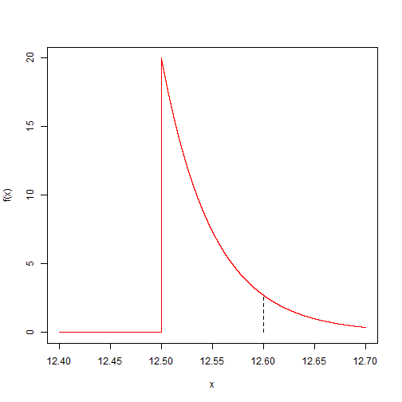
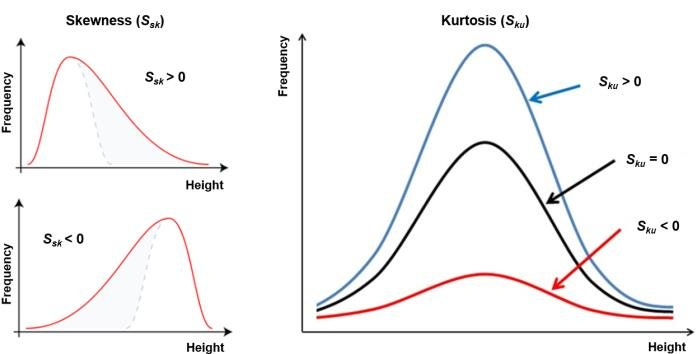
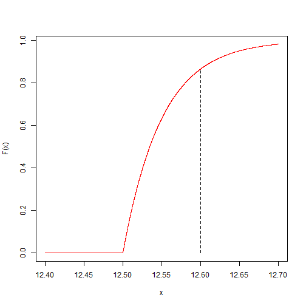

Introduction to statistics 
========================================================
author: Alejandro Cáceres
date:  
autosize: true

Barcelona East School of Engineering<br> 
Universitat Politècnica de Catalunya (UPC)
 

<p style="font-size:70px">Lecture </p>


Objetivo
======================================================

- Variables aleatorias continuas
- Momentos de variables aleatorias continuas
- Función de densidad de probabilidad
- Teorema de Chebyshev


Variables aleatorias discretas
==================================================

Para una variable aleatoria discreta X con valores posibles $x_1, x_2, .., x_m$, una **probabilidad
función de masa** es una función tal que


- $f(xi)\geq 0$
- $\sum_{i=1}^m f(x_i)=1$  
- $f(x_i)=P(X=x_i)$

En la interpretación frecuentista, tenemos que
$f_i=\frac{n_i}{n} \rightarrow f(x_i)=P(X=x_i)$ cuando $n \rightarrow \infty$ ($f_i$ son frecuencias observadas $f(x_i)$ son probabilidades!) .


Variable aleatoria continua
==================================================

¿Qué pasa con las variables continuas?


```
        outcome   ni          fi
1  [0.801,20.9] 2274 0.456718217
2   (20.9,40.7]  992 0.199236795
3   (40.7,60.6]  982 0.197228359
4   (60.6,80.5]  178 0.035750151
5    (80.5,100]  169 0.033942559
6     (100,120]  142 0.028519783
7     (120,140]   58 0.011648925
8     (140,160]  104 0.020887728
9     (160,180]   42 0.008435429
10    (180,200]   38 0.007632055
```

Variable aleatoria continua
==================================================

- Redefinimos los resultados como pequeños intervalos regulares (bins) y calculamos la frecuencia relativa para cada uno de ellos como hicimos en el caso discreto.

$f_i=\frac{n_i}{n} \rightarrow f(x_i)=P(X=x_i)$


La probabilidad ahora depende de la longitud de los contenedores $\Delta x$. Si hacemos los contenedores cada vez más pequeños, las frecuencias se vuelven más pequeñas y también deberíamos tener

$P(X=x_i) \rightarrow 0$ when $\Delta x \rightarrow 0$


Variable aleatoria continua
==================================================

Por lo tanto, definimos una cantidad en un punto $x$ que es la cantidad de probabilidad que encontraríamos en un contenedor infinitesimal $dx$ en $x$

$$f(x)= \frac{P(x\leq X \leq x+dx)}{dx}$$

$f(x)$ es una función de **densidad** de probabilidad. Por lo tanto, la probabilidad de $x$ entre $x$ y $x + dx$
es dado por

$$P(x\leq X \leq x+dx)= f(x) dx$$


Función de densidad de probabilidad
==================================================

**Definición**

Para una variable aleatoria continua $X$, una función de densidad de probabilidad es tal que

- $f(x) \geq 0$
- $\int_{-\infty}^{\infty} f(x) dx = 1$
- $P(a\leq X \leq b)=\int_{a}^{b} f(x) dx$


Función de densidad de probabilidad
==================================================

- Las funciones de densidad de probabilidad son un paso adelante en la abstracción de probabilidades: sumamos el límite continuo ($dx \rightarrow 0 $).

- Todas las propiedades de las probabilidades se traducen en términos de densidades ($\sum \rightarrow \int$).

- La asignación de probabilidades a una variable aleatoria se puede realizar con argumentos de equiprobabilidad (clásicos).

- Las densidades son cantidades matemáticas que algunas se asignarán a experimentos que otras no. *¿Qué densidad se corresponderá mejor con mi experimento?*

Función de densidad de probabilidad
==================================================

Un proceso de producción en línea requiere perforar un agujero de $12.5 mm$ en un disco metálico. A veces, el taladro se mueve y abre agujeros un poco más grandes.

- **Creemos** que $$f(x)=20 e^{-20(x-12.5)}$$  para $12.5 \leq x$ y  $f(x)=0$ y $x\leq 12.5$ 

Más adelante aprenderemos qué significa precisamente *creer*.

Función de densidad de probabilidad
==================================================

Podemos usar la función para calcular, por ejemplo, la densidad $x =12.6$, $f (12.6) =2.70$



Media
==================================================

Como en el caso discreto, la ** media ** mide el centro de la distribución

**Definición**

Suponga que $X$ es una variable aleatoria continua con probabilidad **densidad** función $f(x)$. El valor medio o esperado de $X$, denotado como $\mu$ o $E(X)$, es

$$\mu=E(X)=\int_{-\infty}^\infty x f(x) dx$$


Es la versión continua del centro de masa.

Media
==================================================

Si el ejercicio tiene la distribución de densidad de probabilidad

- $f(x)=20 e^{-20(x-12.5)}$ for $12.5 \leq x$ 
 
- y  $f(x)=0$ for $x\leq 12.5$
 

¿Cuál es el diámetro esperado?


Media
==================================================

$E(X) = \int_{-\infty}^\infty x f(x)dx$
</br>$= \int_{-\infty}^\infty 20 x e^{-20(x-12.5)}dx$
</br>$= -xe^{-20(x-12.5)} -\frac{1}{20}e^{-20(x-12.5)}\bigm|_{12.5}^\infty$
</br>$= 12.5 + 0.05 = 12.55$

Segunda línea: integración por partes. $\int uv' = uv -\int u'v$

Última línea: en el límite, $x\rightarrow\infty$  valor de la integral es 0

Varianza
==================================================

Como en el caso discreto, la varianza mide la dispersión sobre la media

**Definición**

Suponga que $X$ es una variable aleatoria continua con función de densidad de probabilidad $f (x)$. La varianza de $X$, denotada como $\sigma^2$ o $V (X)$, es

$$\sigma^2=V(X)=\int_{-\infty}^\infty (x-\mu)^2 f(x) dx$$


Propiedades de media y varianza
==================================================

- Para cualquier función $h$ de una variable aleatoria X, con función de densidad $f(x)$, su valor esperado viene dado por

$E[h(X)]= \int_{-\infty}^\infty h(x) f(x) dx$


Para $a$ y $b$ escalares, el principal es lineal pero la varianza no lo es ($Y =h (X) =a X + b$)

- $E(a X +b)= \int [a x +b] f(x)dx = a E(X) +b$

- $V(a X +b)=  a^2 V(X)$


La varianza no es lineal: demostración
==================================================
para $Y =a X + b$, $E (Y) =\mu_Y$

$V(a X +b) = \int (a x +b-\mu_Y)^2 f(x)dx$
</br>$=  \int ( a x +b -a E(X) -b)^2 f(x)dx$
</br>$=  \int a^2(x  - E(X) )^2 f(x)dx$
</br>$=  a^2  \int (  x  - E(X) )^2 f(x)dx$
</br>$=  a^2 V(X)$ 

Varianza
==================================================


Si el taladro tiene la distribución de densidad de probabilidad

- $f(x)=20 e^{-20(x-12.5)}$ para $12.5 \leq x$ 
 
- y  $f(x)=0$ para $x\leq 12.5$ 
 
¿Cuál es la varianza de $f (x)$?

Por supuesto, podemos hacer la integral, pero para calcular esta varianza es mejor calcular primero el segundo momento sobre el origen.

Momentos de una variable aleatoria continua
==================================================

Similar al caso discreto, la varianza de una variable aleatoria continua $X$ satisface

$V(X)=\int_{-\infty}^\infty (x-\mu)^2 f(x)dx$
</br>$=\int (x^2-2x\mu+\mu^2) f(x)dx$
</br>$=\int x^2 f(x)dx -2\mu\int x f(x) dx + \mu^2$
</br>$=\int x^2 f(x)dx -2\mu^2 + \mu^2$
</br>$=\int x^2 f(x)dx -\mu^2$

donde $E(x^2)=\int x^2 f(x)dx$ es el segundo momento sobre el origen.

Momentos de una variable aleatoria continua
==================================================


**Propiedad**

La varianza también se puede escribir como

$$\sigma^2=V(X)=\int_{-\infty}^\infty (x-\mu)^2 f(x) dx=\int_{-\infty}^\infty x^2 f(x) dx-\mu^2$$

Recuerde la propiedad de las variables aleatorias **discretas**

$$\sigma^2=V(X)=\sum_{i=1}^n (x_i-\mu)^2 f(x_i) =\Sigma_{i=1}^n x_i^2 f(x_i) -\mu^2$$

La varianza es el momento de inercia sobre el centro de masa


Momentos de una variable aleatoria continua
==================================================


Si el taladro tiene la distribución de densidad de probabilidad

- $f(x)=20 e^{-20(x-12.5)}$ para $12.5 \leq x$ 
 
- y  $f(x)=0$ para $x\leq 12.5$ 
 
¿Cuál es la varianza de $f (x)$?


usemos

$V(X)=E(X^2) -\mu^2$


Momentos de una variable aleatoria continua
==================================================


$V(X)=\sigma^2 = \int_{-\infty}^\infty x^2 f(x)dx - \mu^2$
</br>$= \int_{-\infty}^\infty 20 x^2 e^{-20(x-12.5)}dx - \mu^2$
</br>$= -x^2e^{-20(x-12.5)}\bigm|_{12.5}^\infty + \int_{-\infty}^\infty 2x e^{-20(x-12.5)}dx - \mu^2$
</br>$= 12.5^2 + \frac{2\mu}{20} -\mu^2 = [12.5^2 + \frac{2*12.5}{20}+\frac{1}{20^2}]+\frac{1}{20^2} -\mu^2$
</br>$= (12.5 + \frac{1}{20})^2+\frac{1}{20^2} -(12.5 + \frac{1}{20})^2$
</br>$= \frac{1}{20^2}$

Recuerde  $\mu=12.5+1/20=12.55$ 

entonces $\mu=12.5+\sigma$


Momentos de una variable aleatoria continua
==================================================

Recordemos que el momento $r$ **sobre el origen** son los valores esperados de la función $X^r$

$E(X^r)=\mu'_r=\int_{-\infty}^\infty x^r f(x) dx$


- el primer momento sobre el origen $r =1$ es la media

$E(X)=\mu=\mu'_1=\int_{-\infty}^\infty x f(x) dx$


- el segundo momento sobre el origen $r=2$ es

$\mu'_2=\int_{-\infty}^\infty x^2 f(x) dx$


Momentos de una variable aleatoria continua
==================================================

El valor esperado de $\mu_r=(X-\mu)^r$ es el $r$-momento de X con **aproximadamente la media**.

$E[(X-\mu)^r]=\mu_r=\int_{-\infty}^\infty (x-\mu)^r f(x) dx$

- el momento cero sobre la media es
 
 $\mu_0 =1$

- el primer momento sobre la media es

$\mu_1 =0$

- el segundo momento sobre la media es la varianza  
$\mu_2 =V (X) =\sigma^2$


Momentos de una variable aleatoria continua
==================================================


¿Cómo se relacionan $\mu'_r$ y $\mu_r$?

$E[(X)^r]=\mu'_r=\int_{-\infty}^\infty (x-\mu+\mu)^r f(x) dx$
</br>$=\int_{-\infty}^\infty \sum_{i=0..r} \binom r i \mu^{r-i}(x-\mu)^i f(x) dx$
</br>$=\sum_{i=0..r} \binom r i \mu^{r-i} \int_{-\infty}^\infty (x-\mu)^i f(x) dx$
</br>$=\sum_{i=0..r} \binom r i \mu^{i} \mu_{r-i}$


- cuando $r =2$ tenemos: $$\mu'_2 =\mu_2 + \mu^2$$ 

recuperamos la propiedad de la varianza: 

$$V (X) =\mu'_2 - \mu^2 =E (X^2) -E (X)^2$$


Momentos de una variable aleatoria continua
==================================================

**Consideración teórica**

- cuando $r=3$ tenemos: $\mu'_3= \mu^0\mu_3+3\mu^1\mu_2+3\mu^2\mu_1+\mu^3\mu_0$

$\mu'_3= \mu_3+3\mu\mu_2+\mu^3$


Momentos estandarizados:

- Asimetría: $\frac{\mu_3}{\sigma^3}$ nos dice qué tan simétrica es la densidad de probabilidad con respecto a la media.

- curtosis: $\frac{\mu_4}{\sigma^4}$ nos dice cuánta probabilidad podemos encontrar lejos de la media.


Momentos de una variable aleatoria continua
==================================================

**Consideración teórica**


Asimetría y curtosis




Función generadora de momentos
==================================================

**Consideración teórica**


¿Existe alguna forma de calcular los momentos de forma automática?

**Definición**

Otra forma de codificar la información de la distribución de probabilidad es mediante una función $M_x$ definida como:

$M_X(t)=E(e^{tX})=\int_{-\infty}^{\infty}  e^{tx} f(x)dx$


Que da los momentos por una simple diferenciación

$\mu'_r =\frac{d^r M_X(t)}{dt^r}\bigm|_{t=0}$


Función generadora de momentos
==================================================

**Consideración teórica**

Recuerde

$\frac{d^re^{tx}}{dt^r}=x^r e^{tx}$

así que

$\frac{d^re^{tx}}{dt^r}\bigm|_{t=0}=x^r$

por lo tanto

$\frac{d^r M_X(t)}{dt^r}\bigm|_{t=0}=\int_{-\infty}^{\infty}  x^r f(x)dx$

es el $r$-momentode $X$

Función generadora de momentos
==================================================

**Consideración teórica**

Para el taladro 

- $f(x)=20 e^{-20(x-12.5)}$ para $12.5 \leq x$ 
 
-  y  $f(x)=0$ para $x\leq 12.5$ 
 
¿Cuáles son los momentos de $f(x)$?

Función generadora de momentos
==================================================

**Consideración teórica**

$M_X(t)=E(e^{tX}) =  \frac{20}{20-t} e^{12.5t}$

- El primer momento sobre el origen es la media $\mu$

$E(X)==\mu'_1= \frac{d M_X(t)}{dt}=12.55 = \mu$

- El segundo momento sobre el origen

$E(X^2)=\mu'_2=\frac{d^2 M_X(t)}{dt^2}\bigm|_{t=0}=\frac{1}{20^2} + \mu*\mu$

- El tercer momento sobre el origen

$\frac{d^3 M_X(t)}{dt^3}\bigm|_{t=0}=E(X^3)=\mu'_3=2$ 


Modelo de probabilidad exponencial
==================================================


Si el taladro tiene la distribución de densidad de probabilidad

- $f(x)=20 e^{-20(x-12.5)}$ para $12.5 \leq x$ 
 
-  y  $f(x)=0$ para $x\leq 12.5$ 
 
podemos cambiar la variable: $z =x-12.5$ y $\lambda =20$

$$f(z)=\lambda e^{-\lambda z}, z\geq 0$$


Modelo de probabilidad exponencial
==================================================

Para una función de densidad de probabilidad

$$f(z)=\lambda e^{-\lambda z}, z\geq 0$$

tenemos

- media: $\mu_z=E(Z)=E(X-12.5) =12.5+\frac{1}{\lambda}-12.5=\frac{1}{\lambda}$ 

- varianza: $\sigma^2_z=V(Z)=V(X)=\frac{1}{\lambda^2}$


Modelo de probabilidad exponencial
==================================================


Entonces podemos plantear la pregunta: si sospechamos que nuestro taladro tiene una densidad de probabilidad de la forma

$$f(z)=\lambda e^{-\lambda z}, z\geq 0$$

¿Cuál sería el valor de $\lambda$ para un conjunto de observaciones de un ejercicio en particular?


Modelo de probabilidad exponencial
==================================================


- Llamamos $f (z)$ un **modelo exponencial** para la probabilidad

- Llamamos $\lambda$ al **parámetro** del modelo

Veremos más sobre modelos y cómo estimar parámetros a partir de datos en las siguientes lecturas.


Función de distribución acumulativa
==================================================

Para variables aleatorias continuas, la distribución de función acumulativa es

$$F(x)=P(X\leq x) =\int_{-\infty} ^x f(u)du$$


la acumulación de probabilidad hasta $x$, dada por el área bajo la curva $f$ hasta $x$.

Función de distribución acumulativa
==================================================

De la definición

$F(x)=P(X\leq x) =\int_{-\infty} ^x f(u)du$

tenemos

- $F(-\infty)= 0$ y $F(\infty)=1$
- if $a\leq b$ luego $F(a)\leq F(b)$
- $P(a \leq X \leq b) = F(b)-F(a)$
- $f(x)=\frac{dF(x)}{dx}$ (Teorema fundamental del cálculo)

Función de distribución acumulativa
==================================================


Veamos la segunda propiedad: $P(a \leq X \leq b) = F(b)-F(a)$

Podemos ver:

$P(a \leq X \leq b) = 1-P(X \leq a)-P(b \leq X)$
</br>$= P(b \leq X) - P(X \leq a)$
</br>$=  F(b)-F(a)$ 

Función de distribución acumulativa
==================================================


Si el ejercicio tiene la distribución de densidad de probabilidad

- $f(x)=20 e^{-20(x-12.5)}$ para $12.5 \leq x$ 
 
-  y  $f(x)=0$ para $x\leq 12.5$ 
 
¿Cuál es la función de distribución acumulativa $F (x)$?


Función de distribución acumulativa
==================================================


$F(x) = \int_{-\infty}^x f(u)du$
</br>$= \int_{-12.5}^x 20 e^{-20(u-12.5)}du$
</br>$= -e^{-20(u-12.5)}\bigm|_{12.5}^x$
</br>$= 1 -e^{-20(x-12.5)}$

$F(x)=0$ para $x\leq 12.5$

o si $Z =X-12.5$

$F(z) = 1 -e^{-\lambda(z)}$, para $z\geq 0$

$F(z) = 0$, para $z < 0$

Función de distribución acumulativa
==================================================





Función de distribución acumulativa
==================================================

Podemos usar la función de distribución acumulada para calcular directamente la probabilidad de que $x \leq 12.6$

Cuál es el valor de $F (x)$ en 12,6.

o $F (12,6) =0,86$


Ejercicio
==================================================


La función de densidad de una variable aleatoria continua $X$ se define como: 

\[
    f(x)= 
\begin{cases}
k(a + bx),& \text{if } x \in (0,1)\\
    0,& x \notin (0,1)\\
\end{cases}
\]

Se sabe además que la esperanza es $E(X) = 4/7$. Determina:

(a) El valor de las constantes $a$,$b$ y $k$ y la varianza de $X$.

Pistas: Formula dos ecuaciones. La primera para la media

- $E(X)=\int x f(x)dx$

la segunda para la probabilidad total:

- $\int f(x) dx= 1$

y resulve para $a$ y $b$.

(b) Determina la función de distribución asociada a $X$: $F(x)$.
(c) Determina la mediana de $X$: o $x_m$ tal que $F(x_m)=0.5$.

