Introducción a la estadística
======================================================
author: Alejandro Cáceres
date:  
autosize: true

Escuela Técnica Superior de Ingeniería de Barcelona Este  
Universitat Politècnica de Catalunya (UPC)
 

 Capítulo 5 

Objetivo
======================================================

Modelos de probabilidad discreta:

- Funciones de probabilidad uniformes y de Bernoulli
- Funciones de probabilidad binomial, geométrica y binomial negativa
- Función de probabilidad hipergeométrica
- Función de probabilidad de Poisson

Modelos de probabilidad discreta
======================================================

Modelos de probabilidad discreta
======================================================

Una función de probabilidad de masa de una variable aleatoria discreta X con valores posibles $x_1, x_2, .., x_m$ es **cualquier función** tal que

- $f(x_i)\geq 0$
- $\sum_{i=1}^m f(x_i)=1$  
- $f(x_i)=P(X=x_i)$

Son objetos abstractos con propiedades generales que pueden o no **describir** un proceso natural o artificial

Modelos de probabilidad discreta
======================================================

Los modelos de probabilidad discreta son funciones de masa de probabilidad que **creemos** describen procesos como experimentos aleatorios reales.

Analogía: Piensa en la función $f(x,y)=x^2+y^2$ 

- $f(x,y)=x^2+y^2$  es un círculo de radio $a$.
- es un objeto abstracto.
- Representa la forma de muchos objetos reales.
- la forma de los objetos reales es una aproximación del círculo.

Modelos de probabilidad discreta
======================================================

Los modelos aleatorios discretos son funciones que son **idealizaciones** de experimentos aleatorios sobre variables discretas.

- ¿Cuál es el modelo más simple?

Modelos de probabilidad discreta
======================================================

La interpretación clásica de probabilidad (Laplace)

Siempre que un espacio muestral consta de N eventos posibles que son igualmente probables, la probabilidad de cada resultado es $\frac {1} {N}$.

En muchas ocasiones:

- podemos razonar los posibles valores que puede tomar una variable aleatoria.

No tenemos ninguna razón para suponer que un resultado sea más probable que el otro.

Distribución uniforme
======================================================

Piensa en un dado o en la lotería:

- podemos contar todos los resultados posibles (dados: 1-6, lotería: 0000-9999)

- creemos firmemente que todos son igualmente probables (dado: $1/6$, lotería: $10 ^ {- 4}$) porque el juego es justo y antes del juego, ¡ignoramos por completo el resultado!

Distribución uniforme
======================================================

**Definición**
Una variable aleatoria X tiene una distribución uniforme discreta si cada uno de los n valores en su rango, por ejemplo, tiene la misma probabilidad. Luego,
$f (x) = \frac {1} {n}$

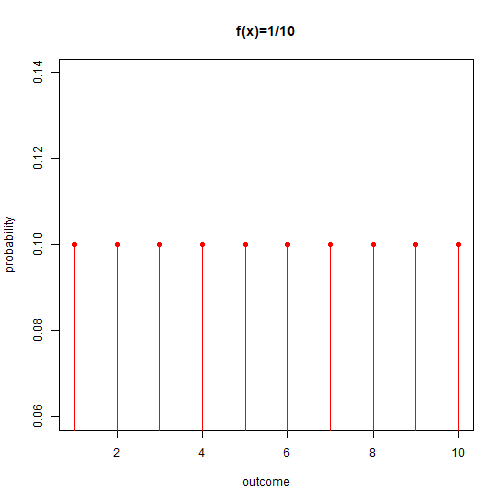

Distribución uniforme
======================================================

- Si $f (x)$ para $x\in\{a, a+1, ...b\}$, donde $a$ y $b$ son números enteros, el tamaño del espacio muestral es: $n = b-a + 1$

- Si todos los eventos son igualmente probables, entonces
$$f (x) = \frac {1} {b-a + 1}$$

Distribución uniforme
======================================================
Calculemos la media de la distribución uniforme.

- cambiando variables para $Y=X-a+1$, $y\in\{1, 2, ...n\}$ luego $f(Y)=\frac{1}{n}$.

- y sabiendo que $\sum_{y=1}^n y = \frac{n(n+1)}{2}$

entonces la media $E(Y)$, viene dada por

$E(Y)=\sum_{y=1}^n y  \frac{1}{n} =\frac{n+1}{2}$

y 

$E(X)=E(Y+a-1)=\frac{n+1}{2}+a-1=\frac{(b-a+1)+1}{2}+a-1=\frac{b+a}{2}$

Distribución uniforme
======================================================

La varianza de $Y$ es

$V(Y) = E(Y^2)-E(Y)^2$

$= \sum_{y=1}^n y^2\big(\frac{1}{n}\big) -E(Y)^2$

$= \frac{1}{n}\frac{n(n+1)(2n+1)}{6} -\big(\frac{n+1}{2}\big)^2$

$= \frac{n^2-1}{12}$

debido a que $V(Y)=V(X)$ entonces 
$V(X)=\frac{(b-a+1)^2-1}{12}$

Distribución uniforme
======================================================

¿Cuál es la media y la varianza de un dado?

Espacio muestral $X\in\{1,2,3,4,5,6\}$ luego $n = 6$

 
- $E(X)=\frac{n+1}{2}=3.5$. Ten en cuenta que el valor esperado no está en el espacio muestral (no es un resultado posible).

- $V(X)=\frac{n^2-1}{12}=2.91$

Ensayos de Bernoulli
======================================================

El caso más simple de una función de probabilidad de masa es donde hay **dos posibles** resultados ($A$ y $B$). Si son igualmente probables, tenemos el lanzamiento de una moneda.

- tratemos de avanzar desde el caso de igual probabilidad y supongamos que los resultados tienen probabilidades desiguales

Ensayos de Bernoulli
======================================================
¿Qué pasa si les dejamos tener diferentes probabilidades?

- resultado A (éxito): tiene probabilidad $p$
- resultado B (falla): tiene probabilidad $q = 1-p$ porque $q + p = 1$.

Luego definimos la variable aleatoria $K$ (mayúscula $K$) donde $k = 1$ (minúscula $k$) cuando la observación es $A$ y $k = 0$ cuando la observación es  $B$.

Ensayos de Bernoulli
======================================================

La función de masa de probabilidad de $K$ es
\[
    P(K=k)=f(k)= 
\begin{cases}
    1-p,& \text{if } k=0\, (evento\, B)\\
    p,& k=1\, (evento\, A) 
\end{cases}
\]

o más corto

$f(k)=(1-p)^{1-k} p^k$, para $k=(0,1)$

Ensayos de Bernoulli
======================================================

Cada vez tenemos dos resultados diferentes, donde podemos definir una variable $k = 0$ para un resultado y $k = 1$ para el otro.

Pensamos en una función de probabilidad de Bernulli $f (k) = (1-p) ^ {1-k} p ^ k$.

- En la distribución uniforme, si conocemos los resultados, la distribución de probabilidad de masa se conoce completamente.

- En un ensayo de Bernoulli nos permitimos la flexibilidad de no conocer el número  $p$ (la relación de probabilidad entre los resultados).

Ensayos de Bernoulli
======================================================

$p$ es un **parámetro** de la distribución: se permite cambiar.

- El ensayo de Bernoulli es realmente una **familia** de distribuciones
- cuando fijamos el valor de $p$ entonces tenemos una sola función de masa de probabilidad $f (k; p)$.

¿Por qué dejamos $p$ libre? porque nuestra esperanza es que los datos, las observaciones reales, nos digan cuál es su valor (lo veremos en el capítulo 7 sobre estimación).

Ensayos de Bernoulli
======================================================

Para las siguientes conferencias, asumiremos que conocemos el valor de $p$.

- Cuando lanzamos una moneda, "sabemos" que $A$: Cruz $\rightarrow k = 1$ y $B$: Cara $\rightarrow k = 0$ tienen probabilidades iguales y por lo tanto $p = 1/2$ y $$f (k) = \frac {1} {2} ^ {1-k} \frac {1} {2} ^ k = \frac {1} {2}$$.

- Si **asumimos** que la probabilidad de transmitir erróneamente ($k = 1$) un bit de información es $p = 1/10$ entonces siendo $k = 0$ una transmisión correcta de un bit, tememos

$$f (k) = \frac {9} {10} ^ {1-k} \frac {1} {10} ^ k$$ 

Ensayos de Bernoulli
======================================================

¿Cuál es la media y la varianza de  $f(k)=(1-p)^{1-k} p^k$?

- La media $E(K)= \sum_{k=0}^1 k f(k)=f(1)=p$

- La varianza
$V(K)= \sum_{k=0}^1 (k-p)^2 f(k)$
 $=  p^2(1-p)+(1-p)^2p$ 
 $=  (1-p)(p^2 + p-p^2)$ 
 $=  (1-p)p = pq$

Distribución binomial
======================================================

Supon que estamos interesados en conocer un ensayo de Bernoulli en particular.

- Repetimos el ensayo de Bernoulli $n$ veces y contamos cuántas veces obtuvimos $A$.

- Definimos una variable aleatoria $K$ tal que cuente en $n$ ensayo cuántas veces obtuvimos el resultado $A$. $k \in {0,1, ... n}$

¿Cuál es la probabilidad de $P (K = k)$?

Distribución binomial
======================================================
- Al lanzar una moneda $n$ veces y contar el número de cruces, ¿Cuál es la probabilidad de observar $k$ cuces en $n$ lanzamientos?

- Al transmitir $n$ bits y contar el número de errores, cuando la transmisión de un solo error es $p$. ¿Cuál es la probabilidad de observar $k$ errores al transmitir $n$ bits?

- Al preguntar a $n$ personas si votarán por el partido político en el gobierno cuando la probabilidad de que alguien vote por el partido gobernante es $p$. ¿Cuál es la probabilidad de observar $k$ votos probables para el partido gobernante en una encuesta de $n$ personas?

Distribución binomial
======================================================

- cada resultado $A$ de un ensayo de Bernoulli que se observa con probabilidad $p$.

- cada resultado $B$ (no  $A$) de un ensayo de Bernoulli que se observa con probabilidad $1-p$.

¡Importante! El experimento aleatorio aquí es el resultado de $n$ experimentos aleatorios independientes (ensayos de Bernoulli): el resultado es la suma de los resultados de Bernoulli.

Distribución binomial
======================================================

- Cuando le preguntamos a 100 personas por sus preferencias de voto, obtendremos $k$, digamos 45; cuando preguntamos a otras 100 personas, obtendremos otros $k$, digamos 40; y así...

Por lo tanto, cada vez que realizamos una encuesta, obtenemos $k$ diferentes, y luego tiene sentido preguntar por la probabilidad de $k$ eventos $P (K = k)$ cuando la probabilidad de que un solo evento sea $p$ .

Queremos encontrar $P (K = k)$ en términos de $p$.

Distribución binomial
======================================================

¿Cuál es la probabilidad de observar $k$ errores al transmitir $n$ bits, cuando la probabilidad de un solo error es $p$?

Observemos primero la probabilidad de una transmisión particular definida por $k$ errores durante $n$ intentos. En un experimento en particular, observamos, por ejemplo, $k$ errores y $n-k$ sin errores.

| ensayo | 1 | 2 | 3 | 4 | ... | n |
| ------- | ------- | ------- | ------- | ------- | ------- | ------- |
| Resultado de Bernulli | sin error | error | sin error | error | ... | sin error |
| Probabilidad de Bernulli | (1-p) | p | (1-p) | p | ... | (1-p) |

Distribución binomial
======================================================

Para obtener la probabilidad de un resultado particular del experimento de $n$ ensayos, como (error, sin error, ..., sin error), con $k$ errores ($A$ resultados) debemos considerar que

- Se observaron errores independientes de $k$ con una probabilidad $p * p ... p$ ($k$ veces)

- $n-k$ independiente no se observaron errores con probabilidad $(1-p) * (1-p) ... (1-p)$ ($n-k$ veces)

Entonces la observación (error, sin error, ..., sin error) con $k$ errores y $n-k$ sin errores tiene probabilidad $(1-p) ^ {n-k}p ^ k$.

Una transmisión en particular es un evento primario.

Distribución binomial
======================================================

Sin embargo, ambos resultados
  (**error**, **sin error**, ..., sin error)
  y
  (**sin error**, **error**, ..., sin error)
  con valores opuestos solamente en el primer y segundo bit, tienen la misma cantidad de $k$ errores.

Estamos interesados en contar errores, y por lo tanto en la probabilidad de observar $k$ en una transmisión del $n$ bits.

Distribución binomial
======================================================

- $k$ errores pueden aparecer de $\binom n k$ diferentes formas: El número de subconjuntos de $k$ elementos de un conjunto de $n$ elementos.

Por lo tanto, la probabilidad de observar el evento de **transmisión** realizado en **cualquier** $k$ errores (resultados individuales de Bernoulli) es

$f (k) = \binom n k (1-p) ^ {n-k}p ^ k$, $k = 0,1, ... n$

Distribución binomial
======================================================

**Definición**

La función de probabilidad binomial es la función de masa de probabilidad de observar $k$ resultados de tipo $A$ en  $n$ ensayos de Bernoulli independientes, donde $A$ tiene la misma probabilidad $p$ en cada ensayo.

La función está dada por

$f (k) = \binom n k (1-p) ^ {n-k}p ^ k$, $k = 0,1, ... n$

Cuando una variable $K$ tiene una función de probabilidad binomial, decimos que se distribuye binomialmente y escribimos

$K \hookrightarrow Bin (n, p)$

Distribución binomial
======================================================

**Perspeciva teórica**

La media de la distribución binomial requiere algo de álgebra, pero su resultado es simple y muy intuitivo.

$E(K)= \sum_{k=0}^n\binom n k  k(1-p)^{n-k} p^k$
 $= \sum_{k=0}^n \frac{n!}{k! (n-k)!}  k (1-p)^{n-k}p^k$
 $= \sum_{k=0}^n \frac{n!}{(k-1)! (n-k)!} (1-p)^{n-k}p^k$
 $= n\sum_{k=0}^n \frac{(n-1)!}{(k-1)! (n-1-(k-1)!)} (1-p)^{n-k}p^k$
 $= n\,\, \sum_{k=0}^n \binom {n-1} {k-1} (1-p)^{n-k}p^k$
 $= np\,\,\sum_{k=1}^n \binom {n-1} {k-1} (1-p)^{(n-1)-(k-1)}p^{k-1}$
 $= np\,\, \sum_{k-1=0}^{n-1} f(k-1)= np$

Distribución binomial
======================================================

La media y la varianza de $K\hookrightarrow Bin(n,p)$ son

- $E(K)=np$
- $V(K)=np(1-p)$

Para demostrar la varianza

- primero encontramos el resultado de $E(K^2)=E(K(K-1))-E(K)=n(n-1)p^2 +np$ 

- y luego usamos  $V(K)=E(K^2)-E(K)^2$

Distribución binomial
======================================================
- La distribución binomial tiene dos parámetros: $n$ y $p$.

- El valor esperado al ejecutar múltiples ensayos de Bernulli y sumar sus resultados es el resultado de multiplicar por $n$ la esperanza de una sola prueba de Bernulli:

$E (K) = np$.

... así que lanzando muchas veces una moneda, podemos conocer la probabilidad de un solo lanzamiento de la moneda.

Distribución binomial
======================================================

Saltemos unas clases hacia adelante.

- ¿Qué pasa si reemplazamos $E (K)$ por el resultado de un sólo experimento de $n$ repeticiones? Si observamos $k = n_{cruces} \sim E (K) = np$

- luego $n_ {cruces}/ n \sim p$.

- ¡Podemos **Estimar** $p$ al repetir un experimento!

Distribución binomial
======================================================

Considera un canal ruidoso donde los bits (0,1) se transmiten aleatoriamente con **la misma probabilidad** la función de probabilidad de la masa de transmitir $k$ número de 1 en una transmisión de 4 bits es

$f(k)= \binom 4 k (\frac{1}{2})^4$

|# de errores | k=0 | k=1  |k=2 | k=3 | k=4 | total   
| -------------- | --------------  |-------------- | -------------- | --------------  |-------------- | --------------|   
|probabilidad| $1/16$ | $4/16$ | $6/16$ | $4/16$ | $1/16$ |  1 | 

Distribución binomial
========================================================

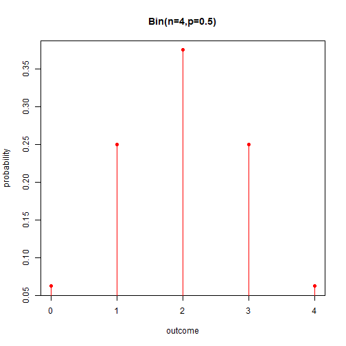

Distribución binomial
========================================================

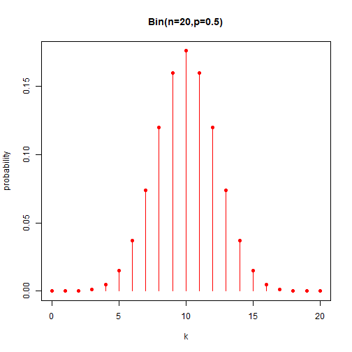

Distribución binomial
========================================================

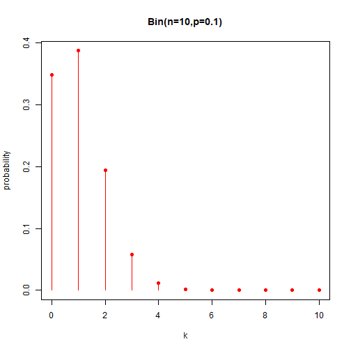

Distribución binomial
========================================================

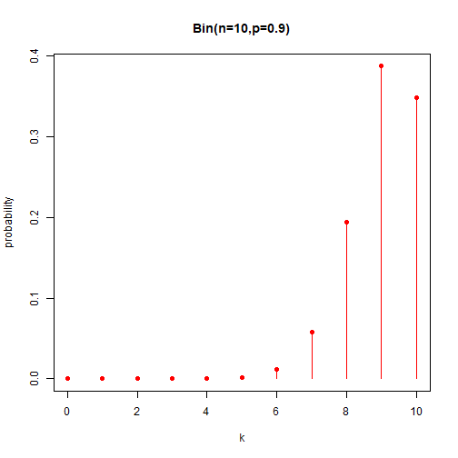

Ejercicio
========================================================

En una población, la probabilidad de que en un parto nazca un niño es $p = 0.51$. Consideramos una familia de 4 hijos.

- Determina la probabilidad de que Ten exactamente un niño o exactamente una niña.

- Calcula la probabilidad de que la familia Ten al menos dos chicos.

- Consideremos otra familia. Calcula el número exacto de hijos que debe tener para que la probabilidad de tener al menos una chica sea mayor de 0.75.

Distribución geométrica para eventos
======================================================

Supongamos que realizamos ensayos de Bernoulli y contamos las veces que aparece $B$ hasta que observemos **la primera vez** que aparece el resultado $A$.

- cuando $p = 1/2$ piensa en lanzar una moneda contar las caras hasta observar la primer cruz:

¿Cuál es la probabilidad de observar $k$ caras hasta la primer cruz?

Distribución geométrica para eventos
======================================================

- al transmitir bits y contar el número de bits correctos **hasta el primer error** si la transmisión de un solo error es $p$:

¿Cuál es la probabilidad de observar $k$ bits correctos hasta que aparezca el primer error?

- al preguntar a las personas si votarán por el partido político en el gobierno, si la probabilidad de que alguien vote por el partido gobernante es $p$:

Cual es la probabilidad
encontrar $k$ votantes de otro partido **hasta que encontremos la primera persona** que votará por el partido gobernante?

Distribución geométrica para eventos
======================================================

Observemos primero la probabilidad de un envío de $k$ bits correctos ($B$) antes del primer error ($A$).

|evento # | 1 | 2  | 3 | 4 | ... | k | k +1 |
| ------- | ------- | -------  | ------- | ------- | ------- | ------- | ------- |
|Bernulli resultado | no error | no error | no error | no error |  ...| no error  | error |
|Bernoulli probabilidad | (1-p) | (1-p)  | (1-p) |  |  ... | (1-p) | p |

La probabilidad de $k$ eventos de tipo $B$ es esta transmisión es

$P(X=k)=f(k)=(1-p)^{k}p$ 

Distribución geométrica para eventos
======================================================

La distribución geométrica para el número de eventos $B$ antes de que se produzca el primer evento $A$

La distribución de la función de probabilidad es

$P(X=k)=f(k)=(1-p)^{k}p$ cuando la variable aleatoria toma valores $k=0,1,2,...$

con 

- media: $E(X)= \sum_{k=0}^\infty k(1-p)^{k}p=\frac{1-p}{p}$

- varianza: $V(X)= \frac{1-p}{p^2}$

Distribución geométrica para eventos
======================================================

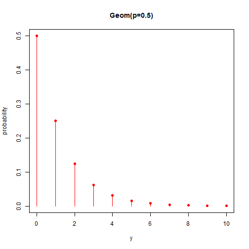

Distribución geométrica para eventos
======================================================

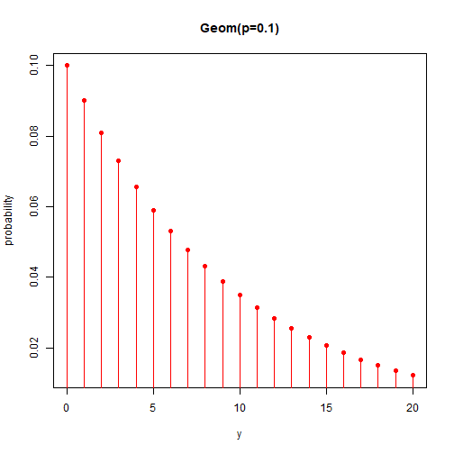

Distribución geométrica para ensayos
======================================================

Imaginemos que queremos contar el número de **ensayos** hasta el primer evento $A$

- ¿Cuántos **lanzamientos** de una moneda en promedio antes de la primera cruz?

- ¿Cuál es el número de **bits** trastimitos hasta que ocurra el primer error?

Distribución geométrica para ensayos
======================================================

Si en la prueba número $m$ apareció el evento $A$, entonces el resultado de este experimento tiene una probabilidad

$P(Y=m)=f(m)=(1-p)^{m-1}p,$ para cuando la variable aleatoria toma valores $m=1,2,3,...$

Nota que $k$ enpieza en 1, y no en 0 como en el caso de que contemos eventos. 

Esta función se llama función de probabilidad **geométrica para ensayos** y tiene

- media: $E(Y)= \sum_{m=1}^\infty m(1-p)^{m-1}p=\frac{1}{p}$

- varianza: $V(Y)= \frac{1-p}{p^2}$

La relación entre eventos número de eventos $X$ y ensayos es $Y=X+1$ o $m=k+1$

Distribución binomial negativa para eventos
======================================================

- Imaginemos ahora que podemos ser tolerantes con un número dado de errores en la transmisión de señales de bits. Digamos que podemos tolerar $r$ errores en una transmisión:

¿Cuál es la probabilidad de observar $k$ bits bien transmitidos antes de $r$ número de errores?

Nota: Nos pregutamos por la probabilidad del número de **eventos** $B$ (no ensayos).

Distribución binomial negativa para eventos
======================================================

Observemos primero la probabilidad de una transmisión en particular con $k$ bits correctos ($B$) antes de $r$ errores ($A$).

Luego observamos $k$ bits sin errores en un total de $k + r$ ensayos.

|ensayo # | 1 | 2  | 3 | 4 | ... | k+r |
| ------- | ------- | -------  | ------- | ------- | ------- | ------- |
|Bernulli resultado | no error | error | no error | error |  ...  | error |
|Bernoulli probabilidad | (1-p) | p  | (1-p) | p |  ...  | p |

Distribución binomial negativa para eventos
======================================================

Consideramos:

- La probabilidad de nuestra transmisión es $(1-p)^kp^r$ donde $p$ es la probabilidad de un error. Sin embargo, las siguientes transmitiones tienen en mismo número de errores: 

(**no error**, error, no error, **error**, ... no error)

(**error**,  error, no error, **no error**, ... no error),

donde ocurre un error en el primer bit y no el cuarto. 

- Todos las transmisiones terminan con un resultado $A$ (error), luego el número total de transmisiones con $k$ número de eventos de tipo $B$ resulta de calular el número de subconjuntos de $k$ elementos de un conjunto de $k + r-1$: $\binom {k + r-1} k$

Distribución binomial negativa para eventos
======================================================

Por lo tanto, la probabilidad de observar $k$ número de eventos de tipo $B$ antes de $r$ eventos de tipo $A$, de probabilidad $p$, es

$P(X=k)=f(k)=\binom {k+r-1} k (1-p)^kp^r$ donde la variable aleatoria $X$ puede tomar valores $k=0,1,...$

Cuando la distribución $X$ es un binomial negativa entonces escribimos

$X \hookrightarrow NB (r, p)$

Distribución binomial negativa para eventos
======================================================

Una variable aleatoria con $X\hookrightarrow NB(r,p)$ tiene

- media: $E(X)= \frac{r(1-p)}{p}$

- varianza: $V(Y)= \frac{r(1-p)}{p^2}$

Nota que esto es $r$ veces la media y la varianza de la distribución geométrica para eventos.

Si realizamos experimentos geométricos $r$ (compuestos en ensayos de Bernoulli), la expectativa para la suma de la cantidad total de eventos  $B$ es la misma al realizar un solo experimento binomial negativo con el parámetro $r$.

Distribución binomial negativa para eventos
======================================================

- Un sitio web tiene tres servidores.

- Un servidor funciona a la vez y solo cuando falla una solicitud se utiliza otro servidor.

- Si se sabe que la probabilidad de falla de una solicitud es $p = 0,0005$, entonces

- ¿Cuál es el número esperado de solicitudes exitosas antes de que fallen los tres equipos?

Distribución binomial negativa para eventos
======================================================

Este es un proceso binomial negativo para el número de éxitos $k$ $(k = 0,1,2, ...)$ antes de $r = 3$ y $p = 0.0005$ por lo tanto

$E(X)=r\frac{1-p}{p}=3\frac{1-0.0005}{0.0005}=5997$

- Ten en cuenta que en realidad hay 6000 ensayos

Distribución binomial negativa para eventos
======================================================

¿Cuál es la probabilidad de tratar como máximo con 5 solicitudes exitosas antes de que falle el sistema?

Recuerde la distribución de funciones acumulada  $F(x)=P(X\leq 5)$

$F(5)=P(X\leq 5)=\Sigma_{k=0}^5 f(k)$
 $=\sum_{k=0}^5\binom {k+2} k  (0.9995)^k(0.0005)^3$
 $=\binom {2} 0 (0.0005)^3 +\binom {3} 1 (0.9995)^1*(0.0005)^3$
 $+\binom {4} 2 (0.9995)^2*(0.0005)^3 +\binom {5} 3 (0.9995)^3*(0.0005)^3$
 $+\binom {6} 4 (0.9995)^4*(0.0005)^3 +\binom {7} 5 (0.9995)^5*(0.0005)^3$
 $= 6.9\times 10^{-9}$

Distribución binomial negativa para eventos
========================================================

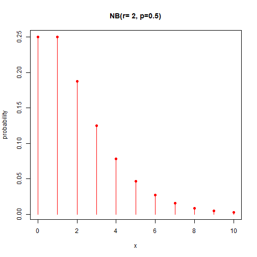

Distribución binomial negativa para eventos
========================================================

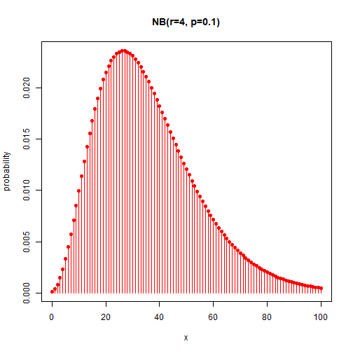

Distribución binomial negativa para ensayos
======================================================

Sí estamos interesados en el número de **ensayos** antes de $r$ eventos del tipo $A$. 

Entonces contamos $m=k+r$ ensayos, y la probabilidad de observer $m$ ensayos antes de $r$ eventos del tipo $A$ es

$P(Y=m)=f(m)=\binom {m-1} {r-1} (1-p)^{m-r}p^r$ donde la variable aleatoria $X$ puede tomar valores $m=r,r+1,...$

con

- media: $E(Y)= \frac{r}{p}$

- varianza: $V(Y)= \frac{r(1-p)}{p^2}$

Nota que esto es $r$ veces la media y la varianza de la distribución geométrica para eventos.

Distribución hipergeométrica
======================================================

- Imagina que tenemos un proceso de fabricación qtal que por cada 850 dispositivos que producimos cada hora 50 tienden a ser defectuosos ($5 \%$).
- No tenemos tiempo para contarlos todos, así que seleccionamos 100 al azar.

- ¿Cuál es la probabilidad de que elijamos 5 ($5 \%$) dispositivos defectuosos?

Distribución hipergeométrica
======================================================

Qué sabemos

- De una población de $N$
- Hay  $K$ que no son buenos ($N-K$ son buenos)
- Se elige una muestra de $n$
- En la muestra, hay $k$ no buenos

Pensemos en cuál es la probabilidad de observar un valor dado $k$

Distribución hipergeométrica
======================================================

Qué sabemos

- De una población de $N$
- Hay $K$ que no son buenos ($N-K$ son buenos)

Imaginemos que podemos marcar cada dispositivo Bueno $G_1, ... G_K$ y cada Malo $B_1, ... B_ {N_K}$.

La población de dispositivos es
$\{G_1, ... G_K, B_1, ... B_ {N_K} \}$

Distribución hipergeométrica
======================================================

De la población $\{G_1, ... G_ {N-K}, B_1, ... B_ {K} \}$ se elige una muestra de tamaño $n$.

existen
$\binom N n$
de aquellos

Distribución hipergeométrica
======================================================

Dado que cada posible $n$ -muestra se obtiene con la misma probabilidad, una sola extracción de n dispositivos tendrá una probabilidad

$P(Z=\{G_3, G_{10}, ... B_5,..B_{610}\})=\frac{1}{\binom N n}$

de estos, vamos a agregar en un solo evento aquellos que tienen el mismo número de $k$ B's ($n-k$ G's)

Distribución hipergeométrica
======================================================

- ¿De cuántas formas podríamos obtener k diferentes dispositivos defectuosos de un grupo de K?

$\binom K k$

- ¿De cuántas formas podríamos obtener n-k dispositivos buenos diferentes de un grupo de n-k?

$\binom {N-K} {n-k}$

Distribución hipergeométrica
======================================================

Por lo tanto, la probabilidad de obtener $k$ malos dispositivos en una muestra de $n$ extraída de una población de $N$ donde $K$ son malos es

$P(X=k)=P(una\,observacion)$
 $\times (Number\, de\, formas\, para\, obtenbter\, k)$
 $=\frac{1}{\binom N n}\binom K k \binom {N-K} {n-k}$

donde $k \in \{\max(0, n+K-N), ... \min(K, n) \}$

Distribución hipergeométrica
======================================================

Pensemos en el rango de $k$

$k \in \{\max(0, n+K-N), ... \min(K, n) \}$

si hay pocos dispositivos buenos y todos son seleccionados, entonces hay al menos $n- (N-K)$ malos.

Distribución hipergeométrica
======================================================

- Imagina que tenemos un proceso de fabricación que por cada 850 dispositivos que produce por hora 50 tienden a estar defectuosos ($5 \%$).

- No tenemos tiempo para contarlos todos, así que seleccionamos 100 al azar.

- ¿Cuál es la probabilidad de que elijamos 5 dispositivos defectuosos?

Distribución hipergeométrica
======================================================

- De una población de N = 850
- Hay K = 50 que no son buenos
(N-K = 800 son buenos)

- Se elige una muestra de n = 100

La probabilidad de que en la muestra haya $ k = 5 $ dispositivos que no son buenos:

$P(X=k) =\frac{1}{\binom N n}\binom K k \binom {N-K} {n-k}$
 $P(X=5) =\frac{1}{\binom {850} {100}}\binom {50} {5} \binom {800} {95} = 0.17\,\, (17\%)$

Distribución hipergeométrica
======================================================

Ten en cuenta que:

- hay un 5,8% de dispositivos defectuosos en la población (850)
- 5 malos dispositivos en la muestra (100) representan el 5%

Solo $\sim 20 \%$ de las veces, obtendríamos exactamente la misma proporción de dispositivos defectuosos que en la población porque los eventos **no son independientes**

Distribución hipergeométrica
======================================================

Estos no son ensayos de Bernoulli.

- Se producirán pruebas independientes de Bernoulli si inspeccionamos un dispositivo, lo dejamos caer y tomamos uno nuevo (puede ser el mismo).
- En este caso, tenemos muestreo **sin reemplazo**
- ¡Con cada extracción de un dispositivo, la población de muestreo cambia!

Distribución hipergeométrica
======================================================

Si una variable aleatoria sigue una función de probabilidad de masa hipergeométrica

$P(X=k)=f(k)=\frac{1}{\binom N n}\binom K k \binom {N-K} {n-k}$
$k \in \{\max(0, n+K-N), ... \min(K, n) \}$

Tiene

- media: $E (X) = \mu = n * K / N = np$

- varianza: $V (X) = np (1-p) \frac {N-n} {N-1}$

Si $p$ es la proporción de $K$ artículos en una población de $N$.

Distribución hipergeométrica
======================================================

Comparemos las medias y varianzas **hipergeométricas** y **binomiales**:

- $E(X)=np$ y varianza $V(X)= np(1-p)\frac{N-n}{N-1}$

- $E_B(X)=np$ y varianza $V_B(X)= np(1-p)$

La varianza de la distribución hipergeométrica se corrige para el muestreo sin reemplazo en una población de tamaño finito.

Distribución hipergeométrica
========================================================

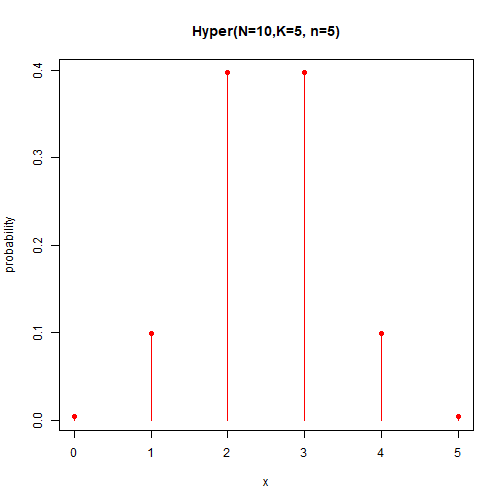

Distribución hipergeométrica
========================================================

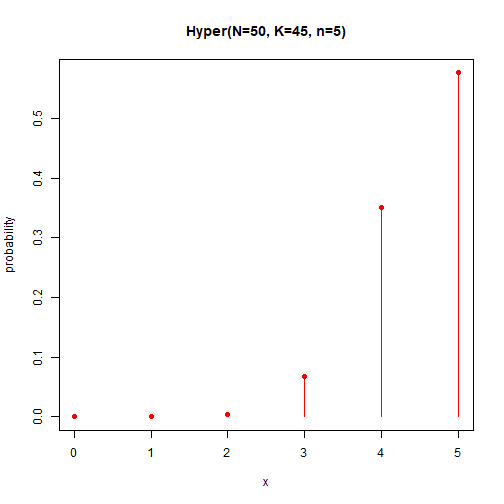

Modelos de probabilidad para variables discretas
======================================================

Estamos construyendo modelos más complejos a partir de modelos simples:

**Uniforme**: interpretación clásica de probabilidad
 $\downarrow$ 
  **Bernoulli**: Introducción de un **parámetro** $p$ (familia de funciones)
 $\downarrow$ 
  **Binomial**: **Repetición** de un experimento aleatorio ($n$ veces ensayos de Bernoulli)
 $\downarrow$ 
  **Poisson**: repetición de un experimento aleatorio dentro de un intervalo continuo (sin **control** sobre cuándo o dónde repetir el experimento).

distribución de Poisson
======================================================

Imagina que estamos observando eventos que **dependen** del tiempo o la distancia **intervalos**.

- coches que llegan a un semáforo
- recibir mensajes en su teléfono móvil
- defectos que ocurren al azar en un alambre de cobre

Supon que los eventos son resultados de experimentos aleatorios **independientes**, cada uno de los cuales aparece al azar en un intervalo continuo.

distribución de Poisson
======================================================

- Cuando estudiamos el proceso binomial pensamos en repetir el lanzamiento de una moneda $n$ veces.

- Asumimos implícitamente que **controlamos** cuándo ocurrieron las repeticiones.

- Ahora consideramos otra capa de aleatoriedad: ¡no controlamos cuándo ocurre el lanzamiento de la moneda!

distribución de Poisson
======================================================

¿Cuál es la probabilidad de observar eventos de $X$ en la unidad de un intervalo (tiempo o distancia)?

Imaginemos que algunas impurezas en un alambre de cobre se depositan al azar a lo largo de un alambre.

- en cada centímetro, contarías un promedio de $\lambda = 10/cm$.
- dividamos el centímetro en micrómetros ($0.0001cm$)

distribución de Poisson
======================================================

Los micrómetros son lo suficientemente pequeños para que 

- haya o no haya una impureza en cada micrómetro
- cada micrómetro pueda considerarse un **ensayo de Bernoulli**

distribución de Poisson
======================================================

La probabilidad de observar $X$ impurezas en $n = 10,000 0 \mu$ (1cm) sigue aproximadamente una distribución binomial

$P(X=x)=\binom n x(1-p)^{n-x} p^x$

donde $p$ es la probabilidad de encontrar una impureza en un micrómetro.

Recuérda
$E (X) = np$
así que para $\lambda = np$ (número promedio de impurezas por 1 cm), podemos escribir

$P(X=x)=\binom n x (1-\frac{\lambda}{n})^{n-x}\big(\frac{\lambda}{n}\big)^x$

distribución de Poisson
======================================================

- Todavía **podría** haber dos impurezas en un micrómetro, por lo que necesitamos aumentar la partición del cable ($n$).

- Las ensayos de Bernoulli solo son verdaderos en el límite ($n \rightarrow \infty$).

$P(X=x)=\binom n x (1-\frac{\lambda}{n})^{n-x}\big(\frac{\lambda}{n}\big)^x$

Donde $\lambda$ es constante porque es la densidad de impurezas por centímetro, dada por $E(X)$.

distribución de Poisson
======================================================

$P(X=x)=\binom n x (1-\frac{\lambda}{n})^{n-x}\big(\frac{\lambda}{n}\big)^x$

en el límite ($n \rightarrow \infty$)

- $\frac{1}{n^x}\binom n x =\frac{1}{n^x}\frac{n!}{x! (n-x)!}=\frac{(n-x)!(n-x+1)...(n-1)n}{n^x x! (n-x)!}=\frac{n(n-1)..(n-x+1)}{n^x x!} \rightarrow \frac{1}{x!}$
- $(1-\frac{\lambda}{n})^{n} \rightarrow e^{-\lambda}$ (definición de la función exponencial)
- $(1-\frac{\lambda}{n})^{-x} \rightarrow 1$

Por lo tanto

$P(X=x)= \frac{e^{-\lambda}\lambda^x}{x!}$

distribución de Poisson
======================================================

**Definición**

Dado

- un intervalo en los números reales
- los recuentos ocurren al azar en el intervalo
- se conoce el número promedio de conteos en el intervalo ($\lambda$)
- si se puede encontrar una pequeña partición regular del intervalo de modo que cada uno de ellos pueda considerarse ensayos de Bernoulli

Entonces...

distribución de Poisson
======================================================

**Definición**

El experimento aleatorio de contar durante un intervalo es un proceso de **Poisson** y los conteos $X$ siguen la función de masa de probabilidad
$f(x)= \frac{e^{-\lambda}\lambda^x}{x!}, \lambda>0$

distribución de Poisson
======================================================

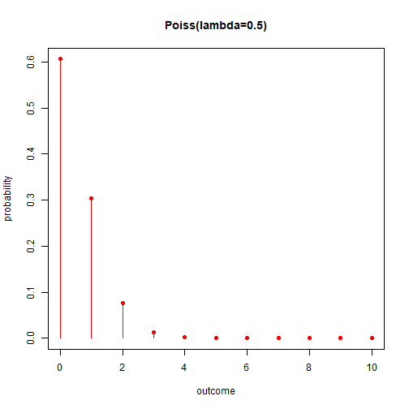

distribución de Poisson
========================================================

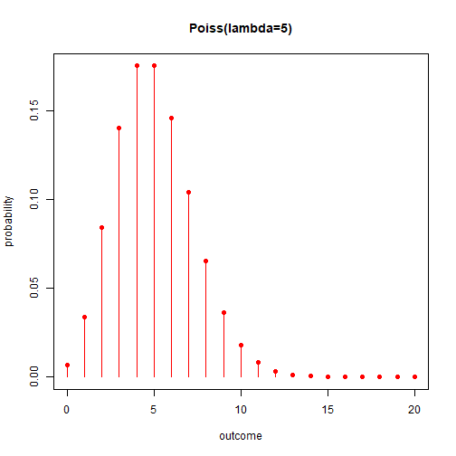

distribución de Poisson
======================================================

para la distribución de Poisson
 $f(x)=\frac{e^{-\lambda}\lambda^x}{x!}, \lambda>0$

tenemos

- significa $E(X)= \lambda$
- varianza $V(X)= \lambda$

distribución de Poisson
======================================================

El número medio de partículas radiactivas que golpean un contador Geiger es de 2,3 segundos.

¿Cuál es la probabilidad de contar exactamente 2 partículas en un segundo?

$f(x; \lambda)=\frac{e^{-\lambda}\lambda^x}{x!}, \lambda>0$

$f(2; \lambda=2.3)=\frac{e^{-2.3}2.3^2}{2!}=0.26, \lambda=2.3\, counts/s$

distribución de Poisson
======================================================

El número medio de partículas radiactivas que inciden en un contador Geiger es de 2,3 conteos/segundo.

¿Cuál es la probabilidad de contar con la detección exacta de 10 partículas en 5 segundos?

$f(x; \lambda)=\frac{e^{-\lambda}\lambda^x}{x!}, \lambda=2.3\, counts/s$

Entonces, la variable aleatoria $Y$ que cuenta cuántas partículas golpean el detector cada 5 segundos tiene una media

$\lambda_{5s}=E(Y)= 5 \times 2.3\, counts/5s=11.5 \, counts/5s$

y su función de probabilidad es:

$f(y; \lambda_{5s})=\frac{e^{-\lambda_{5s}}\lambda_{5s}^x}{x!}, \lambda_{5s}=11.5 \, counts/5s$

$f(y=10; \lambda_{5s})=\frac{e^{-11.5}11.5^{10}}{{10!}}=0.11, \lambda=11.5 \,counts/5s$

distribución de Poisson
======================================================

¿Cuál es la probabilidad de observar al menos un conteo en dos segundos?

El promedio de conteos en 2 segundos es

$\lambda_{2s}=E(Z)= 2 \times 2.3 \, counts/2s=4.6 \, counts/2s$

que es la media de la variable aleatoria $Z$ que cuenta cuántas partículas golpean el detector cada 2 segundos. $Z \hookrightarrow Poiss(\lambda_ {2s})$ y

$P(Z > 0)=1-F_{Pois}(0; \lambda_{2s})=1-f(0; \lambda_{2s})=1-e^{-4.6}=0.98 \nonumber$

 Resumen
========================================================

| Modelo | outcome    | x  |  f(x) | E(X) | V(X) | R |
| ----------- | ------------- | ------ | ----- | ---- | ---- |---- |
| Uniforme | $n$ discreto | a,... b| $\frac{1}{n}$ |$\frac{b+a}{2}$ |  $\frac{(b-a+1)^2-1}{12}$ | <code>rep(1/n, n)</code>|
| Bernoulli             | evento A  | 0,1 | $(1-p)^{1-x}p^x$ | $p$ | $p(1-p)$ | <code>c(1-p,p)</code> |
| Binomial | \# de eventos A en $n$ repeticiones de Bernoulli | 0,1,...| $\binom n x (1-p)^{n-x}p^x$ | $np$ | $np(1-p)$ |<code> dbimon(x,n,p)</code> |
| Geometrico de eventos| \# de eventos B en repeticiones de Bernoulli antes de evento A | 0,1,...|$(1-p)^{x}p$| $\frac{1-p}{p}$ |$\frac{1-p}{p^2}$ |<code>dgeom(x,p)</code> |
| Geometrico de ensayos| \# de ensayos B en repeticiones de Bernoulli antes de evento A | 1,...|$(1-p)^{x-1}p$| $\frac{1}{p}$ |$\frac{1}{p^2}$ | <code>dgeom(x-1,p)</code> |
| Binomial Negativo de eventos | \# de eventos B en repeticiones de Bernoulli hasta r eventos A | 0,1,.. |$\binom {x+r-1} x (1-p)^xp^r$ | $\frac{r(1-p)}{p}$ | $\frac{r(1-p)}{p^2}$ |<code>dnbinom(x,r,p)</code> |
| Binomial Negativo de ensayos | \# de ensayos en repeticiones de Bernoulli hasta r eventos A | r,r+1,.. |$\binom {x-1} {r-1} (1-p)^{x-r} p^r$ | $\frac{r}{p}$ | $\frac{r(1-p)}{p^2}$ |<code>dnbinom(x-r,r,p)</code> |
| Hypergeometrico | \# de eventos A en una muestra $n$ de población $N$ con $K$ eventos A|$\max(0, n+K-N)$, ... $\min(K, n)$ | $\frac{1}{\binom N n}\binom K x \binom {N-K} {n-x}$ | $n*\frac{N}{K}$ | $n \frac{N}{K} (1-\frac{N}{K})\frac{N-n}{N-1}$ | <code>dhyper(x, K, N-K, n)</code> |
| Poisson | \# de eventos en un intervalo | 0,1, ..| $\frac{e^{-\lambda}\lambda^x}{x!}$ | $\lambda$ | $\lambda$ |<code>poiss(x, lambda)</code> |
