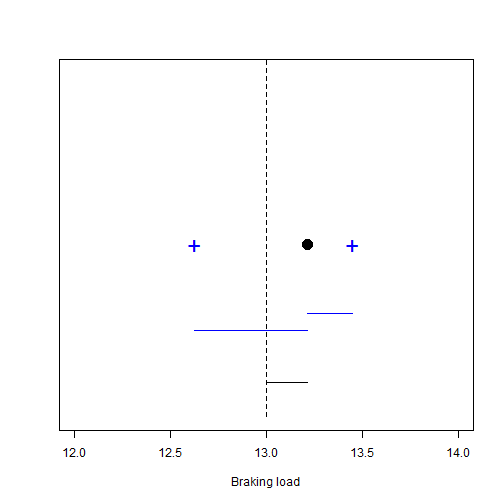

Introducción a la estadística
======================================================

Escuela Técnica Superior de Ingeniería de Barcelona Este <br>
Universitat Politècnica de Catalunya (UPC)
 

<p style = "font-size: 70px"> Capítulo 8 </p>


Objetivo
======================================================

- Distribución para la media muestral
- Distribución para varianza muestral
- Teorema del límite central

Distribución para la media muestral
======================================================

- Probabilidad es motivada por los resultados diferentes que obtenemos cada vez que realizamos un experimento aleatorio.

- Las distribuciones de masa y densidad de probabilidad definen la probabilidad de un resultado.

- Los modelos de probabilidad describen las probabilidades para fenómenos naturales/diseñados. Hemos asumido que **conocemos** los parámetros de los modelos que usamos para calcular probabilidades.

Distribución para la media muestral
======================================================

¿Qué hacemos en la vida real?

- Realizamos un experimento aleatorio muchas veces.

Imagina que un cliente le piden a tu empresa que le venda cables metálicos para el puerto de Barcelona que soporten hasta 12 Toneladas.

- Tienes en **stock** un tipo de cable que podría hacer el trabajo, pero nunca se ha utilizado para soportar más de 10 toneladas.

¿Puedes utilizar los cables en stock o necesitas producir uno nuevo?


Distribución para la media muestral
======================================================

- Si un cable en existencia no puede soportar la carga y se rompe, puede lesionar a un trabajador.

sin embargo

- Imaginemos que probar la resistencia de 8 cables en stock es más económico que producir un producto nuevo.

- Ahorras dinero en diseño y fabricación. Incluso si has fabricado un producto nuevo, aún debes realizar pruebas.


Distribución para la media muestral
======================================================

Entonces convences a la empresa de invertir en probar 8 cables, cargando cada cable hasta que se rompe. Aquí están los resultados


```r
x1=13.34642, x2=13.32620, x3=13.01459, x4=13.10811, x5=12.96999, x6=13.55309, x7=13.75557, x8=12.62747 
```


Distribución para la media muestral
======================================================

vamos a graficarlos


Distribución para la media muestral
======================================================

- Ninguno de ellos se rompió a las 12 Toneladas.

- ¿Qué tan seguros estamos de que el que vendemos no se rompe a los 12 Toneladas?

- Hubo uno que rompió en 12.62747 Toneladas.

¿Te arriesgas?


Distribución para la media muestral
======================================================

- En la vida real repetimos y experimentamos $n$ veces y no conocemos la distribución de probabilidad de los resultados o sus parámetros.


- Supongamos que la carga a la que los cables frenan sigue una distribución normal ($N(\mu, \sigma^2)$).

- No sabemos qué son $\mu$ y $\sigma^2$.

Entonces los **estimamos** a partir de los datos.

Distribución para la media muestral
==================================================

- El promedio, o media muestral, se define como
</br>$\bar{x}=\frac{1}{N} \sum_{j=1..N} x_j$

donde $x_j$ es la **observación** $j$ de un total de $N$.

En términos de **resultados** que pueden tomar las variables categóricas
</br>$\bar{x}= \sum_{i=1..m} x_i \frac{n_i}{N}$

donde $x_i$ es el **resultado** $i$ de un total de $m$. Si el número de observaciones es infinito, entonces **deberíamos** tener
</br>$\bar{x} \rightarrow \sum_{i=1..m} x P(X=x)= E(X)$


Distribución para la media muestral
==================================================
- $\bar{x}$ es el resultado de promediar la repetición de $n$-experimentos independientes.

La repetición de un experimento $n$ veces se denomina una muestra de tamaño $n$.

¿Recuerda la repetición de $n$ ensayos de Bernoulli y el conteo del número de eventos?

Ese es un experimento binomial: un experimento aleatorio compuesto por $n$ experimentos aleatorios.

- Si realizamos otra muestra $n$, obtendríamos otro resultado para $\bar{x}$.

$\bar{x}$ es la observación de **un** experimento aleatorio. Ese experimento consiste en muestrear $X$ $n$-veces.


Distribución para la media muestral
==================================================

**Definición**

La media muestral (o promedio) de una ** muestra aleatoria ** de tamaño $n$ se define como

$\bar{X}=\frac{1}{n}\Sigma_{i=1}^n X_i$

Nuestro experimento con cables en stock da como resultado la realización de esta variable aleatoria

$\bar{X}=\bar{x}_{stock}=13.21Tons$

Funciones de distribuciones de muestra
======================================================


Distribución para la media muestral
==================================================

Hay dos distribuciones:

- La distribución de la población: la misma para cada variable aleatoria $X_i$ de cada experimento aleatorio.

$f_x(x)dx=P(x\leq X\leq x+dx)$

$E(X_i)=E(X)=\mu$ and $V(X_i)=V(X)=\sigma^2$

- La distribución de $\bar{X}$, que es la distribución media muestral

$f_{\bar{x}}(\bar{x})d\bar{x}=P(\bar{x}\leq \bar{X}\leq \bar{x}+d\bar{x})$

$E(\bar{X})=\mu_{\bar{X}}$ y 
$V(\bar{X})=\sigma_{\bar{X}}^2$


Distribución para la media muestral
==================================================

¿Qué son $\mu_{\bar{X}}$ and $\sigma^2_{\bar{X}}$, en términos de $\mu$ y $\sigma^2$?


$E(\bar{X})=\mu_{\bar{X}}=E(\frac{1}{n}\Sigma_{i=1}^n X_i)$
</br>$=\frac{1}{n} \Sigma_{i=1}^n (X_i)$
</br>$=\frac{1}{n} \Sigma_{i=1}^n \mu$
</br>$=\mu$


Esto tiene sentido:
</br> $\mu_{\bar{X}}$ la expectativa del promedio es la expectativa de un solo experimento. Esto nos permite usar $\bar{x}$ para **estimar**  $\mu$.


Distribución para la media muestral
==================================================

¿Cuál es la varianza de $\bar{X}$?

$V(\bar{X})=\sigma^2_{\bar{X}}=V(\frac{1}{n}\sum_{i=1}^n X_i)=\frac{1}{n^2} V(\sum_{i=1}^n X_i)$
</br>$= \frac{1}{n^2} \sum_{i=1}^n \sigma^2=\frac{1}{n^2} n \sigma^2$
</br>$= \frac{\sigma^2}{n}$
</br> ¡Este es un resultado general importante!


La segunda linea usamos

$V(\sum_{i=1}^n X_i)=\sum_{i=1}^nV(X_i)$

que resulta de la independencia de $n$ variables aleatorias -no lo mostramos.


Distribución para la media muestral
==================================================

$V(\bar{X})= \frac{\sigma^2}{n}$
</br>Como $n\rightarrow \infty$ luego $\sigma^2_{\bar{X}}\rightarrow 0$

- Cuantas más repeticiones tengamos del experimento, menos disperso será el $\bar{X}$ promedio.

- Esto es totalmente coherente con la interpretación frecuentista de las probabilidades: cuanto más repetimos el experimento, más nos acercamos a las probabilidades de los resultados; en nuestro caso, a un conocimiento más preciso de $\mu$.

- ¡Tenemos que repetir un experimento tanto como sea posible!


Distribución para la media muestral
==================================================


Distribución para la media muestral
==================================================

Antes de usar datos para aprender sobre las distribuciones, vamos a permanecer en el espacio modelo (abstracto) y primero responderemos la pregunta:


¿Cómo  la distribución de $\bar{X}$, $f(\bar{x})$ es determinada por la distribución de $X$, $f_x(x)$?

Esta pregunta es importante porque si queremos usar el valor observado $\bar{x}$ de una muestra de tamaño  $n$ para **estimar** $\mu_X$, necesitamos saber cómo  se distribuye $\bar{X}$ para que podamos calcular las probabilidades de $\bar{X}$.


Distribución para la media muestral
==================================================

¿Cómo es la distribución de $\bar{X}$ cuando $X$ proviene de

- Un ensayo de Bernoulli
- Una distribución normal
- Cualquier distribución pero realizamos una muestra de gran tamaño $n$

Distribución para la media muestral: ensayos de Bernoulli
==================================================

La función de masa de probabilidad de una variable aleatoria de Bernoulli $X$ con valores $k \in {0,1}$ definidos por $A \rightarrow k = 1$ y $B \rightarrow k = 0$

$f(k)=(1-p)^{1-k} p^k$

- $p$ es la probabilidad de $A$ y el parámetro de la distribución

- $E (X) = p$ y $V (X) = p (1-p)$

Distribución para la media muestral: ensayos de Bernoulli
==================================================

Para una muestra aleatoria $X_1, ... X_n$ de $n$ Bernoulli prueba la variable aleatoria

$Y = \sum_{i = 1}^n X_i$

distribuye binominalmente
</br> $Y \hookrightarrow Bin (p, n)$ y
$P(Y=i)=f(i)=\binom n i p^i(1-p)^{n-i}$ para $i=0,1,...n$


Recuerda

- $E (Y) = np$
- $V (Y) = np (1-p)$

Distribución para la media muestral: ensayos de Bernoulli
==================================================

La media muestral $\bar{X}$ es simplemente

$\bar{X}=\frac{Y}{n}=\frac{1}{n}\sum_{i=1}^n X_i$

Entonces, la media de $\bar{X}$ es

$E(\bar{X})=E(\frac{Y}{n})= \frac{np}{n}=p$
</br>$E(\bar{X})=E(X)=p$

Como $\bar{X}$ es $E(\bar{X}) = E (X) = p$, decimos que es $\bar{X}$ es un estimador **insesgado**  $p$.


Distribución para la media muestral: ensayos de Bernoulli
==================================================
La varianza de $\bar{X}$

$V(\bar{X})=V(\frac{Y}{n})= \frac{1}{n^2}V(Y)$
</br>$=\frac{p(1-p)}{n}$
</br>$=\frac{V(X)}{n}$

o en nocatición $\sigma$, recuperamos el resultado **general**
</br>$\sigma^2_{\bar{X}}=\frac{\sigma^2_X}{n}$

Distribución para la media muestral: ensayos de Bernoulli
==================================================

Ahora, finalmente hemos construido una herramienta matemática que da cuenta de la observación empírica de probabilidades.

- Cuando lanzamos una moneda muchas veces $n\rightarrow \infty$ tenemos una **justificación** matemática para tomar el promedio de cuántas caras **observamos** $\bar{x}$ para estimar la probabilidad $p$ de obtener una cara al lanzar **una** moneda.

Porque:

- el número que obtenemos$\bar{x}$ es una realización de la variable aleatoria $\bar{X}$ que tiene la expectativa $E(\bar{X}) = p$.

- mientras que el número $\bar{x}$ no es $p$, se concentra a su alrededor a medida que aumentamos $n$:  $V(\bar{X})=\frac{1}{n}V(X) \rightarrow 0$ cuando $n \rightarrow \infty$

Distribución para la media muestral: ensayos de Bernoulli
==================================================

$\lim_{n\rightarrow \infty} \bar{x} = \lim_{n\rightarrow \infty} \frac{n_{caras}}{n} = P_{cara}=p$


Distribución para la media muestral
==================================================

¿Cómo es la distribución de  cuando $X$ proviene de

- Un ensayo de Bernoulli
- Una distribución normal
- Cualquier distribución pero grande $n$

Distribución para la media muestral: Normal
==================================================
Si $X$ es una variable aleatoria continua con distribución normal
</br>$X \rightarrow N(\mu_X, \sigma_X^2)$
con **parámetros**: $\mu_X$ y $\sigma_X$.

La media y la varianza de $X$ son: $E (X) = \mu$ y $V (X) = \sigma ^ 2$

- Para una muestra aleatoria $X_1, ... X_n$ de $n$ variables aleatorias normales, $X_i \hookrightarrow N(\mu_X, \sigma_X^2)$, definimos la variable aleatoria media muestral

$\bar{X}=\frac{1}{n}\sum_{i=1}^n X_i$.

¿Cómo es la distribución de $\bar{X}$?

Distribución para la media muestral: Normal
==================================================

Imagina que **sabemos** exactamente cómo se distribuye $X$; eso es $X \rightarrow N(\mu_X, \sigma_X^2)$ y sabemos exactamente cuáles son los valores de $\mu_X$ y la varianza $\sigma_X$

entonces podemos mostrar que
</br>$\bar{X}\rightarrow N(\mu_X, \frac{\sigma_X^2}{n})$


Ya habíamos demostrado que en el caso general </br>$E(\bar{X})=E(X)=\mu_x$ and </br>$V(\bar{X})=\frac{V(X)}{n}=\frac{\sigma_X^2}{n}$.


La parte difícil es mostrar que la **suma** de variables **normales** independientes es también una variable aleatoria normal.


Distribución para la media muestral: Normal
==================================================
**Perspectiva teórica**

Función de generación de momentos

Usamos el momento generando la función  $M_x$, definida como:
</br>$M_X(t)=E(e^{tX})=\int_{-\infty}^{\infty}  e^{tx} f(x)dx$
para producir los momentos mediante una simple diferenciación:
</br>$\mu'_r =\frac{d^r M_X(t)}{dt^r}\bigm|_{t=0}$

Usamos la función generadora de momentos de la distribución normal para mostrar que la suma de las variables independientes distribuidas normalmente es normal.

Distribución para la media muestral: Normal
==================================================

**Perspectiva teórica**

Croquis de la prueva:

- La función generadora de momentos para una distribución estándar $N(\mu,\sigma^2)$ se puede obtener mediante integración:
</br>$M_{X}(t)=\int_{-\infty}^{\infty}  e^{tx} \frac{1}{\sqrt{2\pi}\sigma}e^{-\frac{(x-\mu)^2}{2\sigma}}dx=e^{t\mu+\frac{1}{2}\sigma^2t^2}$

- para $X_1, .... X_n$ variables independientes aleatorias tenemos
$df(x_1,x_2,..,x_n)=f(x_1)f(x_2)..f(x_n)dx_1..dx_n$La función generadora de momento para $\sum_i X_i$ es entonces

$M_{\sum_i X_i}(t)=E(e^{t\sum_i x_i})=\int_{-\infty}^{\infty}  e^{t(x_1+..+x_n)} f(x_1)..f(x_n)dx_1..dx_n$
</br>$=\Pi_{i=1}^{n} M_{X_i}(t)=\Pi_{i=1}^{n} e^{t\mu+\frac{1}{2}\sigma^2t^2}$
</br>$= e^{\sum_i t\mu+\sum_i \frac{1}{2}\sigma^2t^2}= e^{nt\mu+\frac{1}{2}(n\sigma^2) t^2 }$

esta es la función de generación de momentos de una distribución normal
</br>$\sum_{i=1}^n x_i \hookrightarrow N(n\mu, n\sigma^2)$


Distribución para la media muestral: Normal
==================================================

- La suma $\sum_{i=1}^n X_i$ de $n$ variables aleatorias normalmente distribuidas $X_1$,...$X_n$ todas con media $\mu_X$ y varianza $\sigma ^ 2_X$ es una distribución normal:

$\sum_{i=1}^n X_i \hookrightarrow N(n*\mu_X, n*\sigma_X^2)$

con

media: $E(\sum_{i=1}^n X_i)=n*\mu_X$ 

varianza: $V(\sum_{i=1}^n X_i)=n*\sigma_X$


Distribución para la media muestral: Normal
==================================================


- Como la media muestral es $\bar{X}=\frac{1}{n}\sum_{i=1}^n X_i$ entonces 

$\bar{X}\hookrightarrow N(\mu_X, \frac{\sigma_X^2}{n})$,  

con 

media: $E(\bar{X})=\frac{n}{n}E(X)=\mu_X$ 

vaianza: $V(\bar{X})=nV(\frac{1}{n}\sum_{i=1}^n X_i)=\frac{n}{n^2}\sigma^2_X=\frac{\sigma^2_X}{n}$

Distribución para la media muestral: Normal
==================================================

Imagina que **supiéramos** que la carga de rotura de nuestros cables se distribuye normalmente con una media de 13 toneladas y una desviación estándar de 0,35.

- ¿Cuál es la probabilidad de que un cable se rompa a las 12 toneladas?

La media poblacional es
$\mu_X = 13$ y la desviación estándar es $\sigma_X = 0.35$

Queremos calcular $P(X \leq 12)$

$P(X\leq 12 T)=P(\frac{X-\mu_X}{\sigma_X} \leq \frac{12-\mu_X}{\sigma_X})$

Estandaricemos
$P(Z \leq \frac{12-\mu_X}{\sigma_X})=\Phi(\frac{12-\mu_X}{\sigma_X})$ 

Donde $\Phi$ es la función de probabilidad acumulativa para distribución estándar, como $Z \hookrightarrow N(0,1)$.

Reemplazando $\Phi(-2.857143)=0.002$ en R se calcula:

<code>pnorm(-2.857143)=0.002</code>.

La probabilidad de que un cable se rompa es del 0,2%.


Distribución para la media muestral: Normal
==================================================

Para la media muestral

- ¿Cuál es la probabilidad de que la media de 8 muestras sea inferior a 12 toneladas?

La media de **muestra** es
$E (\bar {X}) = 13$
y su desviación estándar es
$\sigma_\bar{X}=\sigma_X/\sqrt{n}=0.35/\sqrt{8}=0.1237437$


Queremos calcular $P(\bar{X}\leq 12)$

$P(\bar{X}\leq12 T)=P(\frac{X-\mu_\bar{X}}{\sigma_\bar{X}} \leq \frac{12-\mu_\bar{X}}{\sigma_\bar{X}})=P(Z \leq \frac{12-\mu_\bar{X}}{\sigma_\bar{X}})$

Dado que $\bar{X}$ se distribuye normalmente, $Z$ sigue una distribución estándar y

</br>$P(Z \leq \frac{12-\mu_\bar{X}}{\sigma_\bar{X}})=\Phi(-8.08)\sim 0$

<code>pnorm(-8.08)=3.238339e-16</code>.

Distribución para la media muestral: Normal
==================================================

Sin embargo, ¿qué pasa si quieren usar los 8 cables para soportar 8*12 = 96 toneladas? ¿Cuál es la probabilidad de que los 8 cables puedan soportar esa carga?

- La media de la **suma** $Y=\sum_{i=1}^8 x_i$
es $E (Y) = 8 * 13 = 104$
y la desviación estándar
$\sigma_Y=n\sigma_X=8*0.35=2.8$


Queremos calcular $P(Y \leq 12)$

$P(Y\leq12 T)=P(\frac{Y-\mu_Y}{\sigma_Y} \leq \frac{12-\mu_Y}{\sigma_Y})=P(Z \leq \frac{12-\mu_Y}{\sigma_Y})$


y como $Y$ también se distribuye normalmente,

$\Phi(-2,857143) = 0,002$

Que era el resulado para un clable. Las probabilidades se suman!


Ejercicio
==================================================

Les alçades de 10000 estudiants tenen una distribució aproximadament normal de mitjana $\mu = 174.5 cm$ i desviació típica σ = 6.9 cm. Considereu una mostra aleatòria simple de $25$ estudiants 

$X_1,X_2,...,X_{25}$ 

i la seva mitjana mostral 

$\bar{X} = \frac{1}{25} \sum_{i=1}^{25} X_i$

(a) Calculeu l’esperança i la desviació típica de la mitjana mostral.

(b) Calculeu la probabilitat que la mitjana mostral sigui inferior a 173. 

(c) Considereu ara un conjunt de 200 mostres aleatòries de 25 estudiants cadascuna. Sigui $\bar{X}_1$ la mitjana mostral de la primera mostra, $\bar{X}_2$ la mitjana mostral de la segona mostra, i així successivament. Sigui ara Y la variable aleatòria discreta que mesura quantes d’aquestes mitjanes mostrals són inferiors a 173. Quin és el valor esperat de mitjanes mostrals que seran inferiors a 173?

(d) Quina hauria de ser la mida de la mostra perquè el valor esperat de mitjanes mostrals que són inferiors a 173 sigui 9?


en (d) piensa en usar $\phi^{-1}(x)$ que en R se calcula con la funcion <code>qnomr(x)</code>

Distribución para la media muestral
==================================================

¿Cómo es la distribución de $\bar{X}$ cuando $X$ proviene de

- Un ensayo de Bernoulli
- Una distribución normal
- Cualquier distribución pero grande $n$

Distribución para la media muestral: $n$ grande
==================================================

- Relajemos la condición de que la variable aleatoria $X$, de la cual se toma la muestra n, sea normal.

- En su lugar, imagina que tomamos muchas muestras $n\rightarrow \infty$ 

Bajo esta condición, ¿cómo se distribuye $\bar{X}$?

Distribución para la media muestral: $n$ grande
==================================================

**Teorema del límite central (TCL)** (no lo probaremos*)

Para una muestra aleatoria $X_1, ... X_2$ en una distribución poblacional de la variable $X$ con media $\mu_X$ y varianza $\sigma_X ^ 2$, entonces la variable estandarizada de $\bar{X}$ dada por

 $Z=\frac{\bar{X}-E(\bar{X})}{\sqrt{V(\bar{X})}}=\frac{\bar{X}-\mu_X}{\sigma_X/\sqrt{n}}$

sigue una distribución estándar; es decir

$Z\hookrightarrow N(0,1)$,

cuando $n\rightarrow \infty$

(*se puede encontrar una prueba que usa funciones generadoras de momentos en Estadística matemática de Freund con aplicaciones)


TCL
==================================================
El teorema del límite central:

$Z=\frac{\bar{X}-\mu_X}{\sigma_X/\sqrt{n}} \rightarrow N(0,1)$
cuando $n\rightarrow \infty$

Justifica la aproximación de

$\bar{X}\sim N(\mu_X, \frac{\sigma_X^2}{n})$
cuando $n >30$


TCL
==================================================

El teorema del límite central nos dice que:

- la distribución de $\bar{X}$ puede **aproximarse** mediante una distribución normal para valores grandes de $n$

- no importa cuál sea la distribución de población $f_X$; es decir, cómo se distribuyen las medidas $X_i$

Tenga en cuenta que cuando $X$ **en realidad** se distribuye normalmente, entonces la distribución de $\bar{X}$ es **exactamente normal**, como mostramos anteriormente.

TCL
==================================================
Veamos una aplicación del teorema del límite central a la distribución binomial


Vamos a mostrar que la distribución Binomial tiende a la distribución Normal cuando el número de ensayos de Bernoulli es grande.

Consideremos la variable randon $Y$ que sigue una distribución binomial /br>$Y\hookrightarrow Bin(n,p)$, es decir

$P(Y=y)=f(y)=\binom n y p^y(1-p)^{n-y}$ $y=0,1,...n$


TCL
==================================================

Estandaricemos $Y$

</br>$Z=\frac{Y-E(Y)}{\sqrt{V(Y)}}=\frac{Y-np}{\sqrt{np(1-p)}}$


porque $E (Y) = np$ y $V (Y) = np (1-p)$

al dividir por $n$ tanto el numerador como el denominador
$Z=\frac{Y/n-p}{\sqrt{p(1-p)}/\sqrt{n}}$

Ahora, $Y$ se puede escribir como
</br>$Y=\sum_{i=1}^n x_i$ 
</br> donde $X$ es una prueba de Bernulli $P(X=x)=p^x(1-p)^{1-x}$, $x=0,1$ 

Por lo tanto $Y/n=\frac{1}{n}\sum_{i=1}^n x_i=\bar{X}$

TCL
==================================================

Para que podamos escribir
</br>$Z=\frac{Y/n-p}{\sqrt{p(1-p)}/\sqrt{n}}$
como
</br>$Z=\frac{\bar{X}-p}{\sqrt{p(1-p)}/\sqrt{n}}=\frac{\bar{X}-\mu}{\sigma/\sqrt{n}}$

Esta es claramente la normalización de $\bar{X}$ la **muestra** de **n** ensayos de Bernulli independientes, cada uno con una media $p$ y una varianza $p (1-p)$.

Por lo tanto, según el teorema del límite central
</br> $Z\rightarrow N(0,1)$
cuando $n\rightarrow \infty$

y

- la distribución de $\bar{X}$ puede aproximarse mediante
</br>$\bar{X} \sim N(p,p(1-p)/n)$


TCL
==================================================

- la distribución de $X$ puede **también** ser aproximada por
</br>$X \rightarrow Bin(n,p)\sim N(np,np(1-p))$

porque comparten la misma estadística estandarizada $Z$

Por lo tanto, tenemos la aproximación de una distribución a otra.

$Bin(n,p)\sim N(np,np(1-p))$

La cual se considera buena cuando $n> 30$ y tanto $np$ como $n(1-p)$ son mayores que 5


Distribución para la media muestral
==================================================

Resumen:

Cuando $X$ proviene de

- Un ensayo de Bernoulli entonces

$\bar{X} \hookrightarrow Bin(n,p)$

- Una distribución normal entonces

$\bar{X} \hookrightarrow N(\mu_X,\sigma^2_X/n)$

- Cualquier distribución pero grande $ n> 30 $ entonces

$\bar{X} \sim N(\mu_X,\sigma^2_X/n)$


Distribución de la varianza muestral
==================================================

Nuestra intención es tomar un valor observado de $\bar{X}$ (big $X$); eso es $\bar{X}$ (poco $X$), como una **estimación ** experimental de $\mu$.

- Eso es suficiente cuando $X$ sigue una distribución de prueba de Bernulli, donde solo tenemos un parámetro $p$, $E(\bar{X})=\mu_\bar{X}=\mu_X=p$

- Cuando $X$ sigue una distribución normal, tenemos dos parámetros $\mu_X$ y $\sigma_X$.

Como  $E(\bar{X})=\mu_X$, ¿podríamos también tomar $V(\ bar {X})$ como una medida de $\sigma$?

</br>$V(\bar{X})=E[(\bar{X}-\mu)^2]$

¡Pero no sabemos $\mu$! y nos da la dispersión de $\bar{X}$ sobre la media, no la dispersión de $x_i$.


Distribución de la varianza muestral
==================================================

**Definición**

La **varianza muestral** $S ^ 2$ es la **variable aleatoria**, función de la muestra aleatoria $n$ $X_1, ... X_n$, dada por
</br>$S^2= \frac{1}{n-1}\sum_{i=1}^n (X_i-\bar{X})^2$


- $S ^ 2$ (grande $S$) es la variable aleatoria y $s ^ 2$ (pequeña $ s $) es la **observación** de $S ^ 2$.

- $s^2$ es la  varianza **muestral** y se calcula a partir de los **datos** (pequeños $x_i$ y $\bar{X}$) como:
</br>$s^2= \frac{1}{n-1}\sum_{i=1}^n (x_i-\bar{x})^2$ 

su raíz cuadrada es el error estándar $s$.

- $S ^ 2$ son las distancias promedio de las observaciones a $\bar{X}$ (excepto que se divide por $n-1$). 

Distribución de la varianza muestral
==================================================

**Perspectiva teórica**

Recuerda que $\bar{X}$ se dispersa alrededor de $\mu_X$ con varianza $\sigma^ 2_X/n$. Para estimar la dispersión de las mediciones alrededor de $\mu_X$, entonces necesitamos corregir la desviación dada por $\bar{X}$.




Distribución de la varianza muestral
==================================================

**Perspectiva teórica**

Calculemos el valor esperado de $ S ^ 2 $

$E(S^2)=E[\frac{1}{n-1}\sum_{i=1}^n (X_i-\bar{X})^2]$
</br>$=\frac{1}{n-1}E[\sum_{i=1}^n \{(X_i-\mu)-(\bar{X}-\mu)\}^2]$
</br>$=\frac{1}{n-1}E[\sum_{i=1}^n \{(X_i-\mu)^2-2(X_i-\mu)(\bar{X}-\mu)+(\bar{X}-\mu)^2\}]$
</br>$=\frac{1}{n-1}E[\sum_{i=1}^n (X_i-\mu)^2-2(\bar{X}-\mu)\sum_{i=1}^n\{(X_i-\mu)\}+(\bar{X}-\mu)^2]$
</br>$=\frac{1}{n-1}E[\sum_{i=1}^n (X_i-\mu)^2-2n(\bar{X}-\mu)^2+n(\bar{X}-\mu)^2]$
</br>$=\frac{1}{n-1}\sum_{i=1}^n E[(X_i-\mu)^2]-E[2n(\bar{X}-\mu)^2]+E[n(\bar{X}-\mu)^2]$
</br>$=\frac{1}{n-1}[n\sigma_X^2- n \frac{\sigma_X^2}{n} ]=\sigma_X^2$

$S^2$ es un estimador **insesgado** de $\sigma_X^2$!

Distribución de la varianza muestral
==================================================


Para nuestro experimento de 8 cables que rompen cargas, tenemos

- $\bar{x}=13.21\,\,Tons \sim \mu_X$, (simulated $\mu_X=13$)

- $s^2=0.127\,\,Tons^2 \sim \sigma^2_X$, (simulated $\sigma^2_X=0.1225$)

Como, **asumimos** que  $X \hookrightarrow N(\mu_X,  \sigma^2_X)$, luego $\bar{X} \hookrightarrow N(\mu_X,  \sigma^2_X/\sqrt{n})$

Pero 

¿Cómo se distribuye $S ^ 2$?

Distribución de la varianza muestral
=================================================

Para una muestra aleatoria $X_1, ... X_n$ con una distribución de población normal $X_i \hookrightarrow N(\mu_X, \sigma_X^2)$ la variable aleatoria definida por
</br>$Y=\frac{(n-1)S^2}{\sigma_X^2}$

tiene una distribución $\chi^2$ (chi-cuadrado) con $df = n-1$ grados de libertad dados por

$f(y)=C_n  y^{\frac{n-3}{2}} e^{-\frac{y}{2}}$

dónde:

- $C_n=\frac{1}{2^{(n-1)/2\sqrt{\pi(n-1)}}}$ asegura que $\int f(t)dt=1$

- $\Gamma(x)$ es el factorial de Euler para números reales

 
Distribución de la varianza muestral
==================================================

Ten en cuenta que la distribución es para $Y=\frac{(n-1)S^2}{\sigma_X^2}$
y no para $S ^ 2$

- ¿Cuál es la probabilidad de que la varianza muestral de los 8 cables que vendimos sea mayor que $0.2 \, \, Ton^ 2$?

 Calculamos $P(S^2 > 0.2)=P(\frac{(n-1)S^2}{\sigma_X^2} > \frac{(n-1)0.2}{\sigma_X^2})=P(Y > \frac{(n-1)0.2}{\sigma_X^2})$
</br> $=1-P(Y \leq \frac{(n-1)0.2}{\sigma_X^2})=1-P(Y\leq \frac{(8-1)0.2}{0.1225})$
</br> $= 1- F_{chi^2,df=7}(11.42857)$

que en R se cacula con
<code>pchisq(11.42857, df=7)=0.12 </code>

Existe una probabilidad de $12 \%$ de obtener un valor de $s ^ 2 = 0.2$ en 8 cables.

Distribución de la varianza muestral
==================================================

En R calculamos la función de probabilidad acumulada de una función de densidad $\chi ^ 2$ con $df = n-1$ grados de libertad usando la función <code>pchisq (y, df)</code>

En tablas: $P (Y> \ chi ^ 2_ {0.05,7}) = 1-F (\ chi ^ 2_ {0.05,7})$

Estas las aprenderemos a usar en el capítulo 10.


Ejercicio
==================================================

Una cierta componente es crítica en la operación de un sistema eléctrico y debe ser reparada inmediatamente si falla. La vida media de la componente es de 100 horas y su desviación estándar es 30 horas. 

a) Si se toma una muestra de 50 componentes, ¿cuál es la probabilidad de que la media muestral no difiera de la media poblacional más de 1 hora?

b) ¿Cuántas componentes deben tenerse preparadas en stock para que la probabilidad de que el sistema funcione durante 2750 horas consecutivas sea 0.95? (asume que la duración de la componente es una variable normal)
