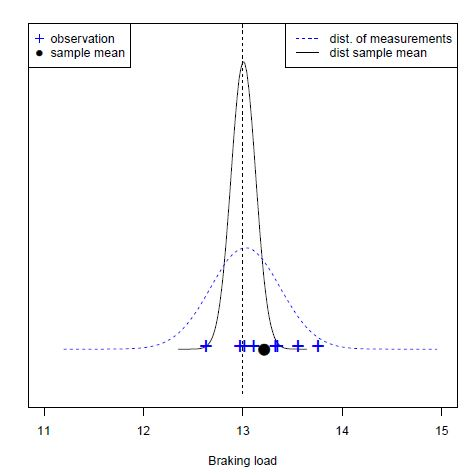

Introducción a la estadística
======================================================
autor: Alejandro Cáceres
fecha:
tamaño automático: verdadero

Escuela Técnica Superior de Ingeniería de Barcelona Este <br>
Universitat Politècnica de Catalunya (UPC)
 

<p style = "font-size: 70px"> Capítulo 9 </p>


Objetivo
======================================================

Estimación:

- Estadísticos
- Máxima verosimilitud
- Método de momentos


Distribuciones de muestra
======================================================

Probaste cargar 8 cables hasta romperlos. Aquí están los resultados


```r
x1=13.34642, x2=13.32620, x3=13.01459, x4=13.10811, x5=12.96999, x6=13.55309, x7=13.75557, x8=12.62747 
```


Distribuciones de muestra
======================================================


Aprendimos que:

- media de la muestra $\bar{x}=\frac{1}{n} \sum_{j=1}^n x_j=13.21$ es un número obtenido de las observaciones.

- $\bar{x}$ es una observación de la variable aleatoria $\bar{X}=\frac{1}{n} \sum_{j=1}^n X_j$ de la $n$ -muestra $X_1$, ... $X_n$.

- la varianza de la muestra $s^2=\frac{1}{n-1}\sum_{i=1}^n (x_i-\bar{x})^2=0.127$ es un número obtenido de las observaciones.

- $s^2$ es una observación de la variable aleatoria $S^2=\frac{1}{n-1}\sum_{i=1}^n (X_i-\bar{X})^2$ de la $n$ -muestra $X_1$, ... $X_n$.


Distribuciones de muestra
======================================================

También aprendimos que cuando $X_i$ son todas repeticiones independientes del experimento aleatorio $X \hookrightarrow N (\mu_X, \sigma_X ^ 2)$ entonces

- $\bar {X} \hookrightarrow N (\mu_X, \sigma_X ^ 2 / n)$
</br> (también satisfecho cuando $n$ es grande independientemente de cómo se distribuya $X$: CLT)

- $S ^ 2 \hookrightarrow \chi ^ 2 (n-1)$


Y en general, no importa cómo se distribuya $X$:

- $E(\bar{X})=E(X)=\mu_X$ and $V(\bar{X})=\frac{\sigma^2_X}{n}$

- $E(S^2)=V(X)=\sigma^2_X$

Distribuciones de muestra
======================================================





Estadística
======================================================


**Definición**

Dada una muestra aleatoria $X_1, ... X_n$ a **estadística** es cualquier función de valor real de las variables aleatorias que definen la muestra aleatoria: $f (X_1, ... X_n)$

- $\bar{X}=\frac{1}{N} \sum_{j=1..N} X_j$ 
- $S^2=\frac{1}{n-1}\sum_{i=1}^n (X_i-\bar{X})^2$
- $\max{X_1, X_n}$


son estadísticas


Estimador
======================================================

**Definición**

Un **estimador** es una estadística $\Theta$ cuyos valores $\hat{\theta}$ son medidas de un parámetro $\Theta$ de la distribución de la población en la que se define la muestra: $E(\Theta)\sim \theta$ 


$X \hookrightarrow f (x; \theta)$

Entonces

- $\Theta$ es un **parámetro** de la distribución de población $f (x; \theta)$
- $\Theta$ es un **estimador** de $\Theta$: una variable aleatoria
- $\hat{\theta}$ es la **estimación** de $\Theta$: Un valor realizado de $\Theta$


Estimador
======================================================


Estimador
======================================================

Ejemplo de cuando $X \hookrightarrow N (\mu_X, \sigma ^ 2_X)$

Por el medio:

- $\mu_X$ es un **parámetro** de la distribución de población $N (\mu_X, \sigma ^ 2_X)$
- $\bar{x}$ es un **estimador** de $\mu_X$
- $\bar{x}=\hat{\mu}=13.21 \, Tons$ es la **estimación** de $\mu_X$


Para la varianza:

- $\sigma ^ 2_X$ es un **parámetro** de la distribución de población $N (\mu_X, \sigma ^ 2_X)$
- $s^2$ es un **estimador** de $\sigma ^ 2_X$
- $s ^ 2 = \hat {\sigma ^ 2_X} = 0.127 \, Tons ^ 2$ es la **estimación** de $\sigma ^ 2_X$


Estimador
======================================================

Un estimador es insesgado si $E(\Theta)=\theta$

- $\bar{x}$ es un estimador **no sesgado** de $\mu_X$ porque $E(\bar{X})=\mu_X$

- $s^2$ es un estimador **no sesgado** de $\sigma ^ 2_X$ porque $E (S ^ 2) = \sigma ^ 2_X$


Máxima verosimilitud: Historia
======================================================


Máxima verosimilitud: Historia
======================================================

**Perspectiva histórica**

- Se pensaba que Ceres era un planeta.

- Desapareció detrás del sol

- Se necesitaban predicciones para saber en qué parte del cielo buscarlo después de que pasara detrás del sol.

- La trayectoria (paralela a los planetas) determinaría si probablemente era un planeta.

- Con varias observaciones con errores, ¿cuál sería el mejor representante de la verdadera posición de Ceres en un momento dado?


Máxima verosimilitud: Historia
======================================================

**Perspectiva histórica**

¿Cuál es la estadística que mejor representa la verdadera posición de Ceres?


Máxima verosimilitud: Historia
======================================================

**Perspectiva histórica**

Gauss propuso que en un momento **dado**

- La posición **más probable** de Ceres fue la media.
- las probabilidades alrededor de la media fueron simétricas.


Máxima verosimilitud: Historia
======================================================

**Perspectiva histórica**

¿Cuál es la distribución de errores para la posición de Ceres?


- El resultado del experimento aleatorio $Y$: medida de la posición de Ceres. El error $z = y-y_{true}$ sigue una función de densidad de probabilidad: $Z \hookrightarrow f (z) = f (y-y_{true})$


- Tenemos $n$ repeticiones del experimento aleatorio: $y_1, ... y_n$

La probabilidad de observar el evento: ($y_1, y_2, ... y_n$) para la muestra $n$ es la multiplicación de la probabilidad de cada evento porque las observaciones son eventos independientes

$f(y_1,y_2,...y_n;y_{true})=f(y_1-y_{true})*f(y_2-y_{true})*...f(y_n-y_{true})$
</br>$=\Pi_{i=0,..m} f(y_i-y_{true})$


Máxima verosimilitud: Historia
======================================================

**Perspectiva histórica**


- la función del parámetro $\Theta$ definida como:

$L(\theta; y_1,y_2,...y_n)=f(y_1,y_2,...y_n;y_{true})$ se llama función de verosimilitud de $\Theta$

- Para la posición de Ceres, la función de verosimilitud es

$L(y_{true}; y_1,y_2,...y_n)=\Pi_{i=0,..m} f(y_i-y_{true})$

Gauss preguntó: Si $y_{true}$  es la media de las observaciones $\mu_Y=\frac{1}{n}\sum_i^n y_i$ y el valor más probable de Ceres, ¿cuál es $f( y_1,y_2,...y_n; \mu_Y)$?

- El valor más probable es el valor que maximiza la función de **verosimilitud**

$\frac{d}{d\mu_Y}L(\mu_Y; y_1,y_2,...y_n)=0$


Máxima verosimilitud: Historia
======================================================

**Perspectiva histórica**

$\frac{d}{d\mu_Y}[L(\mu_Y; y_1,y_2,...y_n)] =\frac{d}{d\mu_Y}[f(y_1-\mu_Y)*f(y_2-\mu_Y)*...f(y_n-\mu_Y)] =0$
</br>$=-f'(y_1-\mu_Y)*f(y_2-\mu_Y)*...f(y_n-\mu_Y)$
</br>$-f(y_1-\mu_Y)*f'(y_2-\mu_Y)*...f(y_n-\mu_Y)-...$
</br>$-f(y_1-\mu_Y)*f(y_2-\mu_Y)*...f'(y_n-\mu_Y)$
</br>$=-[\sum_{i=1}^n\frac{f'(y_i-\mu_Y)}{f(y_1-\mu_Y)}]*L(\mu_Y; y_1,y_2,...y_n)=0$

- si  $\frac{f'(y)}{f(y)}=ky$ entonces resolvemos la ecuación anterior porque

$\sum_{i=1}^n\frac{f'(y_i-\mu_Y)}{f(y_i-\mu_Y)}=\sum_{i=1}^n k(y_i-\mu_Y)=\sum_{i=1}^n y_i -n\mu_Y=0$ debido a que
$\mu_Y= \frac{1}{n} \sum_{i=1}^n y_i$.

- La solución de $\frac{f'(y)}{f(y)}=ky$  es la función normal:$\frac{h}{\sqrt{\pi}}e^{-h^2(y-\mu_Y)^2}$ con $k/2=-h^2$


Máxima verosimilitud: Historia
======================================================

**Perspectiva histórica**

Gauss descubrió que si la **media** es la estimación más probable de las mediciones, entonces la densidad de probabilidad de los errores es la función

$\frac{h}{\sqrt{\pi}}e^{-h^2(y-\mu_Y)^2}$


que llamamos Gaussiana y que Pearson (1920) la bautizó como curva normal.


Máxima verosimilitud: aplicación
======================================================

- A menudo sospechamos la **forma** de la función de probabilidad $X \hookrightarrow f (x; \theta)$.

- $f (x; \theta)$ es una familia de funciones, cada miembro de la familia es determinado por el parámetro $\theta$.


¿Cómo podemos estimar $\theta$ a partir de datos cuando asumimos $f (x; \theta)$?


Máxima verosimilitud: aplicación
======================================================
Distribución normal: Deshaciendo a Gauss ...

- Imagina que **sabemos** (para los mas escépticos: suponemos) que $X \hookrightarrow N (\mu_X, \sigma_X ^ 2)$.

- ¿Cuáles son los estimadores de $\mu_X$ y $\sigma_X ^ 2$ cuando realizamos una muestra de tamaño $n$?


Máxima verosimilitud: distribución normal
======================================================


- Imagina que hacemos $n$ observaciones y obtenemos los valores $(x_1, .... x_n)$ es

La función de verosimilitud, la probabilidad de haber observado $(x_1, .... x_n)$ es
</br>$L(\mu, \sigma^2)=\Pi_{i=1..n} N(x_i;\mu,\sigma)$
<br>$=\big( \frac{1}{\sigma \sqrt{2 \pi}}\big)^n e^{-\frac{1}{2\sigma^2} \sum_i(x_i-\mu)^2}$


Podemos tomar el log de $L$,
</br>$\ln L(\mu, \sigma^2)=-n \ln(\sigma \sqrt{2 \pi})-\frac{1}{2\sigma^2} \Sigma_i(x_i-\mu)^2$

esto se llama función **logaritmo de verosimilitud**


Máxima verosimilitud: distribución normal
======================================================

Las estimaciones de $\mu$, $\sigma$ son donde la probabilidad es máxima y dan la probabilidad más alta para los datos.

- Por lo tanto, diferenciamos con respecto a $\mu$ y $\sigma ^ 2$ y lo igualamos a 0

</br>$\frac{d \ln L(\mu, \sigma^2)}{d\mu}=\frac{1}{\sigma^2} \sum_i(x_i-\mu)=0$

</br>$\frac{d \ln L(\mu, \sigma^2)}{d\sigma^2}=-\frac{n}{2 \sigma^2}+\frac{1}{2\sigma^4} \sum_i(x_i-\mu)^2=0$


Máxima verosimilitud: distribución normal
======================================================

Las soluciones de las ecuaciones
</br>$\frac{1}{\sigma^2} \sum_i(x_i-\mu)=0$
</br>$-\frac{n}{2 \sigma^2}+\frac{1}{2\sigma^4} \sum_i(x_i-\mu)^2=0$

son
</br>$\hat{\mu}=\frac{1}{n}\sum_i x_i=\bar{x}$
</br>$\hat{\sigma^2}=\frac{1}{n}\sum_i(x_i-\bar{x})^2$

El método de máxima verosimilitud asigna los estimadores
</br>$\hat{\mu}=\bar{x}$
</br>$\hat{\sigma^2}=\frac{1}{n}\sum_i(x_i-\bar{x})^2$
</br>para $\mu$ y $\sigma^2$ en una población que se distribuye $X \hookrightarrow N (\mu_X, \sigma_X ^ 2)$


Máxima verosimilitud: distribución normal
======================================================

¡Esto es casi lo que esperábamos!

- $\hat{\mu}=\bar{x}$, como Gauss nos enseñó

pero

- $\hat{\sigma^2}=\frac{1}{n}\Sigma_i(x_i-\bar{x})^2=s^2_{ML}$ no es $s^2=\frac{1}{n-1}\Sigma_i(x_i-\bar{x})^2$

recuerda que $E(S^2)=\sigma^2$ luego $E(S^2_{ML})=\frac{n-1}{n}E(S^2)=\frac{n-1}{n}\sigma^2$

El estimador de máxima verosimilitud $S ^ 2_ {ML}$ de $\sigma ^ 2$ es un estimador **sesgado** por que: $E (S ^ 2_{ML}) \neq \sigma ^ 2$


Estimador
======================================================


Máxima verosimilitud
======================================================
¿Por qué es útil el método de máxima verosimilitud?

Imagina que sospechamos que una variable tiene una función de densidad de probabilidad

\[
    f(x)= 
\begin{cases}
\frac{1}{\alpha}x^{\frac{1-\alpha}{\alpha}},& \text{if } x \in (0,1)\\
    0,& x \notin (0,1)\\
\end{cases}
\]

Donde $\alpha$ es un parámetro.

Si tuviéramos que realizar una muestra de tamaño $n$ : $X_1, ... X_n$

- ¿Cuál sería el estimador de máxima verosimilitud para $\alpha$ ($\hat {\alpha_v}$)?


Máxima verosimilitud
======================================================


Máxima verosimilitud
======================================================


Recuerde que la función de probabilidad para una muestra aleatoria es
</br>$L(\theta)= \Pi_{i=1..n} f(x_i, \theta)$


entonces
</br>$L(\alpha;x_1,..x_n)= \frac{1}{\alpha^n} \Pi_{i=1..n} x_i^{\frac{1-\alpha}{\alpha}}= \frac{1}{\alpha^n}  (x_1x_2...x_n)^{\frac{1-\alpha}{\alpha}}$


y usamos la probabilidad logarítmica
</br>$\ln L(\alpha;x_1,..x_n)= -n \ln(\alpha) + {\frac{1-\alpha}{\alpha}} \Sigma_{i=1...n} \ln (x_i)$

para encontrar su máximo.


Máxima verosimilitud
======================================================

Nos diferenciamos con respecto a $\alpha$
</br>$\frac{d \ln L(\alpha)}{d \alpha}= -\frac{n}{\alpha} - \frac{1}{\alpha^2}  \Sigma_{i=1...n} \ln (x_i)=0$

Resolviendo para $\alpha$
</br>$\alpha=-\frac{1}{n}\Sigma_{i=1...n} \ln (x_i)$


y por lo tanto la estimación máxima de similitud para $\alpha$ es
</br>$\hat{\alpha_v}=-\frac{1}{n}\Sigma_{i=1...n} \ln (x_i)$


Es decir: cuando hemos realizado $n$ mediciones $X_1, ... X_n$ usamos la fórmula anterior para estimar el parámetro $\alpha$ a partir de los datos. Por tanto, **inferimos** (fijamos) la densidad de probabilidad para $X$.


Máxima verosimilitud
======================================================

**Perspectiva teórica**

Otra aplicación importante es la regresión:
</br>$N(y_i;\mu_i=m+b*t_i,\sigma^2)= \frac{1}{\sigma \sqrt{2 \pi}} e^{-\frac{1}{2\sigma^2} (y_i-\mu_i)^2}= \frac{1}{\sigma \sqrt{2 \pi}} e^{-\frac{1}{2\sigma^2} (y_i-m-b*t_i)^2}$ 

</br> ¿Cuáles son las estimaciones de máxima verosimilitud para $m$ y $b$?


Máxima verosimilitud
======================================================

La función de verosimilitud, la probabilidad de haber observado  $(x_1, ....x_n)$ en $t_i, ... t_n$
</br>$L(\mu_i, \sigma)=\Pi_{i=1..n} N(m+b*t_i;\mu,\sigma)$
<br>$=\big( \frac{1}{\sigma \sqrt{2 \pi}}\big)^n e^{-\frac{1}{2\sigma^2} \sum_i(y_i-m-b*t_i)^2}$


El logarítmo de la verosimilitud es
</br>$\log(\Pi_{i=1..n} N(m+b*t_i;\mu,\sigma))=-\frac{n}{2}\log(2\pi)-n\log( \sigma) - \frac{1}{2\sigma^2} \sum_i(y_i-m-b*t_i)^2$


que diferenciamos con respecto a $m$ y $b$ y equiparamos a 0 para encontrar los máximos.

Después de algo de álgebra (ejercicio) tenemos


$b=\frac{\sum_i (t_i-\bar{t})(y_i -\bar{y})}{\sum_i (t_i-\bar{t})^2}$

$m = \bar{y} - b \bar{t}$

Máxima verosimilitud
======================================================
Estos son los valores que obtuvimos cuando ajustamos una línea a las observaciones
$(x_1, y_1) ... (x_n, y_n)$ por cuadrados mínimos (cuando teníamos $X$ en lugar de $t$).

$b=\frac{\sum_i (x_i-\bar{x})(y_i -\bar{y})}{\sum_i (x_i-\bar{x})^2}$

$m = \bar{y} - b \bar{x}$


La diferencia ahora es que sabemos que $b$ es la realización de la variable aleatoria

$B=\frac{\sum_i (x_i-\bar{x})(Y_i -\bar{Y})}{\sum_i (x_i-\bar{x})^2}$

Que es la suma de las variables normales $Y_1, ... Y_n$, y por lo tanto es normal.


Máxima verosimilitud
======================================================

¿Qué hemos ganado?

- Entonces podemos probar la probabilidad de que $P (B> 0)$ o que Ceres se esté moviendo en el cielo.

- Al fijar los valores de $m$ y $b$ podemos calcular $E (y_{t_n})$ como la predicción más probable de la posición de Ceres en el momento $t_n$.

La historia de Gauss es uno de los avances más importantes de la ciencia. Para predecir dónde encontrar a Ceres en el cielo en 1802, Gauss descubrió la distribución normal y puso las bases del método de máxima verosimilitud y el análisis de regresión que se desarrollarian hasta el siglo 21 con Fisher.

Después de que Ceres despareciera detrás del sol. A los 6 meses, los astrónomos apuntaron sus telescopios hacia donde les dijo Gauss, ¡y allí estaba Ceres!


Método de los momentos
======================================================


El método de máxima verosimilitud tiene como objetivo producir los estimadores de distribuciones de probabilidad a partir de datos.

- ¿Existe otra forma de producir esos estimadores? ellos serían iguales

Veamos nuevamente los estimadores de máxima verosimilitud para $\mu$ y $\sigma ^ 2$ para una variable aleatoria que se distribuye normalmente: $X \hookrightarrow N (\mu, \sigma ^ 2) $

- $\hat{\mu}=\frac{1}{n}\sum_i x_i$
- $\hat{\sigma^2}=\frac{1}{n}\sum_i(x_i-\bar{x})^2$


Método de los momentos
======================================================

Reescribamos los estimadores en términos de los valores de $X$ (resultados), no de las observaciones

Por ejemplo:

$\hat{\mu}=\frac{1}{n}\sum_i x_i= \sum_x x \frac{n_x}{n}$


y recuerda que en el límite $n \rightarrow \infty$ la interpretación frecuentista requiere $\frac{n_x}{n} \rightarrow P(X=x)$ y por lo tanto en el límite

$\hat{\mu}=\frac{1}{n}\sum_i x_i \rightarrow E(X)$


El método de momentos asigna una variable aleatoria

$M'_1 = \frac{1}{n}\sum_i X_i$ como el estimador de $E (X)$, o sea $M'_1=\bar{X}$ 


¿Qué nos dice el método de los momentos sobre los modelos probabilísticos?


Summary of probability models
========================================================


| Model |  f(x) | E(X) | Parameter estimates from $E(X)=\bar{x}$|
| -----------  | ----- | ---- | ----------- |
| Bernoulli             |  $p^x(1-p)^{1-x}$ | $p$ | $\hat{p}=\bar{x}$ |
| Binomial | $\binom n x p^x(1-p)^{n-x}$ | $np$ | $\hat{p}=\frac{\bar{x}}{n}$ |
| Shifted geometric | $p(1-p)^{x-1}$ | $\frac{1}{p}$ |$\hat{p}=\frac{1}{\bar{x}}$  |
| Negative Binomial |$\binom {x+r-1} x p^r(1-p)^x$ | $r\frac{1-p}{p}$ | $\hat{p}=\frac{r}{\bar{x}-r}$ | 
| Poisson | $\frac{e^{-\lambda}\lambda^x}{x!}$ | $\lambda$ | $\hat{\lambda}=\bar{x}$ |
| Exponential | $\lambda e^{-\lambda x}$ | $\frac{1}{\lambda}$ | $\hat{\lambda}=\frac{1}{\bar{x}}$ |
| Normal | $\frac{1}{\sqrt{2\pi}\sigma}e^{-\frac{(x-\mu)^2}{2\sigma^2}}$ | $\mu$ |$\hat{\mu}=\bar{x}$,$\hat{\sigma}^2=\frac{1}{n}\sum_ix_i^2-\bar{x}^2$ |


Método de los momentos
======================================================
El parámetro de $f (x; \theta)$ se debe encontrar a partir de la ecuación:

$E(X)=\mu'_1=\frac{1}{n}\sum_i x_i$, donde $\mu'_1$ es una observación de $M'_1$

$\mu'_1$ es el  primer momento **muestral**, es un número que se calcula a partir de datos.


$\mu'_1=\frac{1}{n}\sum_i x_i=\hat{\mu}$

Método de los momentos
======================================================

Si hay más parámetros, usamos los momentos **muestrales** más altos

- El segundo momento **muestral**

$\mu'_2=\frac{1}{n}\sum_i x^2_i$ es el estimador del segundo momento sobre el origen $E (X ^ 2)$


Para la densidad de probabilidad normal, tenemos

$\frac{1}{n}\sum_i x^2_i = E(X^2) = \hat{\mu}^2 + V(X)= \hat{\mu}^2+\hat{\sigma}^2$ 

entonces

$\hat{\sigma}^2= \frac{1}{n} \sum_i x^2_i -\hat{\mu}^2=\frac{1}{n} \sum_i(x_i-\hat{\mu})^2$


Método de los momentos
======================================================

Sea $X_1, ... X_n$ una muestra aleatoria de la distribución de probabilidad $f (x; \theta_1, .. \theta_r)$ (continua o discreta). El $k$-ésimo momento de muestral es

$\mu'_k=\frac{1}{n}\sum_{i=1}^2 x_i^k$

**Método de momentos:**

Los estimadores de $\theta_1 ... \theta_r$ se obtienen de las r ecuaciones:

$\mu'_k=E(X^r), \, \,\,\,k=1,..r$


Método de los momentos
======================================================

Supongamos que $f (x; a)$ es una distribución uniforme, donde no sabemos el valor mínimo que puede tomar $X$, pero sabemos que el máximo es 1

\[
f(x)=
\begin{cases}
    \frac{1}{1-a},& \text{if } x\in (a,1)\\
    0,& de\,\, otra\,\, forma 
\end{cases}
\] 

¿Cuál es el estimador de $a$?

- Realizamos un experimento y obtenemos $X_1, ... X_n$ ¿cómo podemos estimar $a$ a partir de los datos?

Método de los momentos
======================================================

La distribución tiene un parámetro. El método de los momentos nos da una ecuación


$\mu'_1=E(X)$

$\bar{x}=\frac{\hat{a}+1}{2}$

por lo tanto

$\hat{a}=2\bar{x}-1$

es el estimador de la medida mínima que pudimos observar.

Método de los momentos
======================================================

Ten en cuenta que tomar el mínimo de las mediciones es claramente subóptimo.

El método nos dio una respuesta inteligente:

- podemos calcular $\bar{x}$ con una presición creciente dada por $n$
- Sabemos que ninguna medida sobrepasa $b = 1$
- Luego calcule la distancia entre $\bar{x}$ y $b$: $1- \bar {x}$
- Restarlo de $\bar{x}$: $\bar{x}-(1-\bar{x})=2\bar{x}-1$ 


Método de los momentos
======================================================

Imagina que sospechamos que la variable tiene una distribución de densidad de probabilidad

\[
    f(x)= 
\begin{cases}
\frac{1}{\alpha}x^{\frac{1-\alpha}{\alpha}},& \text{if } x \in (0,1)\\
    0,& x \notin (0,1)\\
\end{cases}
\]

Donde $\alpha$ es un parámetro.

Si tuviéramos que realizar una $n$ -muestra: $X_1, ... X_n$

- ¿Cuál sería el estimador de $\alpha$ ($\hat{\alpha_M}$) por el método de los momentos?


Método de los momentos
======================================================

El método de momentos iguala los momentos de la muestra a los momentos de la distribución de densidad de probabilidad.

$\mu'_r=E(X^r)$

El primer momento de la muestra viene dado por el promedio muestral

$\mu'_1=\frac{1}{n}\sum_{i=1}^n x_i$

El primer momento de la distribución de densidad de probabilidad de una variable aleatoria es el valor esperado de la variable $E (X)$

$E(X)= \frac{1}{\alpha} \int_0^1 x x^{\frac{1-\alpha}{\alpha}}dx= \frac{1}{\alpha} \int_0^1 x^{1+\frac{1-\alpha}{\alpha}}dx$

Método de los momentos
======================================================


$E(X)= \frac{1}{\alpha} \big[\frac{x^{2+\frac{1-\alpha}{\alpha}}}{{2+\frac{1-\alpha}{\alpha}}}\big]_0^1=\frac{1}{1+\alpha}$


Por tanto, el método de los momentos nos da la ecuación

$\bar{x}=\frac{1}{1+\hat{\alpha}}$ que resolviendo para $\hat{\alpha}$ nos da la estimación de $\hat{\alpha}_m$

</br>$\hat{\alpha}_m=\frac{1-\bar{x}}{\bar{x}}$


Método de los momentos
======================================================

Tenga en cuenta que este es un ejemplo en el que las estimaciones por máxima verosimilitud y el método de momentos son diferentes

- $\hat{\alpha}_v=-\frac{1}{n}\sum_{i=1}^n \ln (x_i)$


- $\hat{\alpha}_m=\frac{1-\bar{x}}{\bar{x}}$


Método de los momentos
======================================================

Podemos simular la distribución de los estimadores para cada método, pero recuerda que en la vida real sólo tenemos un experimento de $n$ muestras y un único valor para los estimadores.

Ejercicio
======================================================

Sea una muestra aleatoria de tamaño $n$ para una variable con función de probabilidad

\[
f(x)=
\begin{cases}
    (1+\theta)x^\theta,& \text{if } x\in (0,1)\\
    0,& otherwise 
\end{cases}
\] 


a. calcula $E(X)$ en función de $\theta$

b. ¿cuál es el estimador $\hat{\theta}$ usando el método de los momentos?  

c. para una muestra con valores 
$x_1 = 0.92; x_2 = 0.79; x_3 = 0.90; x_4 = 0.65; x_5 = 0.86$

¿cuál es la estimación de $\theta$?
