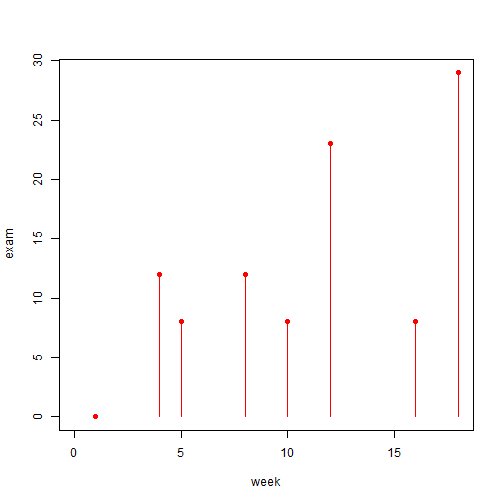
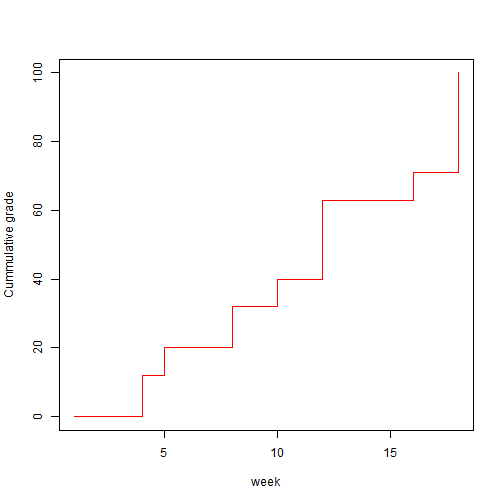
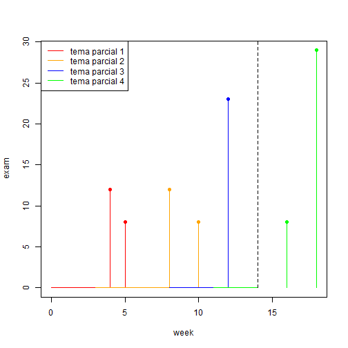

Introduction to statistics 
========================================================
author: Alejandro Cáceres
date:  
autosize: true

Barcelona East School of Engineering  
Universitat Politècnica de Catalunya (UPC)
 

Presentación

Presentación del curso
======================================================

- Estadística es un curso obligatorio del departamento de matemáticas con 6 créditos

Enseñanza de los componentes principales
======================================================

Clases telemáticas

- Teoría: 
 - 15 clases de teoría 
 - 11 clases de problemas

Clases presenciales  

- Prácticas 

Calificación
======================================================

- Teoría: 3 exámenes en línea y 1 examen presencial que comprende el 71%
de la nota.

- Prácticas: 3 exámenes on-line que comprenden cada uno el 8% de la nota (24% en total).

- Competencia general: ensayo presencial tras el 4º examen teórico y valorado en un 5% de la nota final.

Exámenes de un solo grado
======================================================

 
Calificación acumulada
======================================================

Dificultad del curso
======================================================

- Las semanas del los parciales estaremos viendo temas teóricos del parcial siguiente. 

Dificultad del curso
======================================================

Componentes de estudio  

- Teórico: ¿Por qué?
- Problemas: ¿Cómo?
- Práctico: ¿Para qué?

Guía de curso
======================================================

- Seguiremos este [programa] (https://atenea.upc.edu/mod/resource/view.php?id=2500675) donde he detallado el tema semana a semana para la **teoría** y los **ejercicios**.

- Daré al menos un **ejercicio** para después de cada clase. No cuentan para la calificación, pero ayudarán a mantener el hilo. 

- Hay mucho material de apoyo: videos, problemas, diapositivas. Búscalos en ATENEA en nuestro espacio y en el meta curso.

Bibliografía
======================================================

- Montgomery, D. C .; Runger, G. C. aplicado
estadística y probabilidad para ingenieros. Cuarto
ed. Nueva York: John Wiley & Sons, policía. 2006.
ISBN 9780471745891.

- Irwin Miller; Marylees Miller John E. Freund's
Estadística matemática con aplicaciones.
4ª ed. Pearson, 2000. ISBN 9780321807090
